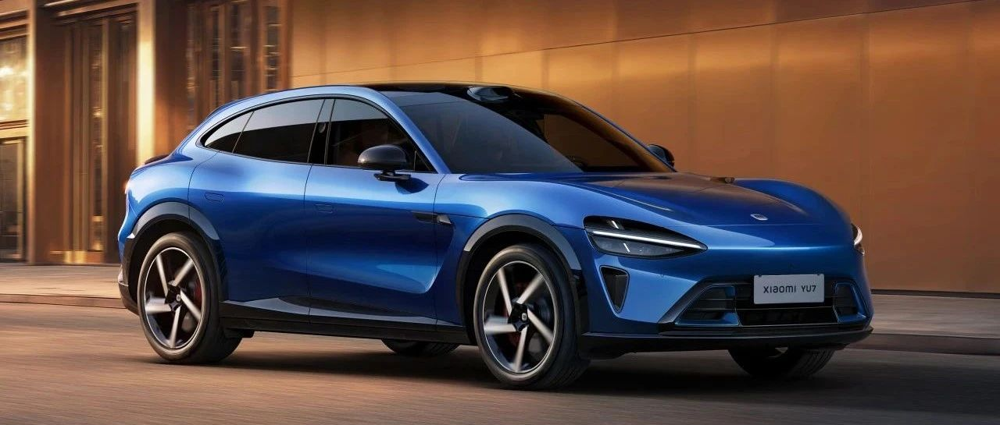

#  小米汽车答网友问（第163集）

[ 小米汽车 ](<javascript:void\(0\);>)

______

**01**

看到有媒体在赛道测试小米YU7时刹车片起火了，这是什么情况？

视频中，小米YU7 Max在天津V1赛车场进行1个暖胎圈+1个飞行圈后，在未进行散热圈的极端情况下，直接驻车，高温导致制动片有机物材料发生起火，但制动系统整体未出现任何制动失效等问题，功能健全，使用正常。  

此外，测试车辆未使用小米YU7 Max大师模式中的“能量回收增强”功能。该功能会增强赛道工况下的能量回收强度，降低机械制动系统的负荷，即便出现ABS抱死情况，依然可以提供最大0.2G的制动能量回收，有效减少制动系统温度超过600℃的极端情况发生。  

在赛道驾驶时，车辆往往需要频繁在超高速行驶中紧急制动，此时制动系统承受的负荷将远高于日常驾驶。在这种工况下，制动盘温度会急剧上升，若未采取有效散热，将引发材料起火。同时，小米YU7作为中大型SUV，相比尺寸更小的SUV车重更高，同时高动力带来的赛道尾速更快，制动系统在猛烈制动过程中产热也会更加明显。因此，有效散热是非常关键且基本的赛道驾驶常识。  

小米YU7 Max采用低金属制动片，材料包含金属纤维、磨料、树脂等有机物。树脂及其他有机物在高温下(一般大于300°C)产生聚合物支链裂解反应产生部分气体，如水分、一氧化碳、二氧化碳、烷基、芳香族气体等，其中部分可燃气体在高温（一般制动盘温度＞600ºC）及氧气充足的环境下可能会产生短暂明火现象。这属于一种正常的物理现象，但制动性能不会失效。  

小米YU7定位于城市豪华高性能SUV，我们强烈倡议大家注意驾驶安全，未经过专业升级与整备的原厂车，不要贸然进行赛道尝试。需要在充分了解产品性能边界及专业驾驶知识的前提下，再进行驾驶技能的逐步学习与进阶。若尝试进行专业赛道驾驶，也需要对于车辆的轮胎、制动系统及散热进行必要的升级，并使用大师模式且打开能量回收增强功能，避免在极端工况下出现安全隐患。

02

现在下定小米YU7，有哪些权益？

在7月31日24点前下定小米YU7，您可至高享价值66000元限时权益：  

  * 小米YU7标准版和小米YU7 Pro版，您将享受总计55000元的限时权益：主驾零重力座椅、副驾零重力座椅、Nappa真皮、电动前备箱、HEPA高效空气净化系统免费送；价值26000元的 Xiaomi HAD，终身免费使用。  

  * 小米YU7 Max版，您将享受总计66000元的限时权益：除享受以上标准版和Pro版的限时权益外，还有Max版车型专属权益，价值 8000 元的碳纤维后视镜和价值3000元的碳纤维迎宾踏板，均免费赠送。

此外，小米SU7或小米SU7 Ultra非现车的锁单未交付，且在开票流程前的用户，可限时改配小米YU7，6月29日24点截止。欢迎大家前往「小米汽车」APP或微信小程序进行订购！

**03**

小米汽车APP上显示的小米YU7预计交付时间，未来还有可能提前吗？

小米汽车中APP显示的交付时间为预估交付时间参考，我们根据锁单量及当前产能情况测算，首次更新了所有订单的预计交付周期。

然而，随着产线磨合提效、产能挖潜爬坡，实际交付时间也可能会有动态变化。我们会在小米汽车APP中动态更新最新的预估时间，请您保持关注。  

我们一定会全力以赴抓紧生产，争取早日将爱车交付到您手上。再次感谢所有朋友们的支持。

04

我的小米SU7 Ultra 订单之前已经参加过限时改配活动，这次的限时改配活动还能参加吗？

如果您的小米SU7 Ultra 非现车订单是在2025年6月26日22点前锁单，且目前订单还未开票，就可以申请参加本次的限时改配。具体活动规则详见小米汽车APP限时改配活动页。  

我们再次提醒您，限时改配时间为2025年6月26日22:00:00 - 2025年6月29日23:59:59。请您注意，活动期间，同一订单，仅可改配一次；我们也将在您改配后重新计算车辆预计交付周期，请您谨慎考虑是否需要参与此次改配活动，感谢您的理解！

05

小米YU7的智能调光天幕，在断电的时候仍会工作么？会一直消耗电量么？

小米YU7 Max配备的是最新一代EC智能调光天幕，拥有遮光和通透两种模式：遮光模式下能够大幅降低阳光强度，缓解太阳直射光线；通透模式下则接近透明天幕效果，能让更多光线进入车内；同时，这款天幕采用低压技术，能耗极低，按每天调节3次计算，约10年才消耗1度电，因此您完全无需担心耗电问题，请放心使用。  

在车辆断电后，智能调光天幕将维持在遮光模式的状态，不会消耗额外电量，请您放心。  

小米YU7 Max的智能调光天幕配合双层镀银等技术，防晒隔热、遮光表现都很好，可达到紫外线隔绝率99.9%、红外线隔绝率99.9%；遮光模式下，天幕最大遮光率可达99.85%。欢迎大家到店体验！

06

小米YU7 Max版的「超静谧座舱」和标准版/Pro版有什么区别？

小米YU7的全系车型都有着非常好的静谧性表现。我们首先通过强化整车密封带来了优异的整车气密性；此外小米YU7全车做了200多处的噪音优化、120多处声学材料应用，阻隔噪音侵入乘员舱；并且小米YU7全系标配静音夹层玻璃，不仅是前风挡、四门车窗，连后三角窗都是夹层隔音玻璃。  

小米YU7 Max则进一步升级了座舱静谧性，前风挡、四门车窗升级为超静音玻璃，采用全新配方的PVB夹胶，风噪高频噪音能降低2～3dB；天幕也增加了隔音膜，升级为静音玻璃；30多处关键部位的隔音材料也均升级成目前行业一流的声学材料，最终实现了同级一流的静谧座舱。现小米YU7试驾车已抵达全国小米汽车门店，欢迎大家预约到店试驾体验。

  

  
  
  
< img alt="图片" class="rich_pages wxw-img" data-ratio="0.8824074074074074" src="https://mmbiz.qpic.cn/sz_mmbiz_png/UaK4PTh6Zpk2TaVLh0tUHxviapUIsTcXOFp1ATh7VRDuqnQr3V3oDvw9DodpJKDZDh0fV2YVzbrgHETVM5DzIqA/640?wx_fmt=png&from=appmsg&wxfrom=5&wx_lazy=1&wx_co=1" data-w="1080" style="visibility: visible !important;width: 350px !important;height: auto !important;" width="100%" data-imgqrcoded="1">

预览时标签不可点

微信扫一扫  
关注该公众号

继续滑动看下一个

轻触阅读原文

小米汽车 

向上滑动看下一个

[知道了](<javascript:;>)

微信扫一扫  
使用小程序

****

[取消](<javascript:void\(0\);>) [允许](<javascript:void\(0\);>)

****

[取消](<javascript:void\(0\);>) [允许](<javascript:void\(0\);>)

****

[取消](<javascript:void\(0\);>) [允许](<javascript:void\(0\);>)

× 分析

__

微信扫一扫可打开此内容，  
使用完整服务

： ， ， ， ， ， ， ， ， ， ， ， ， 。 视频 小程序 赞 ，轻点两下取消赞 在看 ，轻点两下取消在看 分享 留言 收藏 听过