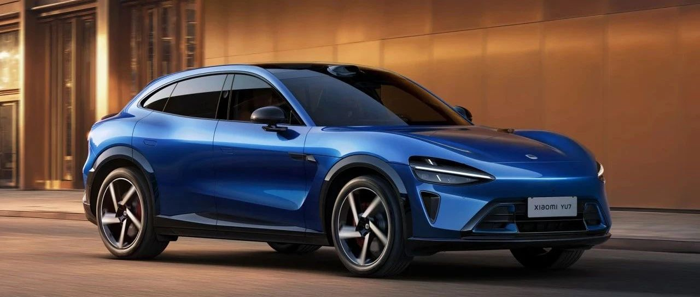

#  小米汽车答网友问（第166集）

[ 小米汽车 ](<javascript:void\(0\);>)

______

**01**

**我****锁单****小米YU7后又改变主意了，想改个配置，还有机会改配么？**

可以的。我们将在**7月6日上午10:00:00到7月7日晚上23:59:59** 开启限时改配活动。所有小米YU7非准现车的已锁单且未交付用户均可参与。在改配活动开始后，您可以在小米汽车APP中查看此次改配活动的详细规则。

我们强烈建议您在改配活动开始前，先到店体验实车，在充分了解小米YU7各个版本和选配，确定好心仪的车型配置之后，再考虑参与此次改配活动。

02

**此次改配活动的订单修改范围是什么？**

此次小米YU7限时改配活动仅限于在小米YU7标准版、Pro版和Max版之间进行版本修改，或对小米YU7订单的车漆、内饰、轮毂等选装项进行修改。感谢您的理解。

**0 3**

**我改配成功后，会重新计算****交付****时间么？**

由于改配会调整工厂的备料节奏和生产计划，您的订单改配成功后将重新参与排队，并重新计算车辆预计交付周期，更新后的预计交付周期将在小米汽车APP展示。我们也建议您谨慎考虑是否需要参与此次改配活动，感谢您的理解。

04

**小米YU7标准版和****Pro****版的手动调节方向盘会影响主驾零重力座椅的体验么？**

在7月31日24:00前下定，小米YU7全系车型都将赠送价值18000元的主、副驾零重力座椅；其不仅支持一键零重力功能，还配备了10点式按摩，能更有效地缓解驾驶疲劳。

您不用担心手动方向盘对主驾零重力座椅体验的影响。小米YU7的零重力座椅基于身高188cm的假人开发，且对人机工学体验做了充分验证，在一键零重力的系统默认位置下，即便方向盘调节至最低位置，假人膝部与方向盘最低点仍有余量。因此，即便将方向盘的位置调到最低，主驾零重力座椅也能满足绝大多数体型用户的需求**。** 如果您身材特别高大，为了保证您的驾驶安全及体验，我们建议您将方向盘调至合适的位置，而非最低。

在一键零重力状态下，座椅的靠背、座垫、腿托位置可进行自定义调节，以满足不同用户的喜好。您可将调节后的零重力座椅位置跟随账号保存记忆，下一次进入一键零重力时，座椅将自动调节至您上次保存的位置，非常方便。至于小米YU7 Max，则配备电动调节方向盘，进入一键零重力时，方向盘会自动向上、向前避让。欢迎您到店进行试驾体验！

05

**通过车外****小爱****打开小米YU7的前备箱，需要满足哪些条件？**

出于安全的考量，在车外通过小爱同学打开小米YU7的前备箱，需要同时满足以下三个条件：

  * 在车机中开启「车外语音唤醒」功能；

  * 蓝牙/数字钥匙位于车辆旁边；

  * 当车辆处于P档且车上无乘员时；

我们建议大家在使用车外小爱功能前，**通过车机中的「账号管理」完成声纹录入** 。录入后，只有当**声纹匹配，且检测到****蓝牙****/数字钥匙时** ，车辆才会执行车外语音指令。这样可以更完善的保障您的车辆安全，有效避免未授权的操作、意外触发及其他安全风险。该功能可以更完善地保障您的车辆安全，有效防止未经授权的操作、意外触发及其他安全风险。

同时，当检测到车内有人时，车辆会自动禁用车外语音功能，优先确保车内人员安全。当然，不仅是开关前备箱，其他车外语音的交互功能也都有以上安全保护机制，即使是家人误操作也无需担心。

06

**网上有人自称“小米汽车****交付****专员”，宣称可以提前交付车辆，是真的吗？**

如有收到类似短信，请大家切勿相信，更不要涉及金钱交易，以避免经济损失。涉及类似“提前交付”、“提前交付需转账给个人”或“支付插队费”等信息，请大家一定要仔细甄别。涉及交付周期的，请参考小米汽车APP展示的预计交付周期。为保护您的个人隐私，订单、手机号等个人隐私信息请注意不要发给他人或其他公开平台。

您的专属交付专员正在陆续建立企业微信交付群。当前订单量较大，请您耐心等待，感谢您的理解与支持！

  

  

  

< img alt="图片" class="rich_pages wxw-img" data-ratio="0.8824074074074074" src="https://mmbiz.qpic.cn/sz_mmbiz_png/UaK4PTh6Zpk2TaVLh0tUHxviapUIsTcXOFp1ATh7VRDuqnQr3V3oDvw9DodpJKDZDh0fV2YVzbrgHETVM5DzIqA/640?wx_fmt=png&from=appmsg&wxfrom=5&wx_lazy=1&wx_co=1" data-w="1080" style="visibility: visible !important;width: 350px !important;height: auto !important;" width="100%" data-imgqrcoded="1">

预览时标签不可点

微信扫一扫  
关注该公众号

继续滑动看下一个

轻触阅读原文

小米汽车 

向上滑动看下一个

[知道了](<javascript:;>)

微信扫一扫  
使用小程序

****

[取消](<javascript:void\(0\);>) [允许](<javascript:void\(0\);>)

****

[取消](<javascript:void\(0\);>) [允许](<javascript:void\(0\);>)

****

[取消](<javascript:void\(0\);>) [允许](<javascript:void\(0\);>)

× 分析

__

微信扫一扫可打开此内容，  
使用完整服务

： ， ， ， ， ， ， ， ， ， ， ， ， 。 视频 小程序 赞 ，轻点两下取消赞 在看 ，轻点两下取消在看 分享 留言 收藏 听过