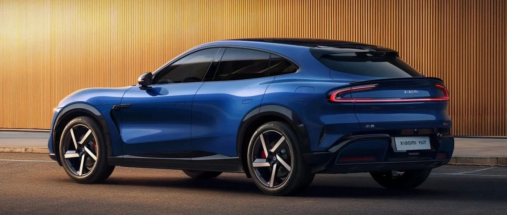

#  小米汽车答网友问（第168集）

[ 小米汽车 ](<javascript:void\(0\);>)

______

**01**

**小米YU7全车有哪些位置可以磁吸，如何在车内找到磁吸点？**

小米YU7全车设计了9处共16个隐藏式可磁吸点位，覆盖前后排常用区域，配合丰富的磁吸生态配件（如纸巾盒、眼镜盒、物理按键等），轻轻一吸即可顺手使用，非常方便。它们分别是：前备箱磁吸点、中控屏后方磁吸点、扶手箱后部磁吸点、B柱磁吸点、副驾座椅左侧磁吸点、前排阅读灯后方磁吸点、中控前部磁吸点、后排座椅右下方储物盒磁吸点（如下图）。您也可以直接通过询问小爱同学来了解具体磁吸点的位置。

  
02

**很喜欢磁吸物理按键，它在小米YU7车内所有的磁吸点上都能用么？**

为了有更好的体验，我们推荐您将物理按键装置在B柱磁吸点、副驾座椅左侧磁吸点或扶手箱后部磁吸点使用。

B柱磁吸点

副驾座椅左侧磁吸点

扶手箱后部磁吸点

除此之外，磁吸纸巾盒和磁吸眼镜盒我们建议您分别装置在中控屏后方磁吸点和中控前部磁吸点处，如下图。

中控屏后方磁吸点 - 磁吸纸巾盒

中控前部磁吸点 - 磁吸眼镜盒

以上推荐的磁吸点位，您均可以长时间或在行车过程中磁吸使用。还有一些临时磁吸推荐点，您可以在驻车场景下使用：

扶手箱后部磁吸点 - 临时磁吸纸巾盒

前排阅读灯后方磁吸点 - 临时磁吸眼镜盒

借此机会，我们温馨提示您，所有磁吸点位仅供吸附小米汽车官方提供的磁吸产品。所有可长时间磁吸的点位均经过实车测试，能保证车辆在正常行驶的情况下对应产品不脱落。而非官方出品的物品可能会在车辆行驶时因颠簸滑落或被甩出，引发潜在的安全隐患，请您务必注意。

**0 3**

**长时间使用磁吸产品，会在内饰上产生压痕么？**

您不用担心，因长时间磁吸产生的压痕属于正常现象，取下一段时间即可慢慢恢复。

**04**

**小米天际屏全景显示在****人机交互****体验上，到底有哪些特点？**

小米天际屏全景显示是一套全新的交互系统。它通过在前风挡下沿投射三块Mini LED屏幕实现全景显示，同时保持视野通透，视觉无遮挡，成本约为传统HUD的三倍。这套系统不仅有着沉浸式的显示效果，更通过多项创新技术带来了出色的清晰度与全新的人机交互体验。

小米天际屏全景显示有一套全新的座舱交互体验：仪表、多媒体、地图、时钟、能耗五类信息卡片可自由组合，充分满足您的个性化需求。当辅助驾驶开启时，仪表会切换为SR环境感知信息；当切换驾驶模式时，小米天际屏也会动态展示当前模式的动力总成和底盘高度信息；当转向灯开启时，盲区影像画面也将直接投射在天际屏上。

我们还将好评如潮的 3D 萌宠卡皮巴拉与水獭带到车内，出行路上两只萌宠随时陪伴。情绪稳定的卡皮巴拉墩墩不紧不慢地从桔子堆里登场，随着车辆转向，敦实的身躯缓缓摆动；可爱的小水獭嘤嘤跳跃着灵活入场，给大家表演绝活干洗脸，随着车辆转向，抓住屏幕表演獭式轻功等等。后续的OTA升级还会带来唤醒小爱时的萌宠旁听和跨屏互动等新功能，敬请期待。

总体而言，小米天际屏全景显示凭借先进的技术、出色的视觉交互体验以及丰富多样的个性化功能，为用户带来了更清晰、更便捷、更安全且充满趣味的驾驶体验。欢迎大家到店实车体验！

  

  

  

< img alt="图片" class="rich_pages wxw-img" data-ratio="0.8824074074074074" src="https://mmbiz.qpic.cn/sz_mmbiz_png/UaK4PTh6Zpk2TaVLh0tUHxviapUIsTcXOFp1ATh7VRDuqnQr3V3oDvw9DodpJKDZDh0fV2YVzbrgHETVM5DzIqA/640?wx_fmt=png&from=appmsg&wxfrom=5&wx_lazy=1&wx_co=1" data-w="1080" style="visibility: visible !important;width: 350px !important;height: auto !important;" width="100%" data-imgqrcoded="1">

预览时标签不可点

微信扫一扫  
关注该公众号

继续滑动看下一个

轻触阅读原文

小米汽车 

向上滑动看下一个

[知道了](<javascript:;>)

微信扫一扫  
使用小程序

****

[取消](<javascript:void\(0\);>) [允许](<javascript:void\(0\);>)

****

[取消](<javascript:void\(0\);>) [允许](<javascript:void\(0\);>)

****

[取消](<javascript:void\(0\);>) [允许](<javascript:void\(0\);>)

× 分析

__

微信扫一扫可打开此内容，  
使用完整服务

： ， ， ， ， ， ， ， ， ， ， ， ， 。 视频 小程序 赞 ，轻点两下取消赞 在看 ，轻点两下取消在看 分享 留言 收藏 听过