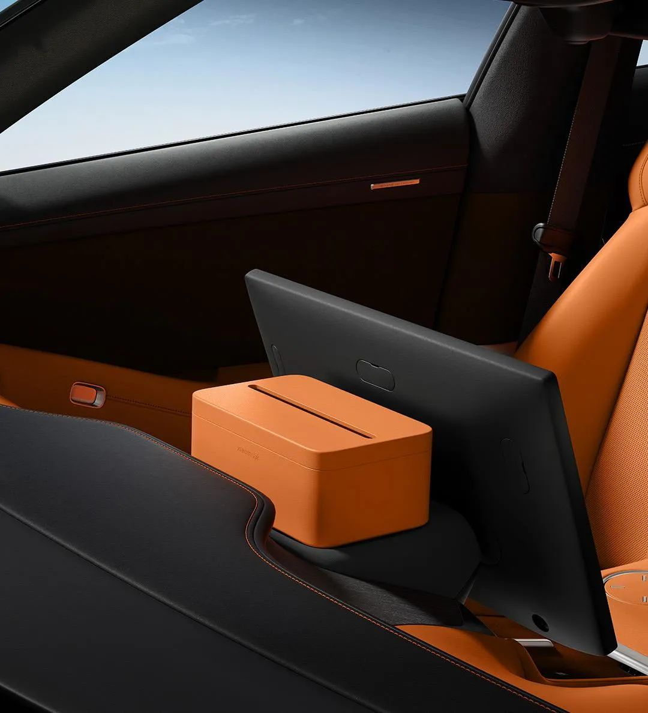
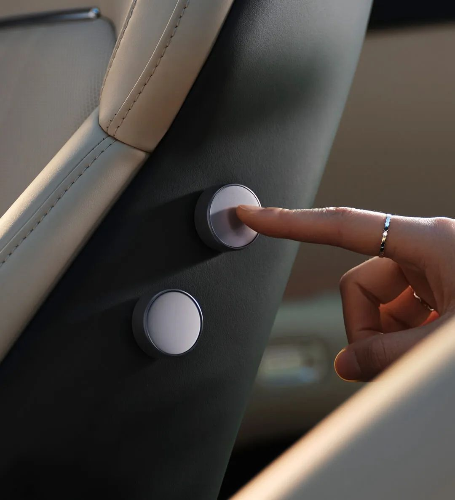
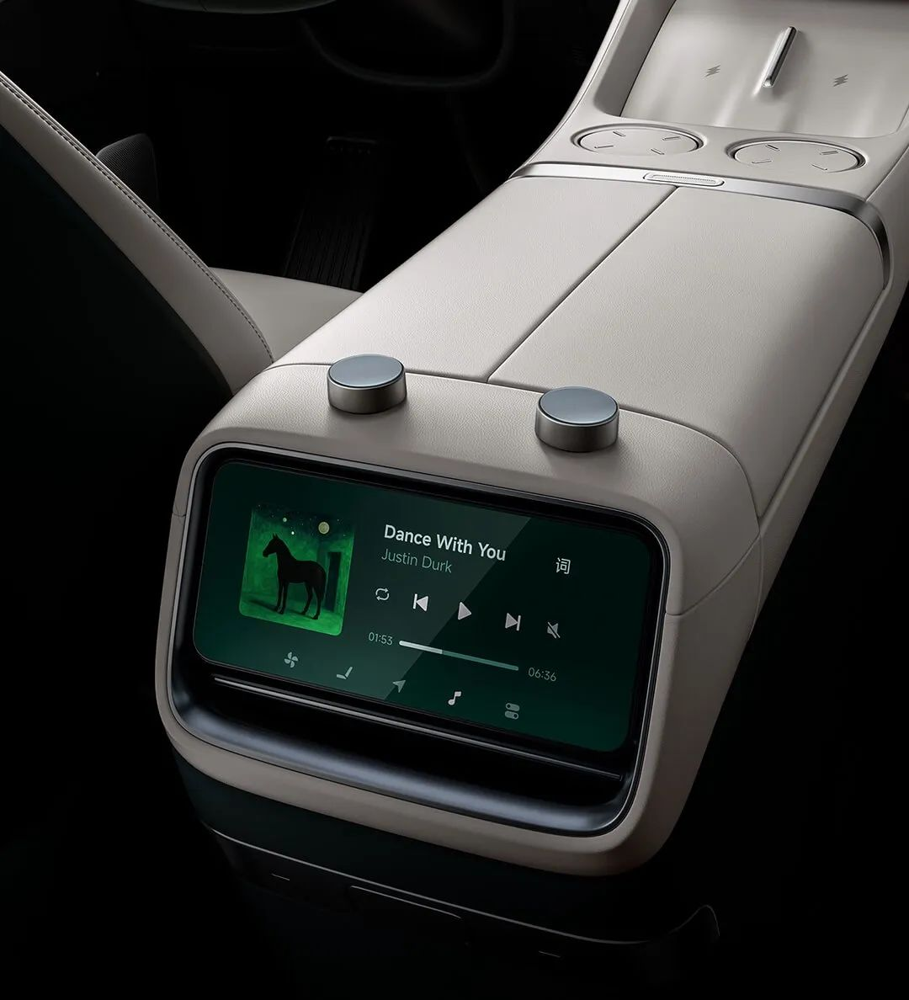
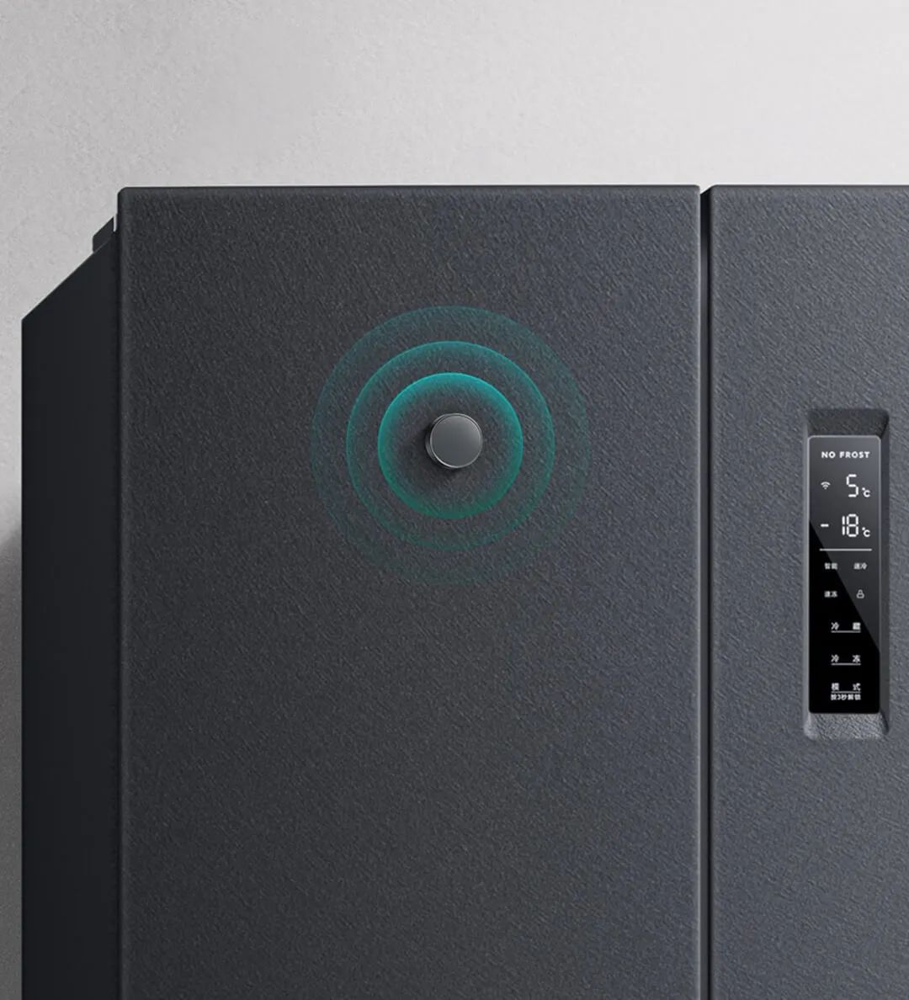
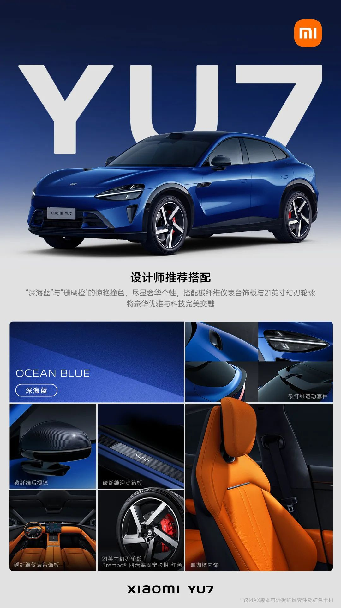
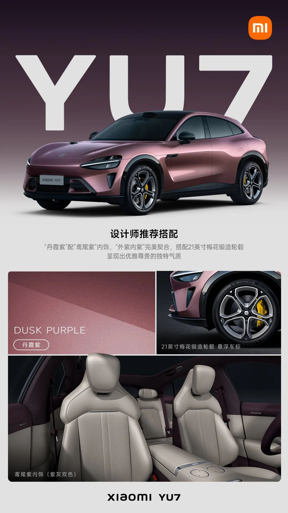
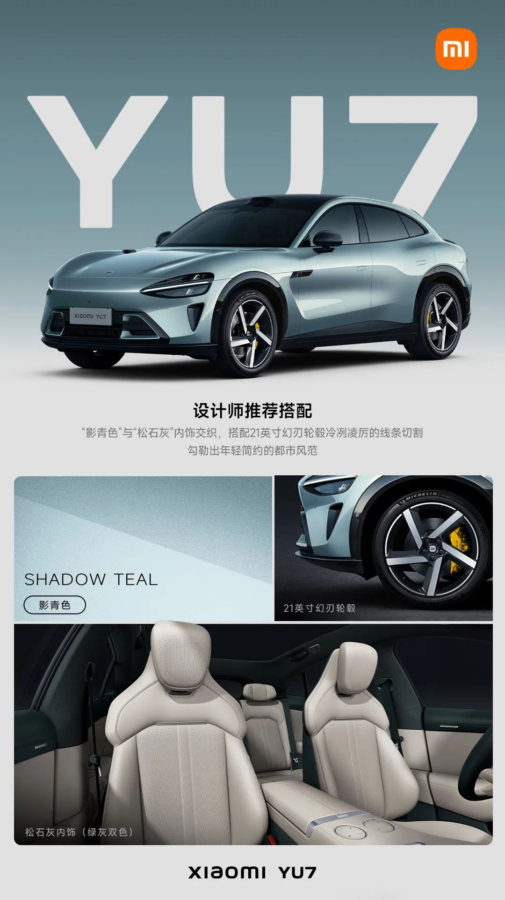
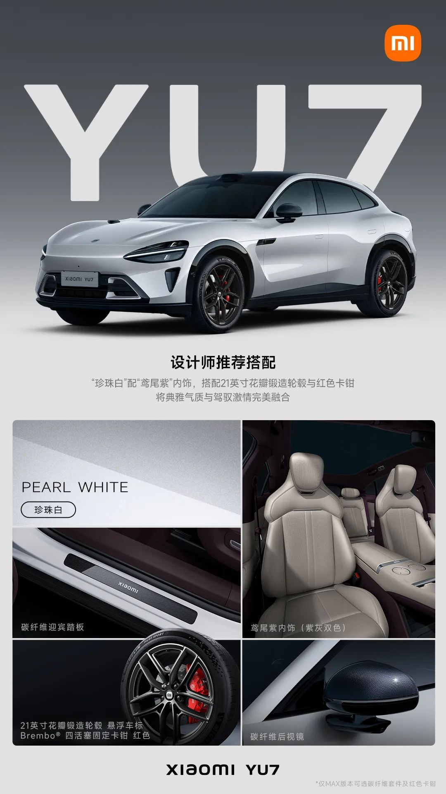

#  小米汽车答网友问（第169集）

[ 小米汽车 ](<javascript:void\(0\);>)

______

01

**Xiaomi Life车载磁吸纸巾盒，有什么特别之处吗？**

相比于普通纸巾盒，Xiaomi Life车载磁吸纸巾盒能够实现更加严格的车载环境可靠性要求，在材质选择，温度要求，抗老化等多个维度进行了专门的开发设计。

比如，为了方便主副驾驶乘客取用纸巾，我们在仪表台上设计了放置纸巾盒的凹槽。考虑到凹槽位置温度可能会在夏季长时间室外暴晒后达到90℃以上，我们特别对纸巾盒进行了专门开发，确保它能耐受高温，以及满足其他相关的性能要求。

首先，纸巾盒需要通过一系列严格的测试，包括耐长周期热老化、耐湿热老化、耐高低温交变、耐光老化，阻燃性能等，这对材料要求极高。更难的是，即使经历这些严苛环境后，它的外观和磁吸功能也必须保持正常。为了确保品质，我们甚至在最高温度高达100℃的环境下进行了热老化测试（模拟吐鲁番暴晒后仪表台的温度），结果依然表现良好。

其次，我们对纸巾盒的外观要求很高。虽然使用软质材料能大幅降低成本并通过所有性能测试，但它难以保持挺括的造型，会和仪表台利落的线条显得不协调。因此，我们选用了成本更高的半硬质材料。

最后，我们对磁吸力的要求也非常的高。普通牌号的磁吸磁铁在80℃左右就会开始退磁，而且磁力一旦消失就无法恢复。考虑到很多地区夏季暴晒后仪表台温度会达到这个临界点，我们特意选用了能耐受95℃高温的磁铁，这样该纸巾盒的成本也提高了不少。

**  
**

02

**磁吸物理按键，支持自定义哪些功能？**

磁吸物理按键可以实现全车上百种功能的一键操作，例如一键打开360全景影像、一键打开小憩模式、一键调节副驾驶座椅、一键打开除雾功能等。磁吸物理按键还支持单击/长按两种操作方式的功能自定义，一个按键可设置不同的控制功能，让车内的操控更有效率。

*左右滑动 查看更多

除此之外，磁吸物理按键还兼容米家loT产品，您可以轻松的在车内一键远程操控米家设备，例如在车内轻轻一点即可打开一键回家模式：亮起灯光、开好空调、合上窗帘等。您还可以将磁吸物理按键安装在家中的任何地方，如玄关、冰箱、床头，在家也能一键控车，提前打开空调/座椅通风等功能，上车既享舒适。更多场景和操控方式，等您来解锁！

**0 3**

**在行车过程中使用磁吸产品，有什么需要注意的么？**

在行车过程中使用磁吸产品，请您务必严格遵循《用户手册》及小米汽车APP商城产品详情页中指定的推荐安装位置并进行使用。官方推荐的每款磁吸产品及其对应的安装位置，都避开了安全气囊的区域，且都通过了严格的碰撞测试。其中标注为可长期使用的磁吸点位通过了实车耐久测试，确保在常规行驶条件下产品稳固可靠；而仅供临时使用的磁吸点位，则不建议长期吸附配件，以规避在极端路况下可能发生的脱落风险。请您严格区分并遵守不同点位的使用要求，以保障行车安全。

**04**

**小米YU7的外观和内饰颜色都太丰富了，有什么官方推荐的搭配建议么？**

我们给大家分享4套设计师的精心搭配，每一款都独具特色：

**「惊艳撞色」** ：深海蓝车漆与珊瑚橙内饰的惊艳撞色，珊瑚橙内饰门板中部材质升级为麂皮绒，表面细腻，触感柔软，显著提升内饰的豪华感和舒适性，尽显奢华个性。还可搭配多款碳纤维部件、21英寸幻刃轮毂和brembo红色卡钳，将豪华优雅与科技完美交融。

**「外紫内紫」** ：丹霞紫车漆配鸢尾紫内饰，外紫内紫完美契合，搭配21英寸梅花锻造轮毂，配备悬浮车标，行驶中始终保持向上，呈现出优雅尊贵的独特气质。

**「都市风范」** ：影青色车漆采用双层色漆工艺，当光影流转，车身呈现出青中泛白、白中透青的优雅感，与松石灰内饰交织，再搭配21英寸幻刃轮毂冷冽凌厉的线条切割，勾勒出年轻简约的都市风范。

**「典雅气质」** ：珍珠白车漆配鸢尾紫内饰，搭配21英寸花瓣锻造轮毂、悬浮车标和brembo红色卡钳，再加入碳纤维后视镜与碳纤维迎宾踏板，将典雅气质与驾驭激情完美融合。

还有更多来自设计师的推荐搭配，欢迎您登陆小米汽车APP - 购车页面进行查看。

*左右滑动 查看更多

  

  

  

< img alt="图片" class="rich_pages wxw-img" data-ratio="0.8824074074074074" src="https://mmbiz.qpic.cn/sz_mmbiz_png/UaK4PTh6Zpk2TaVLh0tUHxviapUIsTcXOFp1ATh7VRDuqnQr3V3oDvw9DodpJKDZDh0fV2YVzbrgHETVM5DzIqA/640?wx_fmt=png&from=appmsg&wxfrom=5&wx_lazy=1&wx_co=1" data-w="1080" style="visibility: visible !important;width: 350px !important;height: auto !important;" width="100%" data-imgqrcoded="1">

预览时标签不可点

微信扫一扫  
关注该公众号

继续滑动看下一个

轻触阅读原文

小米汽车 

向上滑动看下一个

[知道了](<javascript:;>)

微信扫一扫  
使用小程序

****

[取消](<javascript:void\(0\);>) [允许](<javascript:void\(0\);>)

****

[取消](<javascript:void\(0\);>) [允许](<javascript:void\(0\);>)

****

[取消](<javascript:void\(0\);>) [允许](<javascript:void\(0\);>)

× 分析

__

微信扫一扫可打开此内容，  
使用完整服务

： ， ， ， ， ， ， ， ， ， ， ， ， 。 视频 小程序 赞 ，轻点两下取消赞 在看 ，轻点两下取消在看 分享 留言 收藏 听过