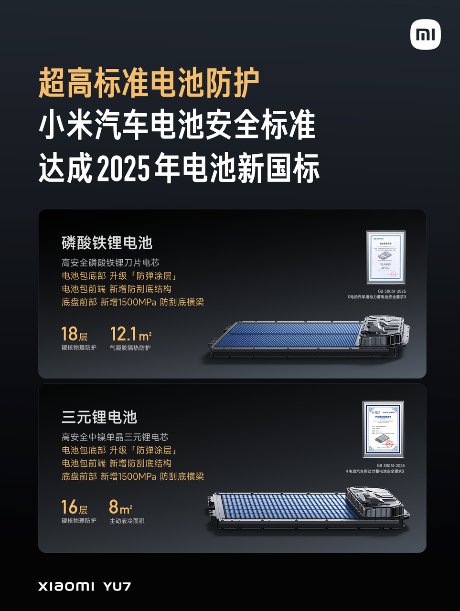
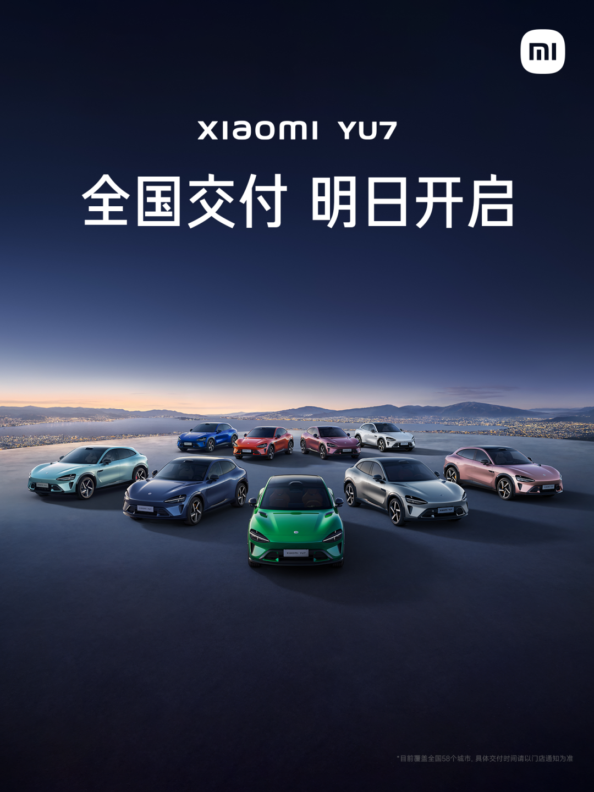

#  小米汽车答网友问（第170集）

[ 小米汽车 ](<javascript:void\(0\);>)

______

01

**小米YU7作为中国汽车耐力锦标赛的官方指定医疗车，主要有些什么任务？**

作为中国汽车耐力锦标赛（CEC）的官方指定医疗车，其要求和职责都远高于普通救援车辆。它必须要拥有媲美赛车的速度（通常基于高性能车改装而来），具备极速响应的能力；还需要具备复杂路况的通过能力，以应对砂石缓冲区、草地等特殊地形。然而小米YU7凭借其出色的性能表现和通过性足以胜任赛事医疗车的任务。

此次中国汽车耐力锦标赛（CEC），小米YU7肩负着保障赛事安全的核心使命。一旦赛场中发生意外事故，医疗车小米YU7将极速响应，争分夺秒地为受伤车手提供现场紧急救援，以最大程度挽救生命；同时，利用车上搭载的专业急救设备对伤者进行及时、专业的处置，有效减轻伤害并防止搬运或处置不当造成的二次伤害，稳定伤情。作为赛道上的移动急救站，小米YU7在赛道介入口严阵以待，随时准备介入处理危及人身安全的重大事故，是守护车手安全的坚实后盾和赛事圆满举办不可或缺的重要保障。

**  
**

02

**小米YU7在电池包防护方面做了哪些提升？**

小米YU7全系电池包在安全防护上采取了多项措施，硬核物理防护提升至16层及以上，达到行业领先水平。

比如在底部防护方面，我们构建了三重防线。首先，我们在底盘前部新增了强度达到1500MPa的防刮底横梁，能在行驶过程中先抵挡掉路面石块的撞击，为电池包提供了第一道防线；其次，我们在电池包前缘新增了防刮底结构，如在行驶中受到碰撞能够有效吸能，构成了电池包的第二道防线；同时小米YU7的电池包底部还升级采用了小米SU7 Ultra同款「防弹涂层」，当车辆底部遭遇刮蹭时，有效地吸收冲击能量，大大减少底部刮蹭对电池包造成的损伤，构筑起了电池包的第三道坚固防线。

值得一提的是，小米汽车所有车型电池包均坚持超高标准开发，小米SU7、小米SU7 Ultra、小米YU7电池均达成2025年电池新国标，请您放心。

**0 3**

**小米天际屏如何维护清洁？可以自己清理吗？**

如果您发现小米天际屏表面被脏污沾染，可以使用软布进行清洁并将其去除。请您放心，小米天际屏的缝隙设计及内部防护均经过严苛测试验证，日常浮尘不会影响其投影效果与使用寿命。

若遇特殊顽固污渍或对操作存有疑虑，可随时联系小米汽车授权服务中心，我们将为您提供专业支持。

**04**

**小米YU7什么时候开始****交付****？**

小米YU7将于明天（7月6日）在全国58个城市开启交付！再次感谢大家的支持，期待与大家相见！

  

  

  

  

< img alt="图片" class="rich_pages wxw-img" data-ratio="0.8824074074074074" src="https://mmbiz.qpic.cn/sz_mmbiz_png/UaK4PTh6Zpk2TaVLh0tUHxviapUIsTcXOFp1ATh7VRDuqnQr3V3oDvw9DodpJKDZDh0fV2YVzbrgHETVM5DzIqA/640?wx_fmt=png&from=appmsg&wxfrom=5&wx_lazy=1&wx_co=1" data-w="1080" style="visibility: visible !important;width: 350px !important;height: auto !important;" width="100%" data-imgqrcoded="1">

预览时标签不可点

微信扫一扫  
关注该公众号

继续滑动看下一个

轻触阅读原文

小米汽车 

向上滑动看下一个

[知道了](<javascript:;>)

微信扫一扫  
使用小程序

****

[取消](<javascript:void\(0\);>) [允许](<javascript:void\(0\);>)

****

[取消](<javascript:void\(0\);>) [允许](<javascript:void\(0\);>)

****

[取消](<javascript:void\(0\);>) [允许](<javascript:void\(0\);>)

× 分析

__

微信扫一扫可打开此内容，  
使用完整服务

： ， ， ， ， ， ， ， ， ， ， ， ， 。 视频 小程序 赞 ，轻点两下取消赞 在看 ，轻点两下取消在看 分享 留言 收藏 听过