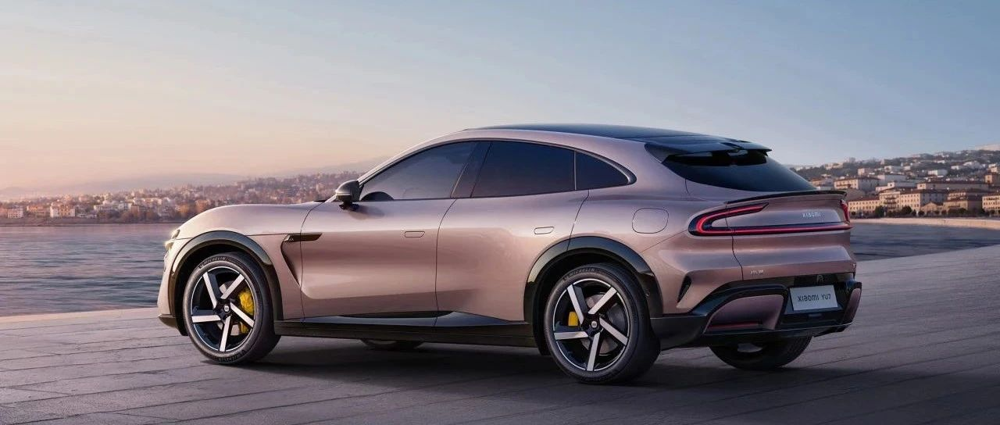
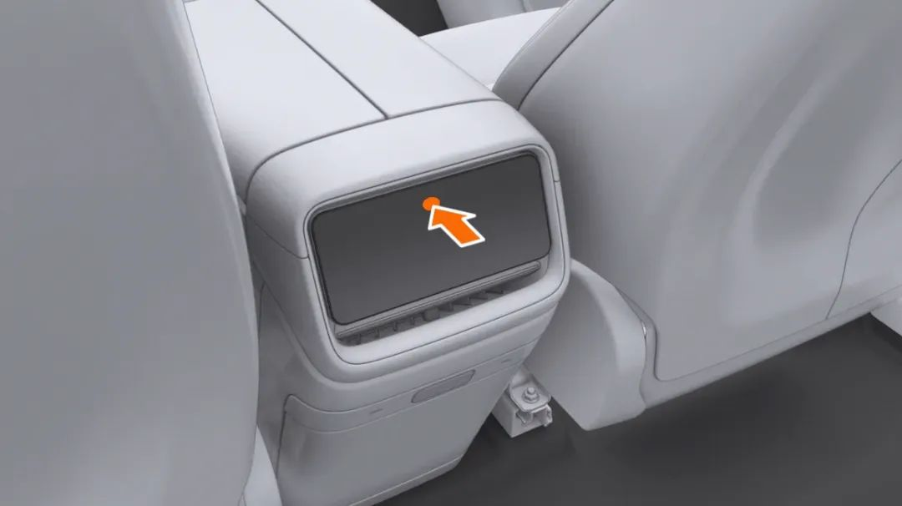
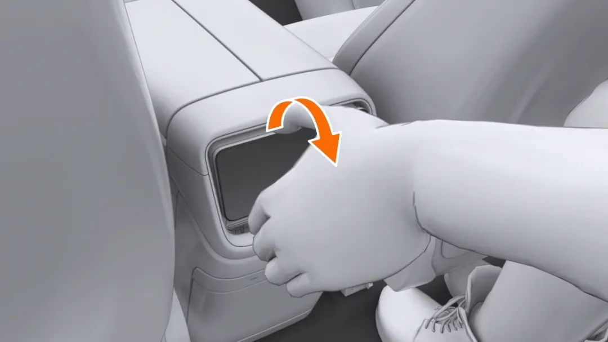
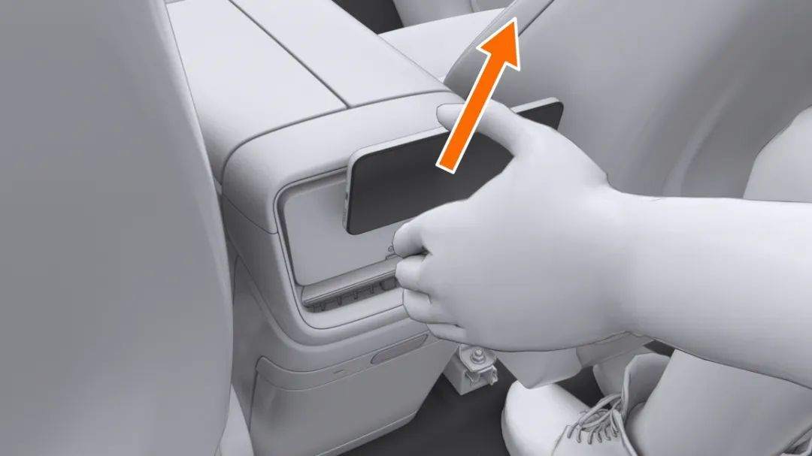
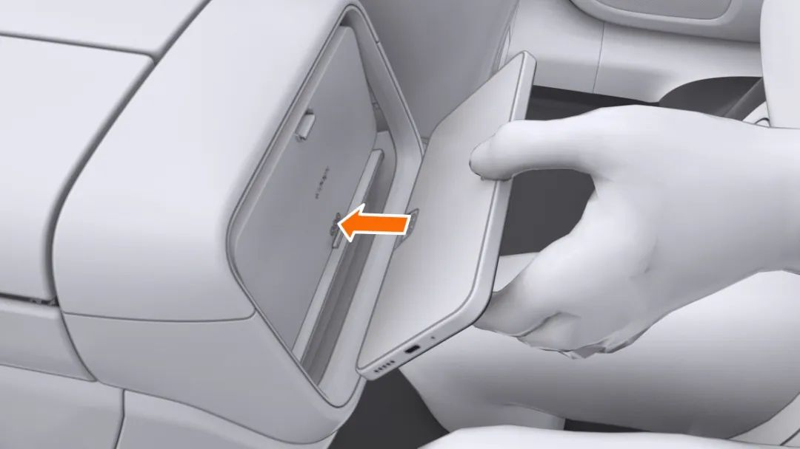
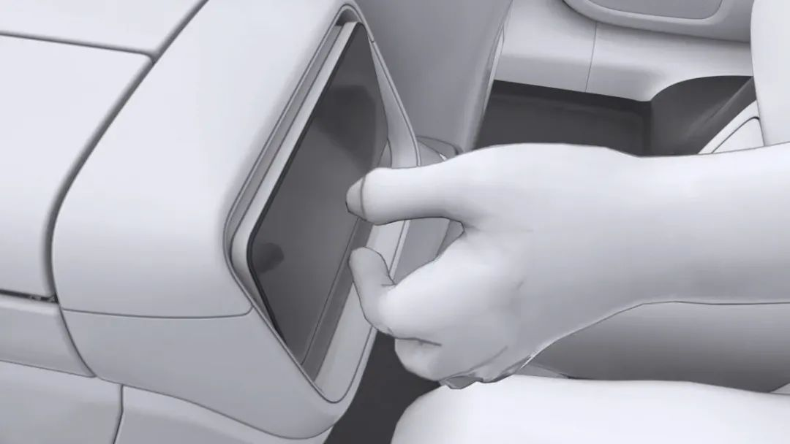
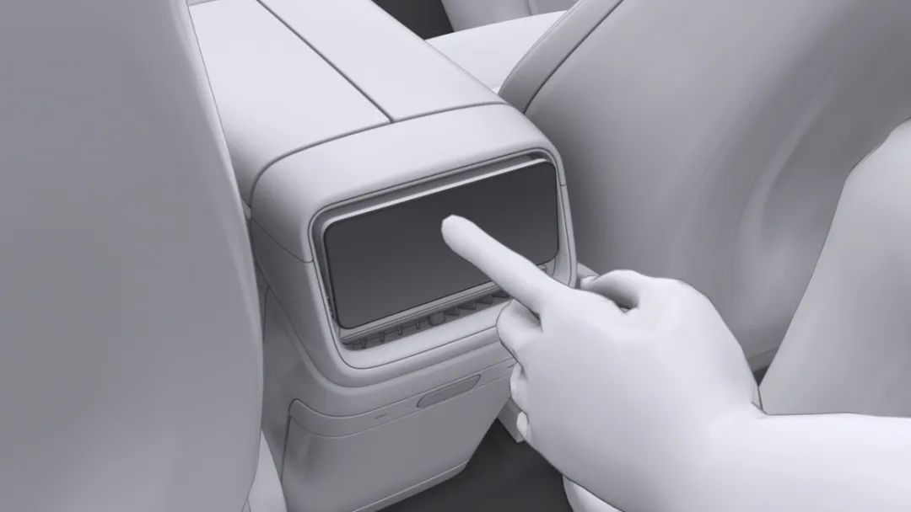

#  小米汽车答网友问（第171集）

[ 小米汽车 ](<javascript:void\(0\);>)

______

01

**我在小米****SU7****上辅助驾驶里程超过了1000km，现在又增购了一台小米YU7，我可以直接****激活****YU7上的辅助驾驶功能么？**

小米YU7出厂既搭载1000万Clips版小米端到端辅助驾驶系统, 满足以下条件即可在城区道路上使用该功能:

  * 若您的账号在原小米SU7上达到了1000km辅助驾驶安全里程，您可在小米YU7车辆交付时登录原账户，即可直接在城区使用HAD端到端辅助驾驶功能;

  * 对于未达到1000km辅助驾驶安全里程的账号，您的账号在任意小米汽车上都可累计辅助驾驶里程，达到1000km后即可自动开放城区HAD端到端辅助驾驶功能。届时，登录该账号后，您的小米YU7或SU7即可使用小米端到端辅助驾驶功能。

如您还有其他疑问，可通过小米汽车APP专属服务管家群获得更多信息。

02

**作为一款纯电车，小米YU7为什么会采用长车头的设计？**

小米YU7的长车头，兼顾美学与实用。我们认为美，首先来自于比例。小米汽车设计团队尊重百年汽车审美，通过长车头，赋予小米YU7更流线型、更具动感的姿态，同时又能与小米SU7的设计语言相呼应。

同时，小米YU7的长车头也兼具实用性。修长的车头使车辆受到正面碰撞时，有更多的溃缩缓冲空间，更安全。同时配合3.11㎡量产车最大蚌式铝机盖，带来了141L的超大前备箱，而且可选电动开合功能（7月31日24:00前下定将全系赠送），充分满足您的储物需求。

而在乘坐空间方面，您也无需担心。小米YU7拥有低趴优雅、极具运动感的豪华外观设计，同时还具有舒适宽敞的内部空间乘坐空间，3000mm的轴距以及仪表台轻薄设计，使后排的腿部空间、前排的乘坐空间表现优异，同时视野开阔。

另外，小米YU7的操控灵活性也很出色。小米YU7全系标配「可变转向比」，转弯半径仅为5.7米，在掉头、泊车等低速工况时更灵活，可实现三车道掉头一把过。同时配备360°全景影像、窄路辅助、低速防碰撞辅助、前向碰撞预警等功能，帮助您判断车辆与前方障碍物的距离。欢迎大家到店进行试驾体验！

**0 3**

**小米YU7****Pro****和Max版搭载了「闭式双腔****空簧****系统」，后期维修起来会很贵么？**

小米YU7 Pro和Max版搭载的「闭式双腔空簧系统」享有「5年/10万公里」的质保期，该质保与整车质保一致，您不用过多担心其维修问题。

小米YU7 Pro和Max版搭载的「闭式双腔空簧系统」，相比传统开式空悬系统来说，其综合调节速度更快，能耗更低，而且调节空簧产生的发热也更少，具备更高的可靠性。小米SU7 Ultra 搭载同样的「闭式双腔空簧」成功地通过了纽北赛道等极端环境下的测试，其品质经过了严苛的认证，您完全可以放心。

**04**

**小米YU7的后排移动控制屏应该如何正确拆装？**

小米YU7的后排配备了一块6.68英寸的移动控制屏，能够方便后排乘客操控导航、音乐、座椅、空调等功能，拿取和安装都非常简单。

拿下来很简单：您只需要轻轻按压屏幕上方，移动屏支架随即弹出，握住移动屏上下边缘，顶部外翻的同时，沿斜上方拿下后排移动控制屏即可（如下图所示）：

*左右滑动 查看更多

装回去也不难：先将移动屏下方接口嵌入抓钩，再将移动屏磁吸到位。最后轻轻按压一下，把移动屏支架扣回去锁好就行（如下图所示）：

*左右滑动 查看更多

  

  

  

  

< img alt="图片" class="rich_pages wxw-img" data-ratio="0.8824074074074074" src="https://mmbiz.qpic.cn/sz_mmbiz_png/UaK4PTh6Zpk2TaVLh0tUHxviapUIsTcXOFp1ATh7VRDuqnQr3V3oDvw9DodpJKDZDh0fV2YVzbrgHETVM5DzIqA/640?wx_fmt=png&from=appmsg&wxfrom=5&wx_lazy=1&wx_co=1" data-w="1080" style="visibility: visible !important;width: 350px !important;height: auto !important;" width="100%" data-imgqrcoded="1">

预览时标签不可点

微信扫一扫  
关注该公众号

继续滑动看下一个

轻触阅读原文

小米汽车 

向上滑动看下一个

[知道了](<javascript:;>)

微信扫一扫  
使用小程序

****

[取消](<javascript:void\(0\);>) [允许](<javascript:void\(0\);>)

****

[取消](<javascript:void\(0\);>) [允许](<javascript:void\(0\);>)

****

[取消](<javascript:void\(0\);>) [允许](<javascript:void\(0\);>)

× 分析

__

微信扫一扫可打开此内容，  
使用完整服务

： ， ， ， ， ， ， ， ， ， ， ， ， 。 视频 小程序 赞 ，轻点两下取消赞 在看 ，轻点两下取消在看 分享 留言 收藏 听过