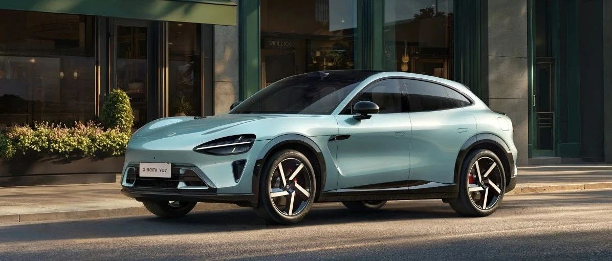

#  小米汽车答网友问（第172集）

[ 小米汽车 ](<javascript:void\(0\);>)

______

01

**小米YU7对于苹果生态的支持有些什么提升吗？**

小米YU7延续了小米SU7的设计理念，充分针对苹果用户优化用车体验，打造让苹果用户也能轻松上手的车型。

首先是iPhone控车更加便捷高效：

  * 支持UWB近场控车与iOS小组件远程控车，比如携带激活了UWB钥匙的苹果手机站在车前3秒，就能打开前备箱；

  * 也可以通过iPhone上的Action Button自定义车控功能，比如一键控车，比如解锁、闪灯鸣笛等；

  * 苹果手机在灵动岛也能够实时查看车辆充电状态；

  * 手机上打开小红书、大众点评等常用应用，在带有地址的帖子界面截图后，选择分享到小米汽车App，地址会被自动扫描识别并同步到车机，此时在车机端一键就能发起导航，轻松前往目的地。

  * 您只需将带有地址的截图分享至小米汽车APP，地址会被自动扫描识别并发送至车机，一键即可发起导航。

此外，用户在行车驻车时候，都能更好的享受苹果生态带来的便捷、丰富的体验：

  * 行车桌面支持将Apple CarPlay添加为桌面卡片，可自由调节到合适的位置和大小，能够1/3、2/3屏或全屏展示；

  * 车机还适配了Apple Music，也支持添加到桌面，可以便捷选择常听和喜欢的音乐；

  * Apple Watch也支持独立控车，可以快速解锁、打开空调，还可以查看停车照片，五个方位的视角图片都能够放大缩小；

  * 后排也可以接入 iPad，连接小米汽车APP后就能够轻松便捷的控车。

02

**连续****阻尼****可变减振器是干啥的？有啥优势？**

小米YU7全系标配连续阻尼可变减振器，它主要负责吸收来自路面的冲击，和在悬架弹簧受到冲击压缩后“拉住弹簧”，从而不产生多余车身晃动，带来更高的舒适性。

相较于传统液压减振器，连续阻尼可变减振器优势通过增加相应的电磁阀，改变减振器油液流量，达到减振器软硬可调的效果，就像瞬间拉动不同直径大小的注射器，大针孔流量大，需要的力越小对应越软，反之需要的力越大越硬，面对多种路面都能实现更强的适应性。欢迎您到店进行试驾体验！

**0 3**

**小米YU7的19英寸钻石****轮毂****和20英寸光环轮毂为什么采用封 闭式的设计？有什么好处？**

小米YU7的19英寸钻石轮毂采用低风阻设计，使风阻降低5 Counts，助力小米YU7的风阻系数低至0.245，获得优异的能耗表现。20英寸光环轮毂也采用低风阻设计，在保证能耗优秀的同时，9色车身都可以选择同色轮毂，使整车搭配更和谐。

之所以采用封闭式设计，是因为轮毂的辐条结构在旋转时，会切割空气产生大量湍流和涡流，而封闭式轮辋平整度更高、开口率更低，旋转产生的涡流就更低；其次，封闭式轮辋平整的表面可以帮助前保侧面的气流更快速流向车尾，减少外部气流与轮腔气流的互相干扰，进而降低风阻系数。钻石轮毂在设计时，还巧妙地预留了开口，兼顾刹车散热的同时，风阻性能堪比全封闭状态。

除了以上两款主打低风阻的轮毂外，小米YU7还提供4款轮毂供大家选择。20英寸旋涡轮毂彰显运动气息；21英寸幻刃轮毂线条凌厉；21英寸花瓣、21英寸梅花两款锻造轮毂，兼顾轻量化与高强度，还配备悬浮车标，彰显豪华感。大家可以根据自己的需求选择不同的轮毂。

**04**

小米YU7的提车礼盒里都包含哪些东西？

小米YU7的提车礼盒包含一顶棒球帽、一个专为小米YU7夹层玻璃设计的专用破窗锤、一副非偏振光墨镜以及一个用于行车记录仪的U盘。其中，破窗锤采用了5mm钨钢破窗尖，轻巧易握，可有效击破夹层玻璃；同时它还内置安全带割刀，在危急时刻可快速割断安全带。而非偏振光墨镜能在有效遮阳的同时，确保您观看小米天际屏时画面清晰无干扰。

  

  

  

< img alt="图片" class="rich_pages wxw-img" data-ratio="0.8824074074074074" src="https://mmbiz.qpic.cn/sz_mmbiz_png/UaK4PTh6Zpk2TaVLh0tUHxviapUIsTcXOFp1ATh7VRDuqnQr3V3oDvw9DodpJKDZDh0fV2YVzbrgHETVM5DzIqA/640?wx_fmt=png&from=appmsg&wxfrom=5&wx_lazy=1&wx_co=1" data-w="1080" style="visibility: visible !important;width: 350px !important;height: auto !important;" width="100%" data-imgqrcoded="1">

预览时标签不可点

微信扫一扫  
关注该公众号

继续滑动看下一个

轻触阅读原文

小米汽车 

向上滑动看下一个

[知道了](<javascript:;>)

微信扫一扫  
使用小程序

****

[取消](<javascript:void\(0\);>) [允许](<javascript:void\(0\);>)

****

[取消](<javascript:void\(0\);>) [允许](<javascript:void\(0\);>)

****

[取消](<javascript:void\(0\);>) [允许](<javascript:void\(0\);>)

× 分析

__

微信扫一扫可打开此内容，  
使用完整服务

： ， ， ， ， ， ， ， ， ， ， ， ， 。 视频 小程序 赞 ，轻点两下取消赞 在看 ，轻点两下取消在看 分享 留言 收藏 听过