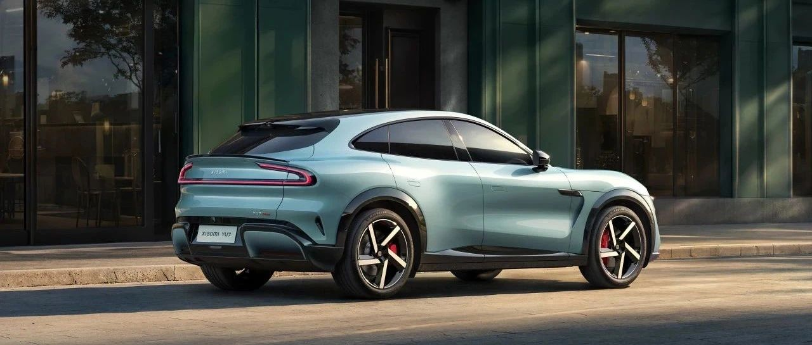
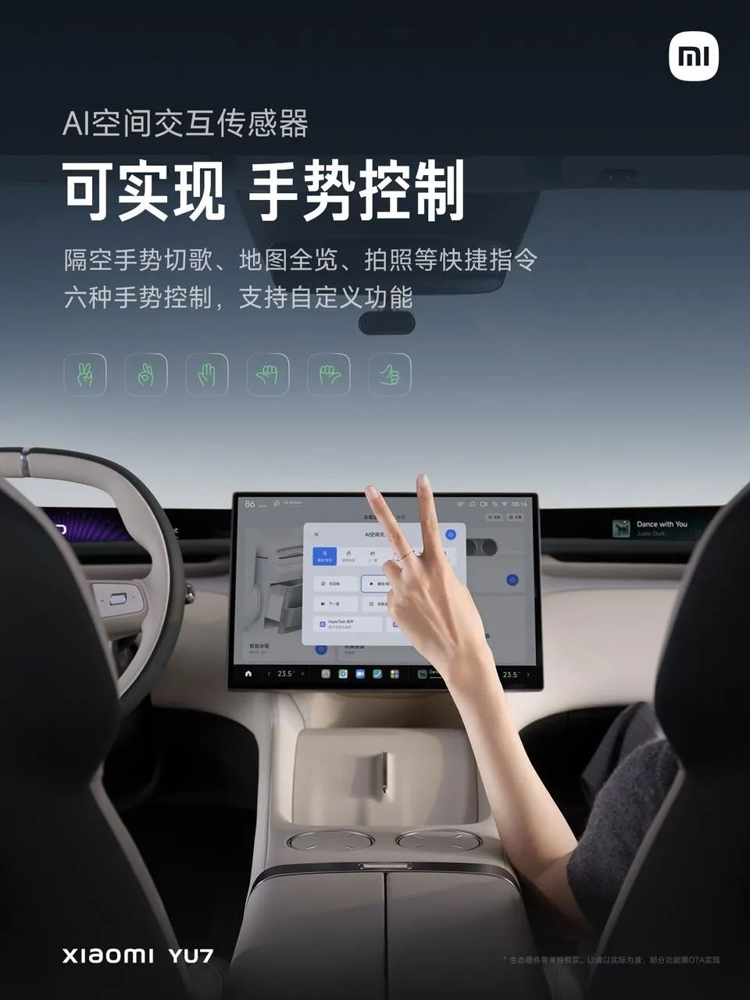

#  小米汽车答网友问（第174集）

[ 小米汽车 ](<javascript:void\(0\);>)

______

01

**刚提了小米YU7，还有必要给车窗贴隔热膜么？**

车辆想要做好防晒和隔热，最核心的在于天幕、前风挡的表现，因为这两块玻璃受到阳光直射，且面积最大：

  * 小米YU7全系车型前风挡采用夹层玻璃+三层镀银工艺，紫外线隔绝率达到99.5%、红外线隔绝率达到97.6%。

  * 小米YU7标准版、Pro版的天幕同样为夹层玻璃，并采用双层镀银工艺，紫外线隔绝率达到99.9%、红外线隔绝率达到99.1%。小米YU7 Max更是配备最新一代EC调光天幕，不仅实现99.85%的最大遮光率，还能达到99.9%的紫外线、红外线隔绝率，隔热能力更进一步。

而小米YU7全系车型四门车窗也标配夹层玻璃，紫外线隔绝率均达到99.9%；前门窗红外线隔绝率为77.23%，后车窗因采用隐私玻璃，红外线隔绝率提升至80.09%。

小米YU7也进行过高温暴晒测试，经过38℃暴晒1.5小时，车内温度甚至比一些配备物理遮阳帘的车型还要低。因此，小米YU7玻璃的防晒隔热性能已经相当出色，满足大部分用户的需求，因此您可以考虑不用额外贴膜。

此外，为提升舒适性，小米YU7还配备「车内高温保护」功能，若车辆在户外暴晒，您可在「设置>服务>车内高温保护」中点击开启该功能，车辆将通过监测车内温度，自动开启空调，以降低车内温度。具体操作及注意事项，您可在用户手册中查看。您也可在小米汽车APP中远程开启空调，或预约开启空调，以便在上车时有舒适的座舱温度。

02

**小米YU7的前机盖风道，下雨的时候会向机舱漏水么？**

您无需担心，小米YU7的机盖风口在设计之初，就考虑到了雨天前备箱的防水问题。当雨水进入前机盖风道口后，会通过美化板内的漏水孔直接排出；同时，前备箱也配备了整圈密封条，可以进一步保护前备箱内的物品。

此外，小米汽车的每一辆新车在下线前，都会经过严苛的淋雨测试，测试标准为10倍暴雨量，使车辆能在各种天气条件下正常运行，为所有小米汽车车主都提供更加安全、可靠的驾驶体验。

**0 3**

**我的小米YU7快要提车了，在****交付****中心提车大概会分为哪些步骤？办理提车手续大概要多长时间？**

您的提车将分为3个步骤：①前置手续准备→②预约到店提车→③现场提车办理

**1.前置手续准备**

**负责交付的同事将提前与您确认提车信息并协助办理，包含但不限于：订单及配置、付款方式（分期/全款）、保险服务、车务办理、充电桩及置换需求、提车城市等。**

**2.预约到店提车**

在您车辆下线后，我们将帮您预约到店时间和登记随行人员；等到车辆完成到店检测后，我们会再次与您确认到店时间，并完成行前提醒。

请务必携带以下资料：

①个人用户：身份证原件/授权委托书（如非本人提车）；

②企业用户：营业执照副本原件/公章/提车人身份证原件/授权委托书。

**3.现场提车办理**

**提车当日，请您准时到达交付中心，我们将协助您完成车辆交付全部步骤:①车辆查验→②功能讲解→③临牌办理→④资料交接→⑤提车返程。**

在店等待时长可参考：①手续前置已完成情况下20-30分钟；②未前置办理情况下需要45-90分钟。

我们温馨提示您**，** 目前工厂产线能力和全国销交服体系能力都在提升爬坡中，大家不用着急，我们会定期为您同步订单的交付进度，请您耐心等待。并请注意，提车通知仅以官方渠道通知为准，请勿相信非官方信息。

**04**

**小米YU7的「****AI****交互传感器」能识别多种手势，感觉挺有趣的，具体能实现哪些功能？**

小米YU7在智能交互体验上有很多有趣的玩法，「AI交互传感器」就是其中之一，可识别手势，进行快捷操作。

「AI交互传感器」目前支持识别6种手势，可以分别设置不同的快捷操作，比如握拳大拇指向左、向右，即可直接执行“播放上一首、播放下一首”。

Xiaomi另外，每种手势还可以联动小米超级任务HyperTask，进行单个功能操作，或者任务场景执行，非常方便快捷。假设您设置了一个小米超级任务：一键打开车内所有灯光，包括氛围灯和全车阅读灯；那么您就可以用「比耶」手势作为触发动作，在昏暗的停车场里查找车内物品时，比个耶就可以轻松打开所有灯光了。

手势识别的结果会通过中控屏的「智能状态显示」反馈给您，比如当您做出「握拳大拇指向左」手势，中控屏上方中央位置区域会显示识别到的手势，并伴随简洁的文字提示（如 “上一首”），清晰直观地展示系统已识别并响应了您的操作。

  

  

  

  

< img alt="图片" class="rich_pages wxw-img" data-ratio="0.8824074074074074" src="https://mmbiz.qpic.cn/sz_mmbiz_png/UaK4PTh6Zpk2TaVLh0tUHxviapUIsTcXOFp1ATh7VRDuqnQr3V3oDvw9DodpJKDZDh0fV2YVzbrgHETVM5DzIqA/640?wx_fmt=png&from=appmsg&wxfrom=5&wx_lazy=1&wx_co=1" data-w="1080" style="visibility: visible !important;width: 350px !important;height: auto !important;" width="100%" data-imgqrcoded="1">

预览时标签不可点

微信扫一扫  
关注该公众号

继续滑动看下一个

轻触阅读原文

小米汽车 

向上滑动看下一个

[知道了](<javascript:;>)

微信扫一扫  
使用小程序

****

[取消](<javascript:void\(0\);>) [允许](<javascript:void\(0\);>)

****

[取消](<javascript:void\(0\);>) [允许](<javascript:void\(0\);>)

****

[取消](<javascript:void\(0\);>) [允许](<javascript:void\(0\);>)

× 分析

__

微信扫一扫可打开此内容，  
使用完整服务

： ， ， ， ， ， ， ， ， ， ， ， ， 。 视频 小程序 赞 ，轻点两下取消赞 在看 ，轻点两下取消在看 分享 留言 收藏 听过