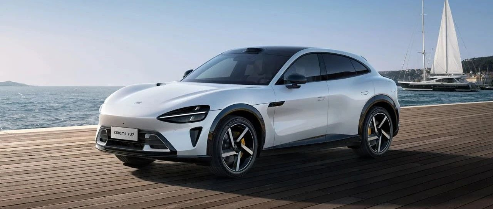
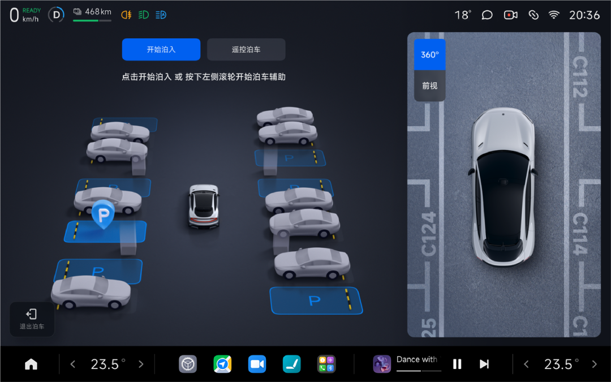
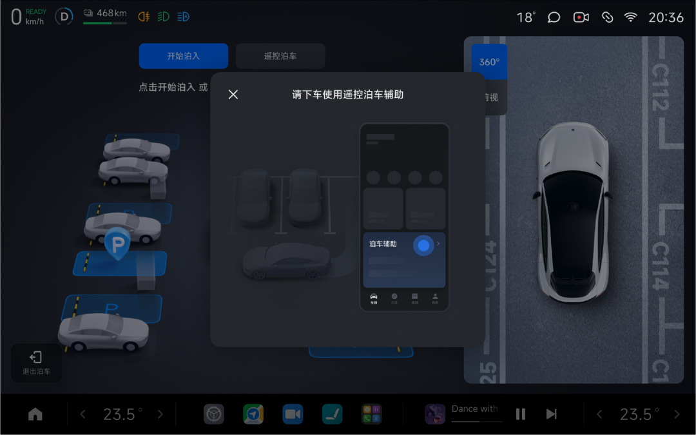

#  小米汽车答网友问（第176集）

[ 小米汽车 ](<javascript:void\(0\);>)

______

01

**小米YU7的几种驾驶模式有什么区别？哪种比较好上手？**

小米YU7最高支持5个主驾驶模式和5个场景模式，支持动力响应、转向手感、悬架软硬/高低等多类参数可调，以满足不同用户的驾驶习惯以及驾驶场景需求。

对于大部分用户来说，我们推荐以下5个主驾驶模式，一键即可轻松切换小米YU7的5种不同「性格」：

  * 「舒适」：如果您更关注驾乘舒适性，请选择「舒适」驾驶模式。这一模式下，动力相当于3.0T豪华SUV的动力水平。此时动力响应柔和、易于控制，转向手感轻盈、悬架柔软，在日常通勤中给与驾驶员和乘客更柔和、舒适、安心的驾驶感受，同时兼顾节能表现。

  * 「运动」：如果您想兼顾运动和舒适，可以切换至「运动」驾驶模式。该模式下，动力输出可达4.0T高性能跑车水准，在保障日常驾驶舒适性的同时，充分满足快节奏驾驶需求。

  * 「运动+」：如果您偏爱更纯粹的驾驶感受，「运动+」驾驶模式可解锁更强动力。这一模式下，当您按下Boost按钮，YU7 Max 0-100km/h加速最快仅需3.23秒；同时车辆悬架高度降低，并调至最硬，弯道性能更强；该模式下，电子稳定控制系统介入程度降低，将赋予驾驶者更大的操控自由度，但对驾驶技术要求极高。我们强烈不建议您在湿滑路面上使用该驾驶模式。

  * 「经济」：如果当下您想要更长的续航，请使用「经济」驾驶模式。这是个性化M1的默认预设模式，动力以低电耗为目标进行标定。这一模式下，动力输出为374PS，在保持够用动力的前提下，尽量为您提供更长续航。

  * 「新手」：如果您刚拿驾照没多久，不妨用「新手」模式过渡一下。这是个性化M2的默认预设选项，该模式以降低新手或新车主上手难度为目标，动力输出调整为210PS，相当于2.0L-2.5L自然吸气SUV的动力水平，最大程度降低驾驶难度，以方便您快速适应并上手您的新小米YU7。  

此外，针对电量不足、晕车、雪地与湿滑路面、轻度越野等典型用车场景，我们还开发了「超级省电」、「晕车舒缓模式」、「雪地模式」和「越野辅助」等场景模式，您可按需选择。

02

**小米YU7的后备箱采用一根电动支撑杆的设计方案，这是什么样的考量？**

小米YU7全系标配电动尾门，并采用了单电动撑杆+平衡杆的组合设计方案。二者协同工作，共同支撑和控制尾门的开启与关闭，以确保尾门能平稳升降并保持在所需位置。

我们根据小米YU7的尾门尺寸和重量进行初步选型，并通过精密的运动力矩匹配计算对方案进行设计和验证，确保其功能可靠、体验流畅，最终确定了该方案。这也是行业内非常成熟并广受采纳的设计方案。此外，尾门也经过了高温、低温、高湿，上下坡等多种工况多轮次多样本的开闭耐久验证和滥用测试，全面保障了其长期使用的可靠性。

您可以通过尾门处实体按键、小米汽车APP、遥控钥匙、车内中控屏、UWB钥匙、车内外小爱同学等多种方式方便地打开小米YU7的电动尾门。小米YU7拥有678L的后备厢空间，后排座椅放倒后，可以扩展至1758L，充分满足您的储物需求。欢迎您到店进行实车体验！

**0 3**

**小米YU7随车附赠的车机流量有限制么？如果不够，可以额外 购买么？**

小米YU7全系车型随车赠送时长为三年，每个月流量上限为15GB双卡数据流量。小米YU7配备了双5G双待双通的蜂窝网络通信，搭载中国电信和中国移动双5G移动物联网卡，确保您在不同网络环境下都能获得稳定、高速的连接体验。

  * 流量赠送期内，每个月两张卡累计超过15GB流量使用后，流量关停。

  * 流量赠送期结束后可以通过小米汽车APP商城--用车服务购买「车载网络服务包」，**车载网络服务包（365天使用权）定价为199元** ，**车载网络服务包（31天使用权）定价为19.9元 。**购买的车载网络服务包为双卡通用，**无限流量** 。即每年花费199元或每月花费19.9元即可继续享用无流量上限的双5G双待双通的蜂窝网络通信。

  * 流量赠送期内觉得流量不够用的用户也可进行车载网络服务包付费升级，届时您将获得不限流量的双5G双待双通的蜂窝网络通信服务。

在数据流量使用方面，您可以在中控屏下方控制栏打开**设置** ，进入**车辆设置 >默认****运营商** ，对蜂窝网络主卡运营商进行设定。

  * 选择**中国电信** 或**中国移动** ，系统将中国电信或中国移动作为默认蜂窝数据流量卡，蜂窝业务将通过此卡进行数据通信，当系统探测到此通信卡网络信号或通信质量较差时，会自动切换到另一张信号较好的卡，以保证网络通信质量。

  * 选择**智能双卡** ，系统将对蜂窝网络状态进行监控，自动选择网络信号或通信质量较优的卡进行数据通信，并根据网络环境波动情况进行动态调整。

**04**

**如何开启小米YU7的****遥控泊车辅助****功能？**

小米YU7全系标配的遥控泊车辅助功能包括遥控泊入/出辅助和直线移车辅助两个功能，可以实现驾驶员在车外一定距离内使用蓝牙设备监管和控制车辆泊车。**  
**

**遥控泊入辅助**

  * 进入泊车辅助功能，踩下制动踏板，点击选择想要泊入的车位后，点击**遥控泊车** 并下车使用遥控泊车辅助。

  * 打开手机小米汽车APP进入**车辆 >泊车辅助**，点击**开始泊入** ，同时保持应用处在前台界面，即可开始遥控泊车。

  * 车辆泊入过程中需要时刻注意周边环境，如果遇到危险时，需要您及时在手机屏幕上点击暂停。也可以进行手机锁屏、关机或打开车门等方式暂停泊车。

  * 泊入完成后，车辆会自动上锁。

**遥控泊出辅助**

  * 打开手机小米汽车APP进入**车辆 >泊车辅助>遥控泊车**，点击**开始泊出** ，同时保持应用处在前台界面，即可开始遥控泊车。

  * 车辆泊出过程中需要时刻注意周边环境，如果遇到危险时，需要您及时在手机屏幕上点击暂停。也可以进行手机锁屏、关机或打开车门等方式暂停泊车。

**直线移车辅助**

  * **打开手机小米汽车APP进入****车辆 >辅助驾驶>直线移车辅助**。

  * 长按对应按键，进行车辆直线前进或后退。

更多有关遥控泊车辅助功能的开启条件，您可在用户手册中查看。

**05**

**HEPA****高效空气净化系统多久需要换一次滤芯？**

小米YU7可选配HEPA高效空气净化系统（在7月31日24:00前下定将全系赠送），在正常用车使用环境，我们建议您每年或每行驶2万公里更换一次滤芯即可，具体您可到店以售后评估为准。

HEPA高效空气净化系统在常规空调滤芯基础上，额外增加了2个初滤滤芯、2个HEPA滤芯，其中HEPA滤芯具备纳米微孔防护层，过滤效果最强；经测试，HEPA滤芯对0.05~0.3μm的颗粒物过滤效率＞99.95%，对金黄色葡萄球菌、甲型流感病毒、H1N1等细菌、真菌、病毒也达到＞99.99%的过滤效率，有效阻隔外界污染颗粒物进入座舱。此外，小米YU7还提供深度空气净化功能，最快35s实现全车快速换气，始终为座舱提供健康、清新的空气。

  

  

  

  

< img alt="图片" class="rich_pages wxw-img" data-ratio="0.8824074074074074" src="https://mmbiz.qpic.cn/sz_mmbiz_png/UaK4PTh6Zpk2TaVLh0tUHxviapUIsTcXOFp1ATh7VRDuqnQr3V3oDvw9DodpJKDZDh0fV2YVzbrgHETVM5DzIqA/640?wx_fmt=png&from=appmsg&wxfrom=5&wx_lazy=1&wx_co=1" data-w="1080" style="visibility: visible !important;width: 350px !important;height: auto !important;" width="100%" data-imgqrcoded="1">

预览时标签不可点

修改于

微信扫一扫  
关注该公众号

继续滑动看下一个

轻触阅读原文

小米汽车 

向上滑动看下一个

[知道了](<javascript:;>)

微信扫一扫  
使用小程序

****

[取消](<javascript:void\(0\);>) [允许](<javascript:void\(0\);>)

****

[取消](<javascript:void\(0\);>) [允许](<javascript:void\(0\);>)

****

[取消](<javascript:void\(0\);>) [允许](<javascript:void\(0\);>)

× 分析

__

微信扫一扫可打开此内容，  
使用完整服务

： ， ， ， ， ， ， ， ， ， ， ， ， 。 视频 小程序 赞 ，轻点两下取消赞 在看 ，轻点两下取消在看 分享 留言 收藏 听过