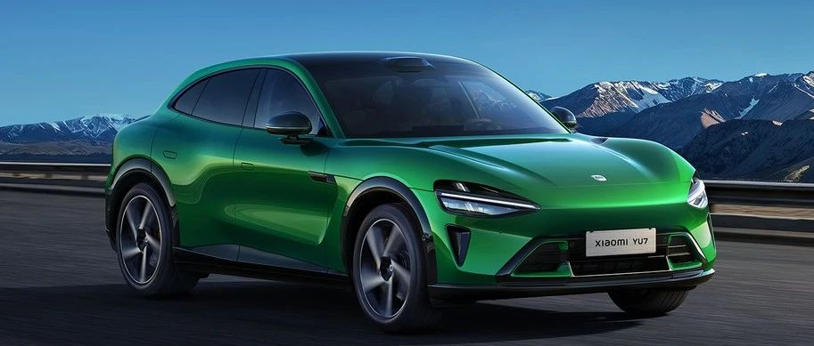

#  小米汽车答网友问（第180集）

[ 小米汽车 ](<javascript:void\(0\);>)

______

01

**我看到Ultra Club最近组织去了****纽北****的活动，我也想参加，要怎么报名？**

这是Ultra Club的独家官方活动。如果您是Ultra Club会员，您可随时关注小米汽车APP中的Ultra Club专区，后续的专属活动招募都将在该专区发布。

Ultra Club是专属于小米SU7 Ultra车主的会员俱乐部，入会后您将获得专属的会员身份标识，并享受到一站式赛道服务，如免费整备服务、免费存胎、免费赛道救援、赛道耗材88折，还可以参加「独家官方活动」，如德国纽北赛道之旅等。近日，Ultra Club赛道服务权益还完成了全新升级，升级内容涵盖服务城市数量、轮胎存储服务等方面。更多详情您可咨询Ultra Club专属顾问，或登录小米汽车APP进行查询。

02

**小米YU7有这么多空调模式，该怎么用？**

小米YU7空调提供诸多实用的功能设置，今天为大家介绍几项常用的：

吹风模式设置：在空调主页面，「A/C」右侧是「自然风」模式开关。开启「自然风」模式，车辆前后排空调出风口将自动调节风速，相比普通模式的恒定风速，该模式模拟了大自然吹风的感觉，避免持续大风量直吹带来的不适感。

吹风风向设置：您可在空调主页面，滑动主、副驾位置的出风口，上下左右自由拖拽调节风向；您可点击「直吹」使风向正对主、副驾驶乘客头部区域，满足快速降温需求；点击「两侧」则使风向从头部两侧区域吹过，适合不喜欢空调直吹的用户；双击空调出风口可关闭。

空气净化功能：小米YU7具备PM2.5监测及「空气净化功能」，点击PM2.5数字旁边的「小叶子」按键即开启「空气净化功能」，点击「小花瓣」按键即开启「深度空气净化功能」。前者的风量适中、空调噪声更小，适合日常用车的普通净化需求；而后者的净化速度快、空调噪音稍大，建议当车内或车外空气有严重污染，需快速净化或有效防护时使用。我们建议您在空调主页面右下角的「设置」中开启「自动空气净化」，当车内PM2.5浓度过高时系统将会自动开启空气净化功能。

此外，空调主页面右下角的「设置」中还有2项实用设置：

  * 「解锁通风」：解锁车辆时，车辆自动开启外循环通风换气，提升车内空气质量。

  * 「车内高温保护」：离车12小时内，当车内温度高于设定的激活温度，空调将自动开启降温，从而避免因车辆暴晒而引起车内温度过高等情况。

最后，我们温馨提示大家，在夏季可以将空调温度设定为20~24℃，并一键开启“懒人专属”的AUTO模式，既舒适又省电。同时，小米YU7空调在AUTO模式下，也能提供强劲、标准、柔和三挡风量可选，适合不同喜好的用户。

**0 3**

**小米汽车车顶滑轨的最大承重是多少？**

位于小米YU7后排顶棚的车顶滑轨在驻车时最大承重为20kg，在行车时最大承重为1.5kg。我们温馨提示您，请尽量不要在行车过程中悬挂如投影仪等重量和体积较大的设备，如确需悬挂，请您务必严格按照上述挂载限制重量的要求操作，安全第一。

**04**

**小米YU7的车顶滑轨供电扩展坞是用来干嘛的？可以外接哪些产品？**

小米汽车车顶滑轨供电扩展坞是一款搭配小米汽车车顶滑轨使用的电源扩展产品，与车顶滑轨一起组合安装在小米YU7后排顶棚，可外接如4K云台摄像头、投影仪（仅限驻车状态下）等设备，其通过Pin点接口直接从汽车端取电，可随时为三方设备供电。供电拓展坞侧身预留了双Type-C口通电接口，最高单口输出功率可达100W，外出也能实现双设备供电自由。

图为供电拓展坞外接4K云台摄像头，轻松捕捉旅途精彩瞬间

  

  

  
< img alt="图片" class="rich_pages wxw-img" data-ratio="0.8824074074074074" src="https://mmbiz.qpic.cn/sz_mmbiz_png/UaK4PTh6Zpk2TaVLh0tUHxviapUIsTcXOFp1ATh7VRDuqnQr3V3oDvw9DodpJKDZDh0fV2YVzbrgHETVM5DzIqA/640?wx_fmt=png&from=appmsg&wxfrom=5&wx_lazy=1&wx_co=1" data-w="1080" style="visibility: visible !important;width: 350px !important;height: auto !important;" width="100%" data-imgqrcoded="1">  

预览时标签不可点

微信扫一扫  
关注该公众号

继续滑动看下一个

轻触阅读原文

小米汽车 

向上滑动看下一个

[知道了](<javascript:;>)

微信扫一扫  
使用小程序

****

[取消](<javascript:void\(0\);>) [允许](<javascript:void\(0\);>)

****

[取消](<javascript:void\(0\);>) [允许](<javascript:void\(0\);>)

****

[取消](<javascript:void\(0\);>) [允许](<javascript:void\(0\);>)

× 分析

__

微信扫一扫可打开此内容，  
使用完整服务

： ， ， ， ， ， ， ， ， ， ， ， ， 。 视频 小程序 赞 ，轻点两下取消赞 在看 ，轻点两下取消在看 分享 留言 收藏 听过