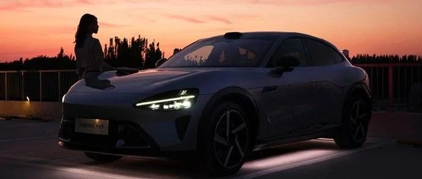

#  小米汽车答网友问（第182集）

[ 小米汽车 ](<javascript:void\(0\);>)

______

**01**

**小米YU7的底盘****氛围灯****，能实现哪些灯色和灯效？****  
**

**小米YU7底盘氛围灯提供8种独特的灯光颜色和2种灯效模式。**

8种颜色包括：晶莹白雪、深海风暴、云杉青石、迷幻紫雾、温暖香橙、静谧星蓝、沙粉流金、柔美青瓷。您可根据您的小米YU7车漆颜色和喜好自由选择，打造个性化氛围。

2种灯效模式分别为：

     * 「常亮模式」：亮度可无级调节，满足不同环境和使用习惯。

     * 「呼吸模式」：提供两挡呼吸频率「快速」和「慢速」，让光影律动更富节奏感。

「常亮模式」下，可以调节亮度 

「呼吸模式」下，可以调节呼吸频率

02

**小米YU7的底盘****氛围灯****，能实现哪些车辆联动功能？**

**小米YU7底盘氛围灯支持以下多种场景的智能联动功能：**

**「驻车点亮」：**

  * 开启「驻车点亮」后，车辆处于P档时，底盘氛围灯自动点亮，并于3分钟后自动关闭。此功能可营造更具层次感和灵动感的驻车氛围。  

  * 若同时启用「跟随近光灯」功能，近光灯开启时底盘氛围灯也会随之亮起，同样在3分钟后关闭。  

  * 同时，在开启「驻车点亮」后，任意车门打开时底盘氛围灯也将自动点亮，并在 3 分钟后关闭。该功能在光线昏暗的场景下，为上下车提供辅助照明，提升使用便利性与安全感。

「充电联动」：

  * 开启「充电联动」后，当检测到车辆开始充电时，底盘氛围灯将亮起绿色流水灯效环绕车身。该效果可直观提示开始充电状态，增强充电操作的仪式感与确认感。

「外灯离车延时照明」联动：

  * 该模式可与车辆原有的「外灯离车延时照明」联动使用。启用后，您在离车时底盘氛围灯将与「外灯离车延时照明」一同点亮，陪伴您和您的家人安全离车。

行驶灭灯和断网灭灯：

  * 车辆行驶过程中底盘氛围灯将自动关闭，以保障您的行车安全及符合相关法规要求。当底盘氛围灯和车机WIFI断连时，为了保证功能正常运行，底盘氛围灯将自动熄灭。

「驻车点亮」和「跟随近光灯」

「充电联动」和「外灯离车延时照明联动」

03

小米YU7可以设定为「只解锁主驾车门」吗？

可以。和小米SU7相同，小米YU7提供了不同的车门解锁范围以满足不同的用户需求，您可通过「设置」-「门锁」-「解锁范围」进行设置：

  * 如选择「仅主驾车门」，车外解锁车辆后，从车外仅可打开主驾车门；这对于长期单独用车的朋友而言，仅打开主驾车门更有安全感；
  * 如选择「所有车门」，车外解锁车辆后，从车外可打开全部车门；对于大多数用户日常用车而言，一键解锁所有车门更方便。

我们温馨提醒，如果您设置为「仅主驾车门」解锁：

  * 以车外开门场景为例，当您携带卡片钥匙解锁车辆，或携带手机钥匙/遥控钥匙靠近自动解锁车辆时，车辆只解锁主驾车门，其余三个车门不可从车外打开。此时如果您希望打开全部车门，可拉开主驾车门后按下主驾车门的中控锁按键，以解锁全车。如果您选购了遥控钥匙，您也可连续两次按下遥控钥匙的解锁按键，从而解锁全部车门。此外，如果您是iPhone 15 Pro系列及更新款的用户，在将Action Button的快捷指令选定为「解锁」功能时，连按2次Action Button也可解锁全部车门。

  * 以车内开门场景为例，当您按P挡停车时，除主驾车门外，其余三个车门不可从车外开门，但四门从车内均可打开；若您按下主驾车门的中控锁按键，所有车门均解锁，从车外、车内均可开门，适合接朋友上车的场景。

**04**

**小米汽车家用充电桩的安装服务「0米安装」和「30米安装」2个选项，我该怎么选择？**

他们的区别主要在于不同的充电桩配套电缆长度，您可根据您的电表（或物业指定接电点）到计划安装充电桩位置的实际电缆敷设距离来选择：

  * 如果您是旧充电桩换新，或者电表离充电桩安装位置电线用量低于22米（非直线距离）的用户，我们建议您购买「0米安装」套餐，安装师傅会根据实际使用的电缆量收取标准费用（详情可见小米汽车APP中产品详情页）。

  * 如果您的电表离充电桩计划安装位置电线用量大于22米，我们建议您直接购买「30米安装」套餐，更划算。

  

< img alt="图片" class="rich_pages wxw-img" data-ratio="0.8824074074074074" src="https://mmbiz.qpic.cn/sz_mmbiz_png/UaK4PTh6Zpk2TaVLh0tUHxviapUIsTcXOFp1ATh7VRDuqnQr3V3oDvw9DodpJKDZDh0fV2YVzbrgHETVM5DzIqA/640?wx_fmt=png&from=appmsg&wxfrom=5&wx_lazy=1&wx_co=1" data-w="1080" style="visibility: visible !important;width: 350px !important;height: auto !important;" width="100%" data-imgqrcoded="1">  

  

预览时标签不可点

修改于

微信扫一扫  
关注该公众号

继续滑动看下一个

轻触阅读原文

小米汽车 

向上滑动看下一个

[知道了](<javascript:;>)

微信扫一扫  
使用小程序

****

[取消](<javascript:void\(0\);>) [允许](<javascript:void\(0\);>)

****

[取消](<javascript:void\(0\);>) [允许](<javascript:void\(0\);>)

****

[取消](<javascript:void\(0\);>) [允许](<javascript:void\(0\);>)

× 分析

__

微信扫一扫可打开此内容，  
使用完整服务

： ， ， ， ， ， ， ， ， ， ， ， ， 。 视频 小程序 赞 ，轻点两下取消赞 在看 ，轻点两下取消在看 分享 留言 收藏 听过