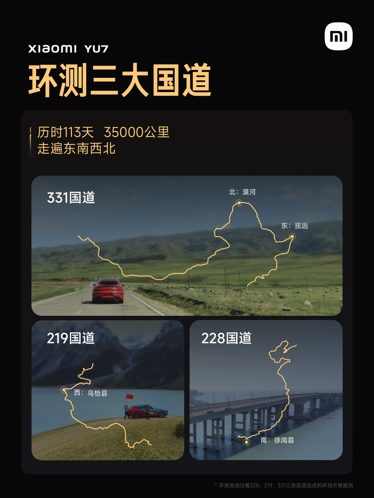
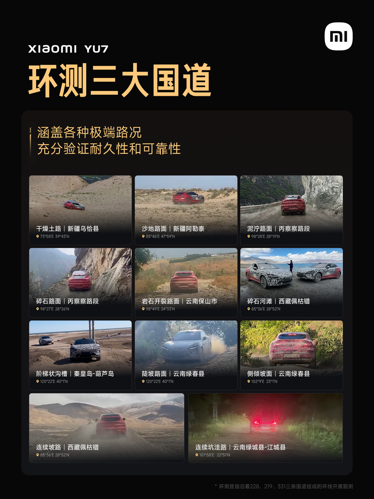
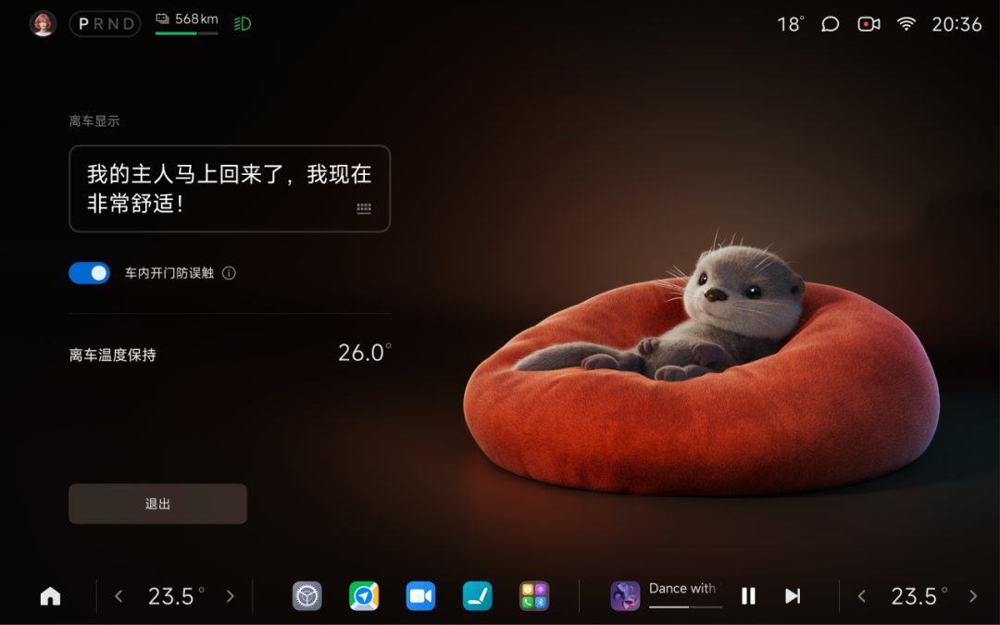
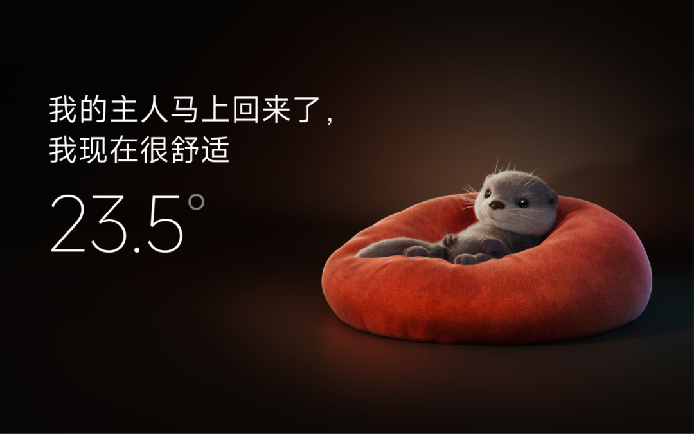

#  小米汽车答网友问（第183集）

[ 小米汽车 ](<javascript:void\(0\);>)

______

01

**小米YU7进行了719万公里的道路实测，到底测了啥？**

这719万公里一共覆盖了全国337个城市，从闹市区到无人区、从高温区、高寒区、到高原区，小米YU7在不同的气温、不同海拔，雪山、戈壁等恶劣环境，都经受住了耐久考验。我们的工程师开着小米YU7测试车经历过53℃的吐鲁番，经历过零下41℃的黑河，也抵达过海拔5380米的西藏阿里地区；作为一台SUV，小米YU7在路测中也充分验证了在复杂路况、恶劣天气等情况下的通过性。

值得一提的是，小米YU7路测团队刚刚完成了一段特殊的路测：「环测三大国道」——贯穿G228、G219、G331三条国道，覆盖各种温区、地形和复杂路况，几乎把全国的“烂路”都测了一遍。「环测三大国道」历时113天，共35000公里，经历了干燥土路、沙地路面、泥泞路面、碎石路面、岩石开裂路面、碎石河滩、阶梯状沟槽、陡坡路面、侧倾坡面、连续坡路和连续坑洼路等极端路况，充分验证了小米YU7在各种场景工况下的可靠性。

「环测三大国道」虽然只是小米YU7道路实测的其中一小段路，却凝聚着小米工程师们对道路测试的坚持与特有的浪漫。期待未来，小米YU7能陪您一同探索祖国的壮丽山河。

*左右滑动 查看更多

  

02

**我想把宠物留在车里，万一它误触了门/窗锁，门会被打开么？**

您无需担心，小米YU7支持「宠物模式」，当您启动该模式后，车内空调将持续工作，同时加速/制动踏板、车窗、喇叭都将暂时禁用，既舒适又安全；如果您担心宠物在车内玩闹，误触车门按钮，可以进一步启用「车内开门防误触」功能以防止您的爱宠误触打开车门。具体的操作方式如下：

  * 在中控屏上边缘向下滑动拉出**控制中心** ，进入**驻车空间 >宠物模式**，点击开启宠物模式。本次离车闭锁车辆后宠物模式将会生效。

  * 打开**「车内开门防误触」** 功能，当您离车锁闭车辆后，车辆将自动禁用车内解锁按钮，防止宠物误触。

*左右滑动 查看更多

**0 3**

**下雨天进商场车库，总感觉轮胎抓不住地，怎么开才安全？**

在雨天或湿度大返潮天进入车库时，特别是铺设环氧地坪的车库时，**请您一定注意提前减速，将车速控制在10km/h以下，同时建议切换稳定性更高的驾驶模式，如雪地模式、舒适模式、新手模式等，以降低意外发生的风险** 。

现在很多地下车库铺设了环氧地坪，这种材料本身具备可自流平，美观、光滑、易清洁的特点，因此受到了广泛应用，但环氧地坪在遇水后会变得非常滑，在此类地面上轮胎抓地力会大幅下降。若车速过高，在轮胎抓地力不足情况下，制动距离大幅度增加，极大增加事故的风险。因此，在雨天或湿度大返潮天进入铺设环氧地坪的地库时，要减速慢行，与前车保持车距，尽可能避开有积水或者潮湿的环氧地坪路面，无法绕开时一定低速行驶、且轻打方向，避免轮胎打滑。

**04**

**小米汽车未来会推出更大****功率****的家充桩么？**

我们正在抓紧研发家用直流充电桩。其充电功率超过7kW，可提供更高的充电功率，缩短充电时长；还可以给所有符合国标的车型充电，适配性更强。

  

< img alt="图片" class="rich_pages wxw-img" data-ratio="0.8824074074074074" src="https://mmbiz.qpic.cn/sz_mmbiz_png/UaK4PTh6Zpk2TaVLh0tUHxviapUIsTcXOFp1ATh7VRDuqnQr3V3oDvw9DodpJKDZDh0fV2YVzbrgHETVM5DzIqA/640?wx_fmt=png&from=appmsg&wxfrom=5&wx_lazy=1&wx_co=1" data-w="1080" style="visibility: visible !important;width: 350px !important;height: auto !important;" width="100%" data-imgqrcoded="1">  

预览时标签不可点

微信扫一扫  
关注该公众号

继续滑动看下一个

轻触阅读原文

小米汽车 

向上滑动看下一个

[知道了](<javascript:;>)

微信扫一扫  
使用小程序

****

[取消](<javascript:void\(0\);>) [允许](<javascript:void\(0\);>)

****

[取消](<javascript:void\(0\);>) [允许](<javascript:void\(0\);>)

****

[取消](<javascript:void\(0\);>) [允许](<javascript:void\(0\);>)

× 分析

__

微信扫一扫可打开此内容，  
使用完整服务

： ， ， ， ， ， ， ， ， ， ， ， ， 。 视频 小程序 赞 ，轻点两下取消赞 在看 ，轻点两下取消在看 分享 留言 收藏 听过