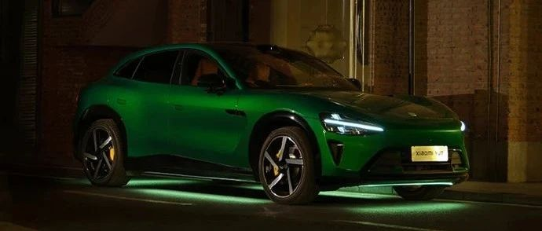

#  小米汽车答网友问（第185集）

[ 小米汽车 ](<javascript:void\(0\);>)

______

01

**小米YU7的制动盘除锈模式应该怎么用？**

您可以在中控屏下方控制栏打开设置，进入「服务>制动盘除锈」，点击开启或关闭该功能。请注意，开启制动盘除锈功能后，制动能量回收功能将无法使用，需要您踩下制动踏板才能获得制动力。

此外，小米YU7还提供制动盘被动除锈功能：在您使用高动能回收模式的情况下，车辆会定期采用液压制动，完成“磨盘除锈”，在您几乎无感知的情况下默默工作，达到除锈目的。

制动盘生锈属于正常现象，您不用担心。因为大多数汽车使用的刹车盘是灰铸铁等材质，最近雨季来临，该材料在暴露于潮湿空气或雨水时容易生锈。轻微的锈迹通常不会对制动性能产生影响，若想快速去除锈迹，您也可以在安全的路段上通过连续的制动来去除。

02

**我想听自己收藏的高品质音乐，小米YU7支持从U盘播放哪些格式的音乐？**

小米汽车全系车型目前支持mp3、aac、flac、wav、mpga、ogg等主流格式，充分满足您播放U盘高品质音乐的需求。

**0 3**

**我要带小朋友出门，小米YU7的后排车门有儿童锁吗？**

小米YU7的左后车门和右后车门均有儿童锁。您可在中控屏下方控制栏进入「设置>门窗锁>儿童锁」，点击选择左后车门童锁或右后车门童锁的开启或关闭。您也可以通过主驾侧中控屏上方下滑控制中心进入「车门童锁>左后/右后车门」。打开车门童锁后，该车门将无法从内部开启，防止儿童误开门；但您仍可以从外部开启车门。

此外，小米YU7全系标配的后排移动控制屏也支持童锁，以避免后排乘客/儿童误触。后排移动控制屏可实现空调、副驾座椅、多媒体等功能控制，您可在中控屏下方控制栏进入「设置>显示>后排屏童锁」，点击开启或关闭该功能。

**04**

**小米YU7中控台下方的两侧有2个“按钮”，这是干什么用的？**

这不是“按钮”，而是挂钩，位于中控台两侧，主副驾位置各有一个。需要使用时可按压弹出，不使用时可按压收回，适合挂一些外卖、奶茶、垃圾袋等小件物品。小米SU7也有类似的挂钩，位置在中控台正下方。

友情提示，为了您的行车安全及使用体验，请不要在车内挂钩上悬挂重物。

< img alt="图片" class="rich_pages wxw-img" data-ratio="0.8824074074074074" src="https://mmbiz.qpic.cn/sz_mmbiz_png/UaK4PTh6Zpk2TaVLh0tUHxviapUIsTcXOFp1ATh7VRDuqnQr3V3oDvw9DodpJKDZDh0fV2YVzbrgHETVM5DzIqA/640?wx_fmt=png&from=appmsg&wxfrom=5&wx_lazy=1&wx_co=1" data-w="1080" style="visibility: visible !important;width: 350px !important;height: auto !important;" width="100%" data-imgqrcoded="1">  
< img alt="图片" class="rich_pages wxw-img" data-ratio="0.8824074074074074" src="https://mmbiz.qpic.cn/sz_mmbiz_png/UaK4PTh6Zpk2TaVLh0tUHxviapUIsTcXOFp1ATh7VRDuqnQr3V3oDvw9DodpJKDZDh0fV2YVzbrgHETVM5DzIqA/640?wx_fmt=png&from=appmsg&wxfrom=5&wx_lazy=1&wx_co=1" data-w="1080" style="visibility: visible !important;width: 350px !important;height: auto !important;" width="100%" data-imgqrcoded="1">  
  

  

< img alt="图片" class="rich_pages wxw-img" data-ratio="0.8824074074074074" src="https://mmbiz.qpic.cn/sz_mmbiz_png/UaK4PTh6Zpk2TaVLh0tUHxviapUIsTcXOFp1ATh7VRDuqnQr3V3oDvw9DodpJKDZDh0fV2YVzbrgHETVM5DzIqA/640?wx_fmt=png&from=appmsg&wxfrom=5&wx_lazy=1&wx_co=1" data-w="1080" style="visibility: visible !important;width: 350px !important;height: auto !important;" width="100%" data-imgqrcoded="1">

预览时标签不可点

微信扫一扫  
关注该公众号

继续滑动看下一个

轻触阅读原文

小米汽车 

向上滑动看下一个

[知道了](<javascript:;>)

微信扫一扫  
使用小程序

****

[取消](<javascript:void\(0\);>) [允许](<javascript:void\(0\);>)

****

[取消](<javascript:void\(0\);>) [允许](<javascript:void\(0\);>)

****

[取消](<javascript:void\(0\);>) [允许](<javascript:void\(0\);>)

× 分析

__

微信扫一扫可打开此内容，  
使用完整服务

： ， ， ， ， ， ， ， ， ， ， ， ， 。 视频 小程序 赞 ，轻点两下取消赞 在看 ，轻点两下取消在看 分享 留言 收藏 听过