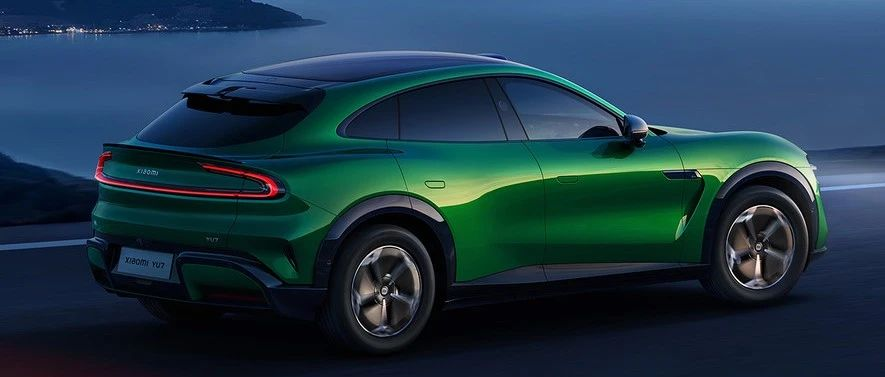

#  小米汽车答网友问（第186集）

[ 小米汽车 ](<javascript:void\(0\);>)

______

01

**升级到1000万****Clips****版本后，小米****端到端****辅助驾驶有哪些变化？**

相比于之前的300万Clips版本，1000万Clips版本的小米端到端辅助驾驶功能对复杂路况的应对更从容、决策更贴近于真实“老司机”的驾驶习惯。具体体现在**：**

  * 加减速更柔和：拥堵场景下，跟车稳定性与起步响应速度提升，可提前识别复杂加塞行为并及时制动减速，减少顿挫感，驾乘体感更舒适；

  * 绕行更灵活：面对车辆、行人等典型障碍物时，绕行路径规划更高效灵活，操作流畅度提升；

  * 变道逻辑升级：综合判断路况后，变道决策更精准果断，整体变道成功率提高；

  * 路口通过更顺畅：能更好地理解中国路口的「游戏规则」，轨迹规划更合理，提升路口通行效率与安全性；

  * 窄路通行提升：对道路空间的判断更精准，同时增强窄路会车时的绕行能力；

  * 防御性驾驶增强：对斑马线行人的礼让响应更及时，强化安全冗余；

  * 高速场景优化：新升级的小米端到端辅助驾驶也在高速场景有了明显优化，升级后的高速领航辅助功能运行更稳定，体感更舒适。

  * 更多有关1000万Clips版本小米端到端辅助驾驶的详细信息，您可移步至[「1000万Clips上车！小米辅助驾驶的新篇章」](<https://mp.weixin.qq.com/s?__biz=MzkyNzU3MDI3Nw==&mid=2247506815&idx=2&sn=1a5d962bcc32ef2c6c01a8c4d8c96082&scene=21#wechat_redirect>)了解。

**同时我们也再次呼吁，辅助驾驶现阶段不是****自动驾驶****，请大家正确理解和使用相关辅助驾驶功能，确保时刻注意路况信息，并随时准备控制车辆 。**

02

**小米YU7上的座舱新功能，小米****SU7****系列什么时候能用到？**

在完成本次1000万Clips版本小米端到端辅助驾驶功能的OTA推送之后，我们计划在下个版本为小米SU7系列和小米SU7 Ultra更新小米YU7座舱同款的多项新功能，例如车内超级小爱、小米互联互通、苹果生态体验、以及行车桌面升级等。

新功能上线时，我们会通过官方渠道公布具体的升级内容。请大家留意后续的官方信息，感谢您的关注与耐心等待！

**0 3**

**小米YU7的方向盘滚轮可以自定义功能吗？**

可以。您可于「设置>车辆控制>方向盘>右滚轮长按自定义」处，对方向盘右侧滚轮的长按动作绑定功能，可以进行「开启泊车影像」、「启动泊车辅助」、「保存行车记录」的功能自定义。

值得一提的是，当您连接了小米AI眼镜后，该菜单下还提供了「智能眼镜拍照」、 「智能眼镜录像」功能，可以实现手不离方向盘的同时轻松记录精彩瞬间。

**04**

**看到了央视关于小米汽车挑战****纽北****赛道的报道，小米****SU7 Ultra****目前的赛道刷圈计划是啥？**

小米汽车现已成为纽北高级合作伙伴，将有团队常驻纽北做测试。未来我们还会持续挑战纽北、不断突破自我，在纽北赛道上验证核心技术，打造性能更好、更安全的汽车。

大家想小米SU7 Ultra接下来去挑战哪些赛道？欢迎在评论区留言！

  
< img alt="图片" class="rich_pages wxw-img" data-ratio="0.8824074074074074" src="https://mmbiz.qpic.cn/sz_mmbiz_png/UaK4PTh6Zpk2TaVLh0tUHxviapUIsTcXOFp1ATh7VRDuqnQr3V3oDvw9DodpJKDZDh0fV2YVzbrgHETVM5DzIqA/640?wx_fmt=png&from=appmsg&wxfrom=5&wx_lazy=1&wx_co=1" data-w="1080" style="visibility: visible !important;width: 350px !important;height: auto !important;" width="100%" data-imgqrcoded="1">

预览时标签不可点

微信扫一扫  
关注该公众号

继续滑动看下一个

轻触阅读原文

小米汽车 

向上滑动看下一个

[知道了](<javascript:;>)

微信扫一扫  
使用小程序

****

[取消](<javascript:void\(0\);>) [允许](<javascript:void\(0\);>)

****

[取消](<javascript:void\(0\);>) [允许](<javascript:void\(0\);>)

****

[取消](<javascript:void\(0\);>) [允许](<javascript:void\(0\);>)

× 分析

__

微信扫一扫可打开此内容，  
使用完整服务

： ， ， ， ， ， ， ， ， ， ， ， ， 。 视频 小程序 赞 ，轻点两下取消赞 在看 ，轻点两下取消在看 分享 留言 收藏 听过