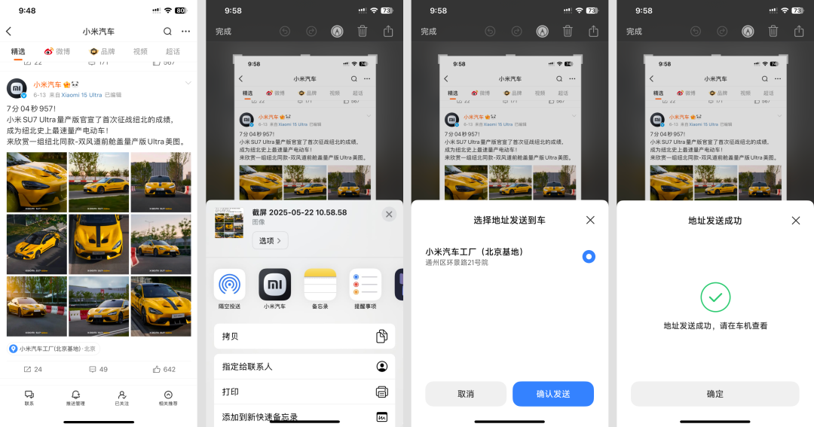
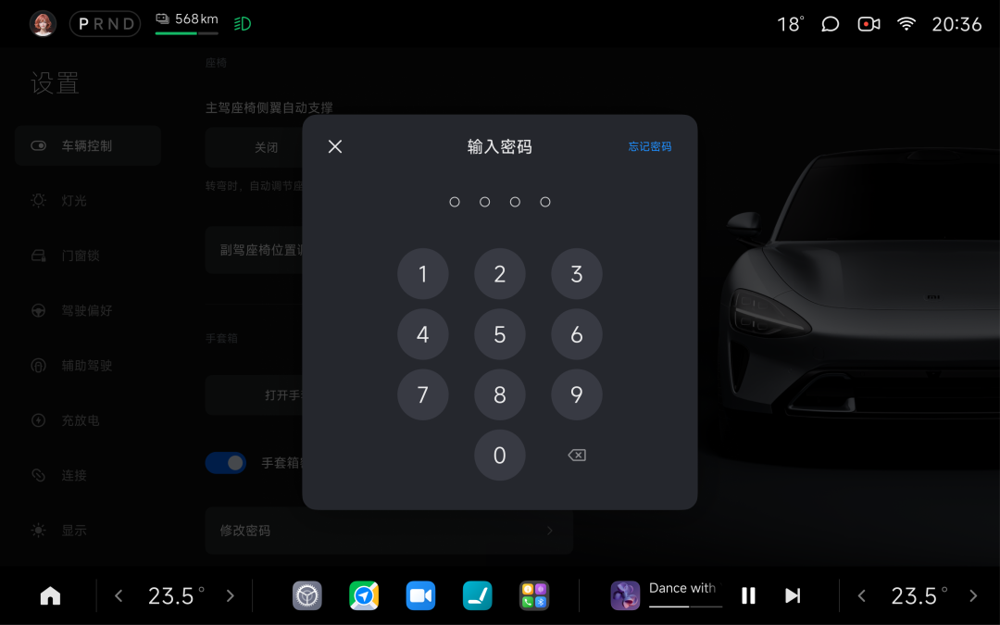
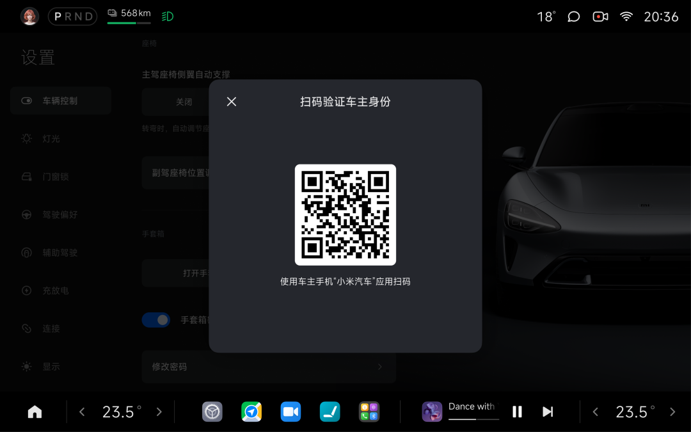
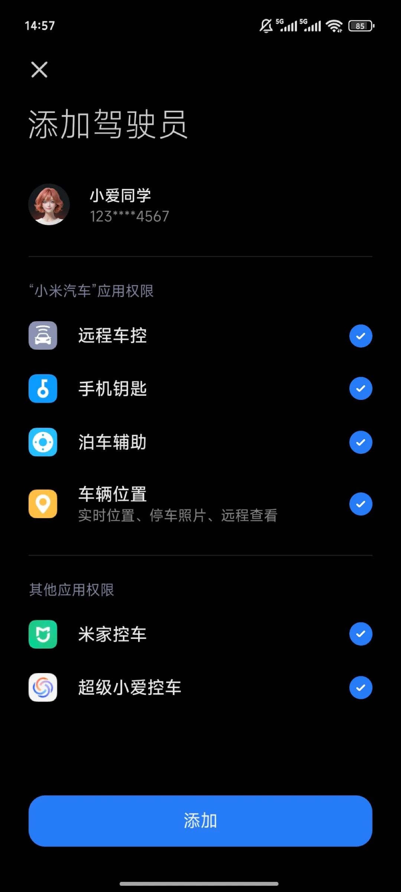

#  小米汽车答网友问（第188集）

[ 小米汽车 ](<javascript:void\(0\);>)

______

01

**小米****SU7****升级的「截图导航」功能该如何使用？**

如果您是苹果手机用户，有了「截图导航」功能，您只需要将带有地址的截图分享至小米汽车APP，地址将会被自动扫描识别并发送到车机。近期我们已经将这个功能逐步推送至小米SU7系列车型，只需要简单几步，车机就能直接发起导航。具体操作步骤如下：

  * 浏览到目标地址页面，截图保存；

  * 发送截图，选择 「分享至小米汽车 APP」；

  * 在弹窗内选择对应地址，点击 「确认发送」即可（需将您的小米汽车APP更新至V1.16.2及以上版本）

此外，除了苹果手机用户，小米手机用户还可通过语音快速操作：浏览带有目标地址的页面时，长按电源键唤醒小爱，说“把这个地址发送到车上”，选择地址后即可同步至车机。

  

02

**我忘了小米YU7的手套箱****密码****，该怎么重设？**

如果您忘记了手套箱密码，您可以通过「设置>车辆控制>手套箱>修改密码」页面中，选择「忘记密码」，使用登录车主账号的小米汽车APP扫描屏幕二维码完成身份验证后即可重置密码。

请注意，有且只有车主才可以修改或重置密码，授权人账号仅可修改密码。

  

**0 3**

**我想把手机钥匙分享给家人，该怎么操作？**

车主在开通手机钥匙后，可向亲友分享车辆使用权，详细操作如下：

**车主分享流程：**

  * 车主打开小米汽车APP进入「车辆」，点击「多人用车」。

  * 点击「发送验证码」，进行车主身份验证。

  * 验证成功后，点击「添加」，开始添加驾驶员。

  * 输入用车人手机号，点击「下一步」。

  * 勾选并授权用车人可使用的功能后，点击「添加」。

  * 出现授权弹窗，点击「确认授权」。

请留意，如果授权人需要使用手机蓝牙钥匙、泊车辅助等功能时，需要勾选相应权限；

  * 添加成功后出现提示弹窗，点击「我知道了」，完成手机钥匙分享。

**亲友创建流程：**

  * 被分享的亲友打开小米汽车APP，登录个人账号。

  * 个人账号登录后，会有分享弹窗，点击「立即开通」，根据流程引导开通。

  * 添加成功后，点击「完成」，完成手机钥匙分享。

**04**

**为什么我的小米汽车车顶滑轨供电扩展坞在连接投影仪后，另一个Type-C接口就没电了？**

请不用担心，这是正常现象。当您使用Type-C转DC电源线给大功率设备（如投影仪）供电时，为了确保有足够的电力供应，也为了防止双口同时输出总功率超过承受能力，小米汽车车顶滑轨供电拓展坞会自动关闭另一个Type-C口。

  

  

< img alt="图片" class="rich_pages wxw-img" data-ratio="0.8824074074074074" src="https://mmbiz.qpic.cn/sz_mmbiz_png/UaK4PTh6Zpk2TaVLh0tUHxviapUIsTcXOFp1ATh7VRDuqnQr3V3oDvw9DodpJKDZDh0fV2YVzbrgHETVM5DzIqA/640?wx_fmt=png&from=appmsg&wxfrom=5&wx_lazy=1&wx_co=1" data-w="1080" style="visibility: visible !important;width: 350px !important;height: auto !important;" width="100%" data-imgqrcoded="1">

预览时标签不可点

微信扫一扫  
关注该公众号

继续滑动看下一个

轻触阅读原文

小米汽车 

向上滑动看下一个

[知道了](<javascript:;>)

微信扫一扫  
使用小程序

****

[取消](<javascript:void\(0\);>) [允许](<javascript:void\(0\);>)

****

[取消](<javascript:void\(0\);>) [允许](<javascript:void\(0\);>)

****

[取消](<javascript:void\(0\);>) [允许](<javascript:void\(0\);>)

× 分析

__

微信扫一扫可打开此内容，  
使用完整服务

： ， ， ， ， ， ， ， ， ， ， ， ， 。 视频 小程序 赞 ，轻点两下取消赞 在看 ，轻点两下取消在看 分享 留言 收藏 听过