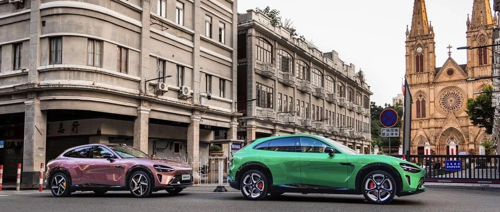
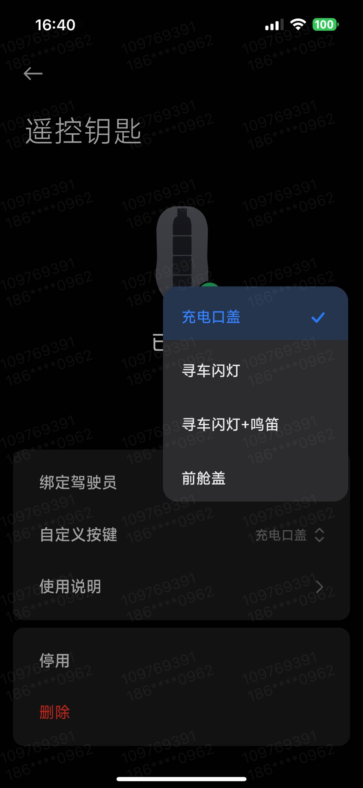
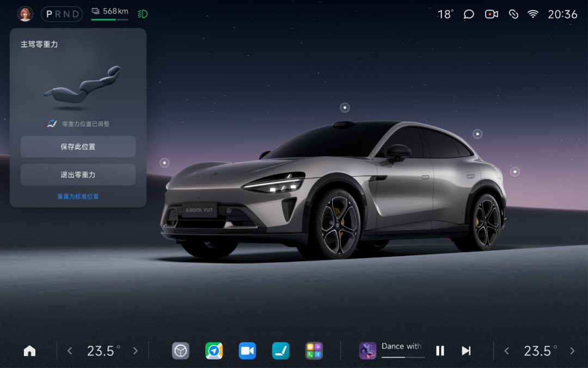
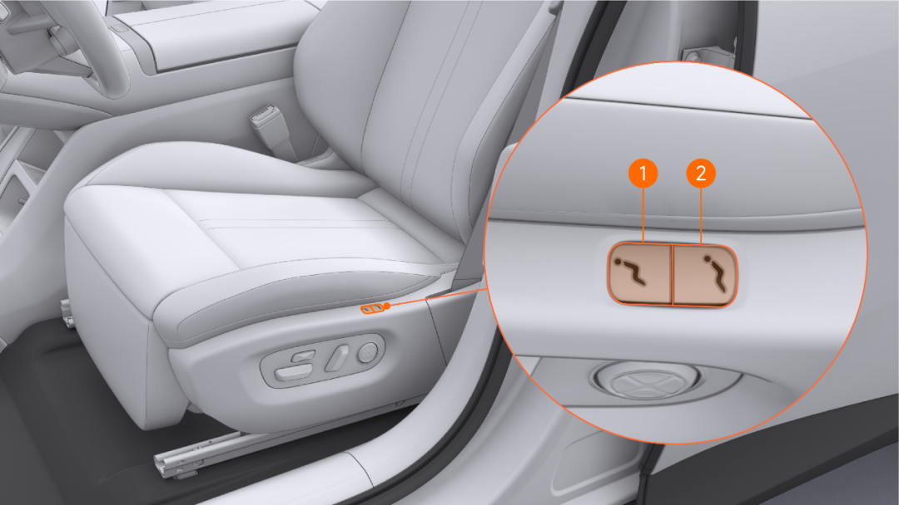
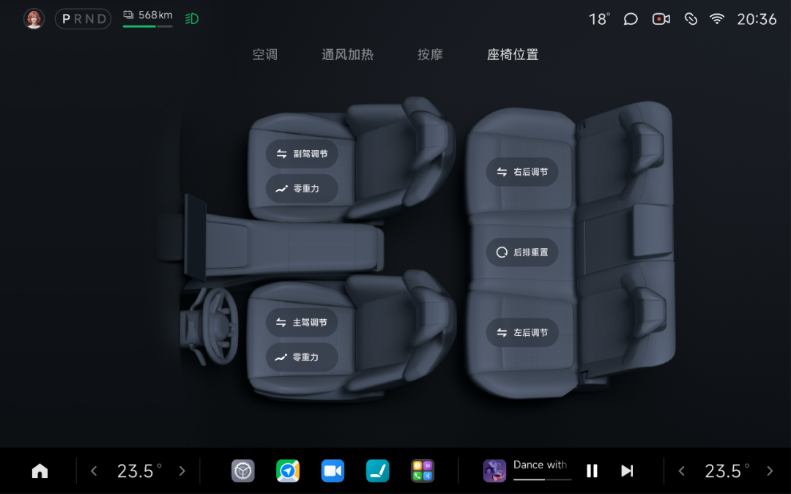

#  小米汽车答网友问（第189集）

[ 小米汽车 ](<javascript:void\(0\);>)

______

01

**最****近****OTA****升级之后，小米汽车****APP****遥控钥匙****界面有些不一样了，新增了什么功能？**

在最近的OTA升级中，我们更新了「遥控钥匙」中的「自定义按键」功能，在完成升级后，您可以通过小米汽车APP自定义遥控钥匙第四按键的车控功能。

打开小米汽车APP，点击「车辆>钥匙>遥控钥匙>自定义按键」，就能给第四按键设置功能了。比如，如果您想一键打开充电口、寻车闪灯、寻车时让车闪灯 + 鸣笛，或者打开前备箱，都可以自定义设置。设置完之后，按一下按键即可触发您选择的功能。（温馨提示，该功能需要您将小米汽车APP更新至V1.16.2及以上版本）

02

**我不想现在立刻就****OTA****升级，可以换个时间预约升级吗？**

可以的。在最近的OTA升级中，我们新增了自动更新功能，该功能能让预约更新更加便捷，一次预约，后续所有版本都生效，再也不用为频繁手动预约升级而困扰，还无需担心升级会影响您的用车计划。

操作步骤也很简单：

  * 手动选择您方便的闲置时段（比如夜间停车、午休等非用车时间）；

  * 在完成时段选择后，勾选「记住我的选择」选项；

  * 后续所有 OTA 升级都会自动在您预约的时段内执行，无需重复操作，一次设置就能长期省心。

**0 3**

**小米YU7的零重力座椅可以自定义调节位置吗？**

可以。座椅在完成零重力状态调节后，您仍可对靠背、座垫、腿托位置进行自定义调节，调节完成后，在中控屏弹窗点击「保存此位置」即可记忆零重力座椅位置，从而在下次进入零重力状态时，自动调整到您记忆的位置。其中，主驾零重力座椅位置跟随您的账号记忆，副驾零重力座椅位置不跟随账号记忆，随车记忆。

小米YU7全系车型可付费选装主驾、副驾零重力座椅。零重力座椅不仅可以实现更舒适的零重力状态，还配备了十点式按摩。今天也向大家介绍一些小米YU7零重力座椅的使用小技巧：

  * 零重力座椅提供多种、便利的进入/退出方式，比如长按座椅外侧的物理按键、通过中控屏「座椅>座椅位置>零重力>进入/退出」、通过小爱同学进入/退出零重力状态。退出零重力状态时，主驾零重力座椅将复位到您当前用车习惯的记忆位置、副驾零重力座椅将复位为您进入零重力状态前的位置。

  

  * 若您记忆了自定义的零重力座椅位置，希望恢复出厂默认的零重力位置，您可在零重力状态下任意调节位置，触发中控屏的位置记忆弹窗，点击「重置为标准位置」即可。或在零重力状态，向小爱同学说：“零重力座椅恢复出厂设置”。

  * 我们温馨提示您，在调节进入零重力姿态前，请确保正后方座椅没有遗留易碎物品、无人乘坐；如后排靠背处于折叠状态，也请先展开对应靠背方能进入零重力座椅姿态。

**04**

**我发现我的****4K****云台摄像头在工作时外壳有些发热，这是正常的么？**

请您放心，4K云台摄像头工作时外壳摸起来热是正常的，不会影响产品的安全使用和寿命。

4K云台摄像头采用了一体化铝合金机身的设计，可以让内部热量迅速且均匀得分布到机身上。与常见的塑料机身摄像头不同，铝合金金属外壳导热更快，这是您摸起来会感觉温度有些高的原因之一：金属传热快且触感更明显。同时，我们也做了许多验证，保证其能在70℃左右的环境下连续工作，也能在85℃左右的环境下连续放置后功能保持正常。

最后，我们温馨提示您：

  * 请不要在机身上做任何覆盖，避免影响散热；

  * 不建议在阳光直晒的情况下长时间使用；

  * 在工作状态下，当产品内部温度达到90℃以上时（环境温度大概在75～80℃左右），会触发产品的高温预警提醒。收到提醒后，建议您关闭摄像头，等待一段时间后再使用。

  
< img alt="图片" class="rich_pages wxw-img" data-ratio="0.8824074074074074" src="https://mmbiz.qpic.cn/sz_mmbiz_png/UaK4PTh6Zpk2TaVLh0tUHxviapUIsTcXOFp1ATh7VRDuqnQr3V3oDvw9DodpJKDZDh0fV2YVzbrgHETVM5DzIqA/640?wx_fmt=png&from=appmsg&wxfrom=5&wx_lazy=1&wx_co=1" data-w="1080" style="visibility: visible !important;width: 350px !important;height: auto !important;" width="100%" data-imgqrcoded="1">

预览时标签不可点

修改于

微信扫一扫  
关注该公众号

继续滑动看下一个

轻触阅读原文

小米汽车 

向上滑动看下一个

[知道了](<javascript:;>)

微信扫一扫  
使用小程序

****

[取消](<javascript:void\(0\);>) [允许](<javascript:void\(0\);>)

****

[取消](<javascript:void\(0\);>) [允许](<javascript:void\(0\);>)

****

[取消](<javascript:void\(0\);>) [允许](<javascript:void\(0\);>)

× 分析

__

微信扫一扫可打开此内容，  
使用完整服务

： ， ， ， ， ， ， ， ， ， ， ， ， 。 视频 小程序 赞 ，轻点两下取消赞 在看 ，轻点两下取消在看 分享 留言 收藏 听过