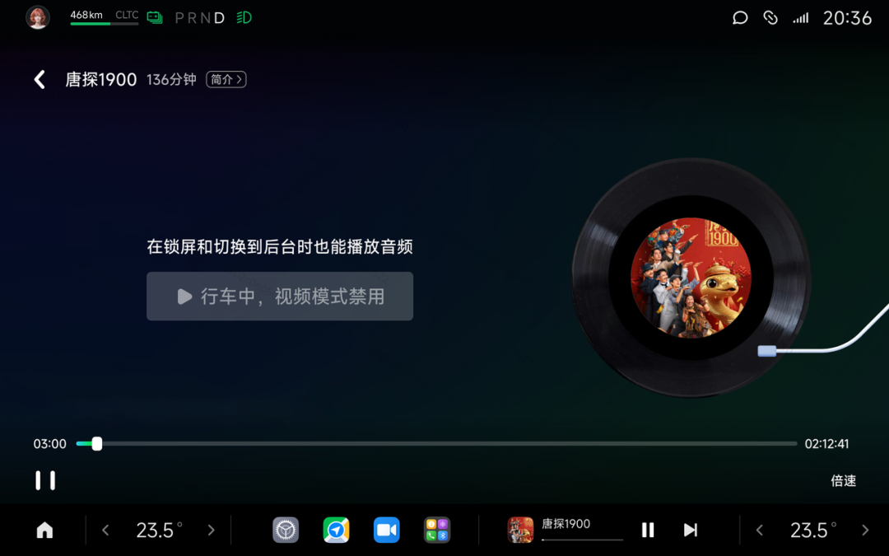
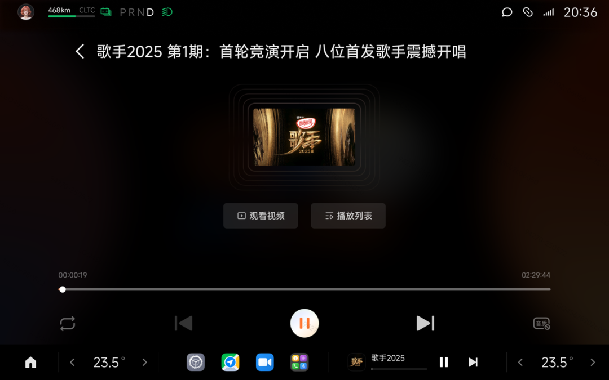

#  小米汽车答网友问（第190集）

[ 小米汽车 ](<javascript:void\(0\);>)

______

01

**磁吸物理按键除了在车里用，还可以放在家里使用吗？能够实现什么功能？**

您可以将磁吸物理按键安装在家中的任何地方，如玄关、冰箱、床头等。磁吸物理按键已接入米家，其可通过米家APP操控，并与其他产品互联互通。其兼容米家loT产品，您可以轻松一键操控米家设备，执行设定好的智能场景，比如亮起灯光、开启空调、合上窗帘等。此外，通过磁吸物理按键，您在家也能一键控车，比如一键提前打开车内空调/座椅通风等功能，上车既享舒适。

打开米家APP，点击页面右上角的“+”号，根据APP提示即可添加设备和设置按键功能。（请注意，若您在家中使用磁吸物理按键，需通过蓝牙Mesh网关或蓝牙网关配合进行控制/操作）

02

**如何调节小米YU7天际屏全景显示的高度和亮度？**

您可以通过中控屏下方控制栏打开「设置>显示>HUD>HUD高度亮度调节」，使用方向盘右侧控制区的左按键和右按键来调节小米天际屏全景显示的亮度；上下滚动方向盘右侧的滚轮按键来调节小米天际屏全景显示的高度。此外，您也可以直接通过小爱同学来调节，例如：“小爱同学，HUD亮一点”。

温馨提示，车辆将通过前风挡上部的阳光雨量传感器来进行对外部环境的识别，从而自动调节小米天际屏全景显示的亮度。请保持该传感器区域清洁、无遮挡，以确保其对外界光线的感知能力更准确有效。

**0 3**

**小米汽车车顶滑轨灯如何恢复出厂设置？**

在通电状态下，您可以在7秒内快速点按小米汽车车顶滑轨灯开关10次，当灯光出现呼吸式闪烁并随后转为常亮时，即表示小米汽车车顶滑轨灯已恢复出厂设置。

同时我们温馨提醒：

  * 车顶滑轨灯出厂前已处于等待连网状态，接通电源30分钟内可通过「设置>智能设备」页面进行连接。

  * 若车顶滑轨灯通电超过30分钟且未连接至APP，可拆下滑轨灯重新安装，并在接通电源30分钟内通过「设置>智能设备」页面进行连接。

  * 如车顶滑轨灯已经绑定到其他账号，须先恢复出厂设置后再重新绑定。

**04**

**我开车的时候想“听”视频的音频内容，可以么？**

可以的。在最近的OTA升级中，我们新增了爱奇艺、芒果TV APP的音频模式。当您在行车途中，如果想要“听”平时常看的综艺、电影等视频的音频内容，在挂入D挡后或应用切换到后台时，画面自动转为音频继续播放，既能确保行车专注，又能延续娱乐体验，打造安全随行的移动娱乐空间。

爱奇艺

芒果TV

  
< img alt="图片" class="rich_pages wxw-img" data-ratio="0.8824074074074074" src="https://mmbiz.qpic.cn/sz_mmbiz_png/UaK4PTh6Zpk2TaVLh0tUHxviapUIsTcXOFp1ATh7VRDuqnQr3V3oDvw9DodpJKDZDh0fV2YVzbrgHETVM5DzIqA/640?wx_fmt=png&from=appmsg&wxfrom=5&wx_lazy=1&wx_co=1" data-w="1080" style="visibility: visible !important;width: 350px !important;height: auto !important;" width="100%" data-imgqrcoded="1">

预览时标签不可点

修改于

微信扫一扫  
关注该公众号

继续滑动看下一个

轻触阅读原文

小米汽车 

向上滑动看下一个

[知道了](<javascript:;>)

微信扫一扫  
使用小程序

****

[取消](<javascript:void\(0\);>) [允许](<javascript:void\(0\);>)

****

[取消](<javascript:void\(0\);>) [允许](<javascript:void\(0\);>)

****

[取消](<javascript:void\(0\);>) [允许](<javascript:void\(0\);>)

× 分析

__

微信扫一扫可打开此内容，  
使用完整服务

： ， ， ， ， ， ， ， ， ， ， ， ， 。 视频 小程序 赞 ，轻点两下取消赞 在看 ，轻点两下取消在看 分享 留言 收藏 听过