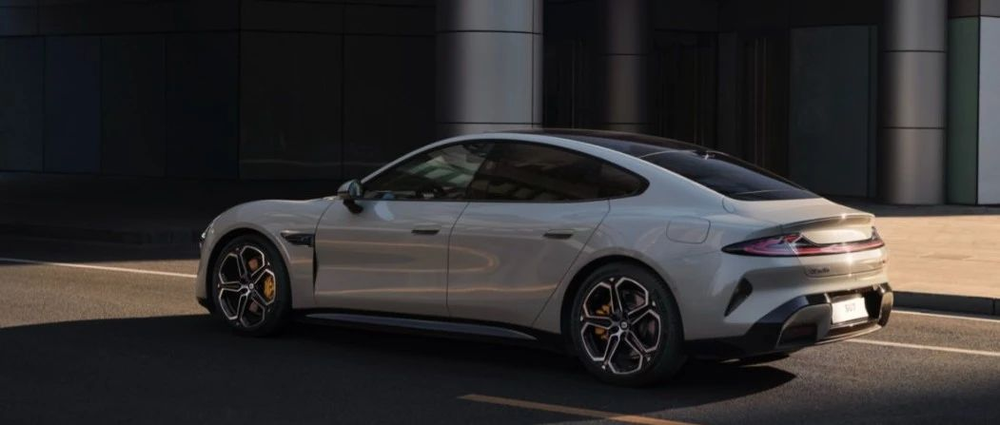

#  小米SU7答网友问（第二十二集）

[ 小米汽车 ](<javascript:void\(0\);>)

______

**01**  

**小米SU7首次参加北京国际车展，有什么看点吗？**

我们的展位在W2馆，W203展位，欢迎大家来我们的展台看看。我们准备了丰富的活动，能给您带来精彩的展示体验。同时，我们还将披露一系列大家关心的信息和小米SU7的最新进展，相信你会感兴趣，下周开始逐步向大家汇报。

  

## **02**

**误点进了修改配置界面，但不修改配置，会影响之前的排队时间吗？**

申请改配后，如未在改配时间内改配成功，改配时间截止后退出改配页面，订单会退回至原车型配置，不影响预计交付周期。

## **03**

**金融方案假如预定的时候是选的分期，交付的时候可以改为全款吗？**

在交付当日车辆激活前，均可将分期付款改为全款交付，只需与您的交付专员提前沟通妥当即可。

  

## **04**

**前后排雨伞储物槽尺寸是多少？对雨伞款式、尺寸有什么限制吗？**

小米SU7在主副驾前门板各有一个雨伞储物槽，同时后排左右座椅下方也各有一个雨伞储物槽。

因前排门板的雨伞储物槽是开放式设计，所以大部分折叠伞均可容纳。

后排座椅下方的雨伞槽受到座椅骨架限制，放置长度300mm以下的三折折叠伞较为合适；另外，该雨伞槽也可容纳小米汽车APP在售的小米SU7车载前风挡遮阳伞。

  

## **05**

**360°全景影像在车辆时速超过多少就不能使用了？**

360°全景影像在车辆挡位从R挡切换到D挡后，车速超过10km/h时自动退出。您还可以通过点击中控屏Home键操作退出360°全景影像；

在行驶中，您也可以通过中控屏下方控制栏手动打开360°全景影像，此时360°全景影像不会随着车速增加而自动退出。

  

## **06**

**小米SU7标准版高速NOA可以避让锥桶么？**

小米SU7标准版车型搭载Xiaomi Pilot Pro，目前是对3个以上的锥桶工况处理会更好，后续OTA将升级该功能。智能辅助驾驶功能并不能完全代替驾驶员控制车辆，驾驶员在驾驶车辆过程中请务必全程保持注意力集中，时刻关注车辆周围路况，并做好随时接管车辆的准备。

因为Xiaomi Pilot Max版带有激光雷达和超大算力平台，当前阶段拥有更精准地识别障碍物的能力，高速NOA实际体验感受Xiaomi Pilot Max预计会优于Xiaomi Pilot Pro。当然，随着我们纯视觉方案算法不断优化升级，二者体验都会越来越好。

## **07**

**开启LCC的时候，如何一键同步当前限速？**

开启LCC功能后，点击中控大屏上的当前车速或限速图标，可以快捷设定LCC巡航车速为当前车速或道路限制车速。

  

  

## **08**

**车主账号（车控管理权）是否可以转移？**

暂不支持。目前您可以通过授权用车权限的形式，与家人或朋友共享爱车。

后续我们将通过小米汽车APP、400热线、专属服务管家群的方式受理车主账号的解绑、绑定及变更。

预计5月上旬开始，我们将先通过400热线及专属服务管家群的方式进行受理，届时您可根据客服指引提供资料进行车控管理权的变更。

  

## **09**

**小米SU7长时间停放不启动，对于电池或者车辆有没有损害？**

从电池的材料特性上来说，车辆超过5天不使用时，建议将电池充至40%到60%的电量，这样可以更好地保护电池。

建议选择一个安全、干燥、通风的地方存放车辆，尽量避免阳光直射或者雨水淋湿。如果可能的话，最好将车辆存放在室内，比如车库。

长时间停放会对轮胎造成压力，可能导致轮胎局部变形或者产生气压问题。建议定期检查轮胎气压，并确保轮胎处于适当的气压状态。

在长时间停放之前，最好对电动车进行一次全面的检查，包括刹车、轮胎、电量等等。确保车辆处于良好的工作状态，以便减少停放期间出现的潜在问题。

  

小米SU7答网友问  

持续进行中...

[小米SU7答网友问（第一集）](<http://mp.weixin.qq.com/s?__biz=MzkyNzU3MDI3Nw==&mid=2247486958&idx=1&sn=fa1835ddd2eee3bdafefcad5b74d2d94&chksm=c2274de4f550c4f28c7b9e54f1a6a8bcacc3459e88bbe256c362a899a36ca32c80be4f87c45a&scene=21#wechat_redirect>)

[小米SU7答网友问（第二集）](<http://mp.weixin.qq.com/s?__biz=MzkyNzU3MDI3Nw==&mid=2247487024&idx=1&sn=0c7cfca4d7c560dedf8062fa3a7230e3&chksm=c2274e3af550c72cdf2c4b04f2e6f3f66f10eac3634f77346b68be322d895dfb1398978ccbcf&scene=21#wechat_redirect>)

[小米SU7答网友问（第三集）](<http://mp.weixin.qq.com/s?__biz=MzkyNzU3MDI3Nw==&mid=2247487063&idx=2&sn=a0651af985a684e2379d3805947abc23&chksm=c2274e5df550c74b86d3871da393feb8fcadab0dfcdc8e77c806309341c89f1b37396b0e6318&scene=21#wechat_redirect>)

[小米SU7答网友问（第四集）](<http://mp.weixin.qq.com/s?__biz=MzkyNzU3MDI3Nw==&mid=2247487079&idx=1&sn=9cf62cd9e760babefdd444d29ee00b68&chksm=c2274e6df550c77b506f07fb315efff406bc12a55eba23c69b349cba973f61811d88fd0ade33&scene=21#wechat_redirect>)

[小米SU7答网友问（第五集）](<http://mp.weixin.qq.com/s?__biz=MzkyNzU3MDI3Nw==&mid=2247487101&idx=1&sn=9e00cc3239d1e6d9cb373f2efad42e3c&chksm=c2274e77f550c76157349d363d8e0c17ceadab29fae7538c156149e37c9c89e7cc22644201b2&scene=21#wechat_redirect>)

[小米SU7答网友问（第六集）](<http://mp.weixin.qq.com/s?__biz=MzkyNzU3MDI3Nw==&mid=2247487835&idx=2&sn=30cf8170af01397c46dc34cf495f7c02&chksm=c2275151f550d847fcc5d8d333c20a5d27d60276888d7192f51064f53e6fa738e21bf375ef29&scene=21#wechat_redirect>)

[小米SU7答网友问（第七集）](<http://mp.weixin.qq.com/s?__biz=MzkyNzU3MDI3Nw==&mid=2247487849&idx=1&sn=45b7ceae12489188c167129f3fb8b1a6&chksm=c2275163f550d87500cbacfac5ee05ea1b5083b97beb0d16e375b98480c98c823fbfdcc4d45a&scene=21#wechat_redirect>)

[小米SU7答网友问（第八集）](<http://mp.weixin.qq.com/s?__biz=MzkyNzU3MDI3Nw==&mid=2247487860&idx=1&sn=337ffc5a7972e5758d3208fb1eb7a28d&chksm=c227517ef550d86838d64b08036486d07a6ea303f0f8e2e9bb93b097750beeb6b2649b692ede&scene=21#wechat_redirect>)

[小米SU7答网友问（第九集）](<http://mp.weixin.qq.com/s?__biz=MzkyNzU3MDI3Nw==&mid=2247487868&idx=1&sn=8021638c108d845fab76580a6cc405e9&chksm=c2275176f550d86086dc3bcdbc3b4cf518b1ba41a294c3ad5d39504791907edcc6422b015131&scene=21#wechat_redirect>)

[小米SU7答网友问（第十集）](<http://mp.weixin.qq.com/s?__biz=MzkyNzU3MDI3Nw==&mid=2247487890&idx=1&sn=47696df25bbc82e7c5aea71ccd30030e&chksm=c2275198f550d88e577cf942e5f0b4a7a6a21cc2cec4b0f04562b6acaa878177be8d8f2507b9&scene=21#wechat_redirect>)

[小米SU7答网友问（第十一集）](<http://mp.weixin.qq.com/s?__biz=MzkyNzU3MDI3Nw==&mid=2247487900&idx=1&sn=7765954b27cc8772008540f91ca7224d&chksm=c2275196f550d8807e8be4cee38e091559c454cfc8bed3e843d4e425f4b002ee0cb931c883d8&scene=21#wechat_redirect>)

[小米SU7答网友问（第十二集）](<http://mp.weixin.qq.com/s?__biz=MzkyNzU3MDI3Nw==&mid=2247487915&idx=1&sn=abbebbb9cbe0668b66a9c1026b12932f&chksm=c22751a1f550d8b73c8ad64a95a0158ef65c19c0becad656d616125a396dc6b4c6703e97f967&scene=21#wechat_redirect>)

[小米SU7答网友问（第十三集）](<http://mp.weixin.qq.com/s?__biz=MzkyNzU3MDI3Nw==&mid=2247487947&idx=1&sn=f544e6be6fd1221b57e5123f58c1f72c&chksm=c22751c1f550d8d76cf64deaaaf06423ad37525bfbda26eb8e1d0a5952a5b1ae30188c90c2c4&scene=21#wechat_redirect>)

[小米SU7答网友问（第十四集）](<http://mp.weixin.qq.com/s?__biz=MzkyNzU3MDI3Nw==&mid=2247487955&idx=1&sn=ee2a1734fe86b15000822bee9ae0ffd2&chksm=c22751d9f550d8cfdb48ae0c890173e37f66356ad6316e9ada00ee7c231d0772ee6e4c817c65&scene=21#wechat_redirect>)

[小米SU7答网友问（第十五集）](<http://mp.weixin.qq.com/s?__biz=MzkyNzU3MDI3Nw==&mid=2247487979&idx=1&sn=ab9d29fdf3c1147cd9c500ac5fafedde&chksm=c22751e1f550d8f725f7b294d004e04caa682567387ee5ee39a067fad1859fcaca2e68748e6f&scene=21#wechat_redirect>)

[小米SU7答网友问（第十六集）](<http://mp.weixin.qq.com/s?__biz=MzkyNzU3MDI3Nw==&mid=2247488003&idx=1&sn=9ed994132d197917e93f91b9f332e8d1&chksm=c2275209f550db1fe70c13abc492f5c01be8e5b5b81fba7379fe76c52c5256038eb4d6080ce6&scene=21#wechat_redirect>)

[小米SU7答网友问（第十七集）](<http://mp.weixin.qq.com/s?__biz=MzkyNzU3MDI3Nw==&mid=2247488035&idx=1&sn=fcfdeca83d7ca7c13e84b84a92146ed0&chksm=c2275229f550db3f3019dfe29d896a4c7c49a61351dd801e7b3520c9174e26ce040555c9756a&scene=21#wechat_redirect>)

[小米SU7答网友问（第十八集）](<http://mp.weixin.qq.com/s?__biz=MzkyNzU3MDI3Nw==&mid=2247488044&idx=1&sn=15e0313c7b352da563c38d6b64e5cb27&chksm=c2275226f550db303d96d77050e8fe6c21f6c0fd9453e84d129f29cd0024fcf7dd5d0cab4ec8&scene=21#wechat_redirect>)

[小米SU7答网友问（第十九集）](<http://mp.weixin.qq.com/s?__biz=MzkyNzU3MDI3Nw==&mid=2247488049&idx=1&sn=20d5d20c485040ccd9bbe1100ad0dd18&chksm=c227523bf550db2d8d6d7bb477f3f83742d63b451060848150a41d9bf819ff812b73c67add01&scene=21#wechat_redirect>)

[小米SU7答网友问（第二十集）](<http://mp.weixin.qq.com/s?__biz=MzkyNzU3MDI3Nw==&mid=2247488056&idx=1&sn=efcffc7ee04fad7bcb74c548c6941929&chksm=c2275232f550db24c3c6d404748637a9d2a1e60c653ddbf9ddafdc767e79454a3602f3d0ef1c&scene=21#wechat_redirect>)

[小米SU7答网友问（第二十一集）](<http://mp.weixin.qq.com/s?__biz=MzkyNzU3MDI3Nw==&mid=2247488116&idx=1&sn=023b64046c6b458d5d18d3127927f1d7&chksm=c227527ef550db683a84f930ced2a5490c3db91875d0f42b3f9389ccd9c7f28f2df9bc801981&scene=21#wechat_redirect>)

预览时标签不可点

微信扫一扫  
关注该公众号

继续滑动看下一个

轻触阅读原文

小米汽车 

向上滑动看下一个

[知道了](<javascript:;>)

微信扫一扫  
使用小程序

****

[取消](<javascript:void\(0\);>) [允许](<javascript:void\(0\);>)

****

[取消](<javascript:void\(0\);>) [允许](<javascript:void\(0\);>)

****

[取消](<javascript:void\(0\);>) [允许](<javascript:void\(0\);>)

× 分析

__

微信扫一扫可打开此内容，  
使用完整服务

： ， ， ， ， ， ， ， ， ， ， ， ， 。 视频 小程序 赞 ，轻点两下取消赞 在看 ，轻点两下取消在看 分享 留言 收藏 听过