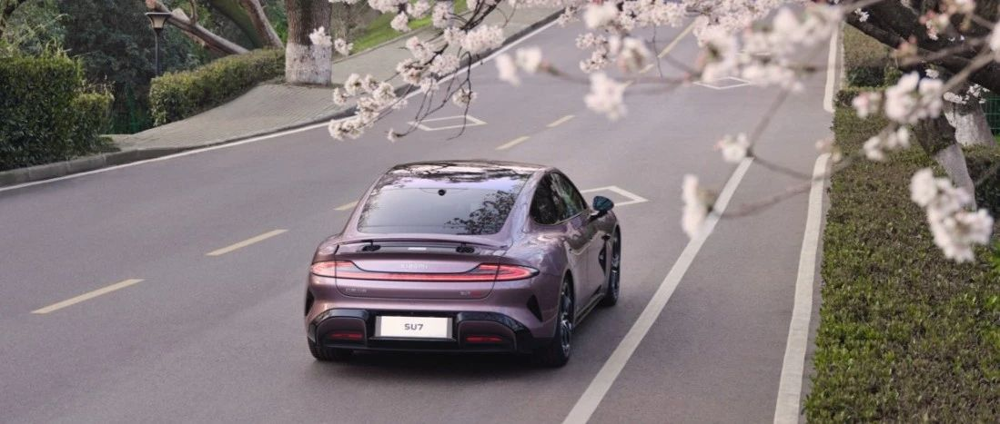

#  小米SU7答网友问（第二十九集）

[ 小米汽车 ](<javascript:void\(0\);>)

______

**01**  

**已经设置了车内高温保护，为何有时候温度超过了，空调也没有启动？**

在中控屏下方控制栏打开设置，进入安全与服务>车内高温保护，可开启该功能，用户可设定40℃、45℃、50℃三种激活温度；但如下条件将限制该功能：

  * 车辆电量低于20%，该功能不再触发；

  * 驻车超过12个小时后，该功能不再触发；

  * 如设置了远程开关空调、预约空调，优先执行以上功能，不触发高温保护。

## **02**

**常见的用车问题，除了咨询客服，有什么渠道可以自行查询吗？**

小米汽车APP中有电子说明书，车主或授权使用车辆的用户在激活车辆后，可以在小米汽车APP“【我的】→【服务】”里查看。

小米SU7车机「全部应用」页面有「用户手册」，且具备搜索功能，用户可搜索关键词自行查阅；

小米汽车官网最底部左下角有「维修信息」入口，点击进入也可查阅小米SU7用户手册，其同样具备搜索功能。（小米SU7用户手册链接：https://tis.ev.xiaomi.com/#/home）

当然，遇到用车疑问时，问问小爱同学会更加方便直接。并且针对一些车控开关，使用小爱同学还能自动跳转到相应控制页，箭头高亮指示，操作直观方便。

## **03**

**是否能用U盘同时兼顾放音乐，以及记录行车记录仪两项功能？**

手套箱内的USB接口仅用于哨兵模式和行车记录仪，不能播放USB音乐。但中控屏下方右侧的Type-C接口可以插U盘实现USB音乐播放。

  

## **04**

**光环尾灯可以在白天常亮吗？**

在车机的灯光控制界面中，手动打开近光灯，可使光环尾灯常亮，但离车要记得手动关闭或切回灯光的自动模式。

  

## **05**

**锁车后短时离开，可以让空调保持一直常开吗？**

在车机屏幕下拉菜单栏中，打开「驻车用电保持」功能，即便关门锁车，空调、娱乐系统等用电器也将保持工作状态；同时用电保持的时长可以设置15分钟~6小时，车辆电量耗至20%时将自动退出。

## **06**  

**后排Pad装上就会默认充电，是否会对Pad电池有影响？**

Pad在车内安装后，存在高温及长时间充电场景，为保护电池循环寿命，我们设计了电量控制逻辑：Pad电量达到30%时启动充电，充到80%时停止充电；所以用户无需担心默认充电对Pad电池的影响。

## **07**

**后备厢左侧的挂钩承重多少？**

后备厢左侧的挂钩适用于悬挂一些在后备厢中不易固定的袋子类物品，悬挂物品的重量不得超过5kg；

此外，中控台下方也有挂钩可悬挂外卖等物品，悬挂物品的重量不得超过10kg。

  

小米SU7答网友问  

持续进行中...

[小米SU7答网友问（第一集）](<http://mp.weixin.qq.com/s?__biz=MzkyNzU3MDI3Nw==&mid=2247486958&idx=1&sn=fa1835ddd2eee3bdafefcad5b74d2d94&chksm=c2274de4f550c4f28c7b9e54f1a6a8bcacc3459e88bbe256c362a899a36ca32c80be4f87c45a&scene=21#wechat_redirect>)

[小米SU7答网友问（第二集）](<http://mp.weixin.qq.com/s?__biz=MzkyNzU3MDI3Nw==&mid=2247487024&idx=1&sn=0c7cfca4d7c560dedf8062fa3a7230e3&chksm=c2274e3af550c72cdf2c4b04f2e6f3f66f10eac3634f77346b68be322d895dfb1398978ccbcf&scene=21#wechat_redirect>)

[小米SU7答网友问（第三集）](<http://mp.weixin.qq.com/s?__biz=MzkyNzU3MDI3Nw==&mid=2247487063&idx=2&sn=a0651af985a684e2379d3805947abc23&chksm=c2274e5df550c74b86d3871da393feb8fcadab0dfcdc8e77c806309341c89f1b37396b0e6318&scene=21#wechat_redirect>)

[小米SU7答网友问（第四集）](<http://mp.weixin.qq.com/s?__biz=MzkyNzU3MDI3Nw==&mid=2247487079&idx=1&sn=9cf62cd9e760babefdd444d29ee00b68&chksm=c2274e6df550c77b506f07fb315efff406bc12a55eba23c69b349cba973f61811d88fd0ade33&scene=21#wechat_redirect>)

[小米SU7答网友问（第五集）](<http://mp.weixin.qq.com/s?__biz=MzkyNzU3MDI3Nw==&mid=2247487101&idx=1&sn=9e00cc3239d1e6d9cb373f2efad42e3c&chksm=c2274e77f550c76157349d363d8e0c17ceadab29fae7538c156149e37c9c89e7cc22644201b2&scene=21#wechat_redirect>)

[小米SU7答网友问（第六集）](<http://mp.weixin.qq.com/s?__biz=MzkyNzU3MDI3Nw==&mid=2247487835&idx=2&sn=30cf8170af01397c46dc34cf495f7c02&chksm=c2275151f550d847fcc5d8d333c20a5d27d60276888d7192f51064f53e6fa738e21bf375ef29&scene=21#wechat_redirect>)

[小米SU7答网友问（第七集）](<http://mp.weixin.qq.com/s?__biz=MzkyNzU3MDI3Nw==&mid=2247487849&idx=1&sn=45b7ceae12489188c167129f3fb8b1a6&chksm=c2275163f550d87500cbacfac5ee05ea1b5083b97beb0d16e375b98480c98c823fbfdcc4d45a&scene=21#wechat_redirect>)

[小米SU7答网友问（第八集）](<http://mp.weixin.qq.com/s?__biz=MzkyNzU3MDI3Nw==&mid=2247487860&idx=1&sn=337ffc5a7972e5758d3208fb1eb7a28d&chksm=c227517ef550d86838d64b08036486d07a6ea303f0f8e2e9bb93b097750beeb6b2649b692ede&scene=21#wechat_redirect>)

[小米SU7答网友问（第九集）](<http://mp.weixin.qq.com/s?__biz=MzkyNzU3MDI3Nw==&mid=2247487868&idx=1&sn=8021638c108d845fab76580a6cc405e9&chksm=c2275176f550d86086dc3bcdbc3b4cf518b1ba41a294c3ad5d39504791907edcc6422b015131&scene=21#wechat_redirect>)

[小米SU7答网友问（第十集）](<http://mp.weixin.qq.com/s?__biz=MzkyNzU3MDI3Nw==&mid=2247487890&idx=1&sn=47696df25bbc82e7c5aea71ccd30030e&chksm=c2275198f550d88e577cf942e5f0b4a7a6a21cc2cec4b0f04562b6acaa878177be8d8f2507b9&scene=21#wechat_redirect>)

[小米SU7答网友问（第十一集）](<http://mp.weixin.qq.com/s?__biz=MzkyNzU3MDI3Nw==&mid=2247487900&idx=1&sn=7765954b27cc8772008540f91ca7224d&chksm=c2275196f550d8807e8be4cee38e091559c454cfc8bed3e843d4e425f4b002ee0cb931c883d8&scene=21#wechat_redirect>)

[小米SU7答网友问（第十二集）](<http://mp.weixin.qq.com/s?__biz=MzkyNzU3MDI3Nw==&mid=2247487915&idx=1&sn=abbebbb9cbe0668b66a9c1026b12932f&chksm=c22751a1f550d8b73c8ad64a95a0158ef65c19c0becad656d616125a396dc6b4c6703e97f967&scene=21#wechat_redirect>)

[小米SU7答网友问（第十三集）](<http://mp.weixin.qq.com/s?__biz=MzkyNzU3MDI3Nw==&mid=2247487947&idx=1&sn=f544e6be6fd1221b57e5123f58c1f72c&chksm=c22751c1f550d8d76cf64deaaaf06423ad37525bfbda26eb8e1d0a5952a5b1ae30188c90c2c4&scene=21#wechat_redirect>)

[小米SU7答网友问（第十四集）](<http://mp.weixin.qq.com/s?__biz=MzkyNzU3MDI3Nw==&mid=2247487955&idx=1&sn=ee2a1734fe86b15000822bee9ae0ffd2&chksm=c22751d9f550d8cfdb48ae0c890173e37f66356ad6316e9ada00ee7c231d0772ee6e4c817c65&scene=21#wechat_redirect>)

[小米SU7答网友问（第十五集）](<http://mp.weixin.qq.com/s?__biz=MzkyNzU3MDI3Nw==&mid=2247487979&idx=1&sn=ab9d29fdf3c1147cd9c500ac5fafedde&chksm=c22751e1f550d8f725f7b294d004e04caa682567387ee5ee39a067fad1859fcaca2e68748e6f&scene=21#wechat_redirect>)

[小米SU7答网友问（第十六集）](<http://mp.weixin.qq.com/s?__biz=MzkyNzU3MDI3Nw==&mid=2247488003&idx=1&sn=9ed994132d197917e93f91b9f332e8d1&chksm=c2275209f550db1fe70c13abc492f5c01be8e5b5b81fba7379fe76c52c5256038eb4d6080ce6&scene=21#wechat_redirect>)

[小米SU7答网友问（第十七集）](<http://mp.weixin.qq.com/s?__biz=MzkyNzU3MDI3Nw==&mid=2247488035&idx=1&sn=fcfdeca83d7ca7c13e84b84a92146ed0&chksm=c2275229f550db3f3019dfe29d896a4c7c49a61351dd801e7b3520c9174e26ce040555c9756a&scene=21#wechat_redirect>)

[小米SU7答网友问（第十八集）](<http://mp.weixin.qq.com/s?__biz=MzkyNzU3MDI3Nw==&mid=2247488044&idx=1&sn=15e0313c7b352da563c38d6b64e5cb27&chksm=c2275226f550db303d96d77050e8fe6c21f6c0fd9453e84d129f29cd0024fcf7dd5d0cab4ec8&scene=21#wechat_redirect>)

[小米SU7答网友问（第十九集）](<http://mp.weixin.qq.com/s?__biz=MzkyNzU3MDI3Nw==&mid=2247488049&idx=1&sn=20d5d20c485040ccd9bbe1100ad0dd18&chksm=c227523bf550db2d8d6d7bb477f3f83742d63b451060848150a41d9bf819ff812b73c67add01&scene=21#wechat_redirect>)

[小米SU7答网友问（第二十集）](<http://mp.weixin.qq.com/s?__biz=MzkyNzU3MDI3Nw==&mid=2247488056&idx=1&sn=efcffc7ee04fad7bcb74c548c6941929&chksm=c2275232f550db24c3c6d404748637a9d2a1e60c653ddbf9ddafdc767e79454a3602f3d0ef1c&scene=21#wechat_redirect>)

[小米SU7答网友问（第二十一集）](<http://mp.weixin.qq.com/s?__biz=MzkyNzU3MDI3Nw==&mid=2247488116&idx=1&sn=023b64046c6b458d5d18d3127927f1d7&chksm=c227527ef550db683a84f930ced2a5490c3db91875d0f42b3f9389ccd9c7f28f2df9bc801981&scene=21#wechat_redirect>)

[小米SU7答网友问（第二十二集）](<http://mp.weixin.qq.com/s?__biz=MzkyNzU3MDI3Nw==&mid=2247488132&idx=1&sn=9886d3575c66671b6730a33b6306dab3&chksm=c227528ef550db987a53c13da3d506b2811d5055612cd653ef3991e43c17f4ec4537272e2921&scene=21#wechat_redirect>)

[小米SU7答网友问（第二十三集）](<http://mp.weixin.qq.com/s?__biz=MzkyNzU3MDI3Nw==&mid=2247488147&idx=1&sn=152e9e104197e2a3cf83a0752b29ab2c&chksm=c2275299f550db8f55fc3419acf0eaaa7942e67e59fd74824fe80163cc474cfe2c2c4f86b57e&scene=21#wechat_redirect>)

[小米SU7答网友问（第二十四集）](<http://mp.weixin.qq.com/s?__biz=MzkyNzU3MDI3Nw==&mid=2247488153&idx=1&sn=5813bae70bf685e3be696e424e91c2b8&chksm=c2275293f550db85b0f9e2c070e7e44c503db4898fc24aa5408212264c0047d4f027510be852&scene=21#wechat_redirect>)

[小米SU7答网友问（第二十五集）](<http://mp.weixin.qq.com/s?__biz=MzkyNzU3MDI3Nw==&mid=2247488181&idx=2&sn=8c839457b13992e0fa44edf3c74c9b89&chksm=c22752bff550dba973f0a90364cfd25c389abce8b4d1f193fd418ab7ec724579d6b6b7c70848&scene=21#wechat_redirect>)

[小米SU7答网友问（第二十六集）](<http://mp.weixin.qq.com/s?__biz=MzkyNzU3MDI3Nw==&mid=2247488457&idx=2&sn=dc543fd12a83946ac754f5587901551b&chksm=c22753c3f550dad5ffda70b1d547b1c1ebfb49acd80723e8532dbf868b6ce80322f3a21f54c2&scene=21#wechat_redirect>)

[小米SU7答网友问（第二十七集）](<http://mp.weixin.qq.com/s?__biz=MzkyNzU3MDI3Nw==&mid=2247488844&idx=2&sn=98831e69ba6a5309e094f854c33c1239&chksm=c2275546f550dc50ae5e62fa68397d8534114ad575fa9d42a024a02a7c76e4f387c67870ecd4&scene=21#wechat_redirect>)

[小米SU7答网友问（第二十八集）](<http://mp.weixin.qq.com/s?__biz=MzkyNzU3MDI3Nw==&mid=2247489053&idx=1&sn=3d62061e54b6f4f3c1bba10951f9fd63&chksm=c2275617f550df01be5542c293f970e423f9de7f4b52f78df9d859f093ac70c3f245e3b1c61f&scene=21#wechat_redirect>)

  

* * *

4月25日至5月4日北京国际车展期间，关注“小米汽车”公众号，每小时抽送**不锈钢马克杯** 、**合金T恤** ，每天抽送**手机** 、**合金****车模** 。点击下方卡片链接，即可参与⬇️

  

预览时标签不可点

微信扫一扫  
关注该公众号

继续滑动看下一个

轻触阅读原文

小米汽车 

向上滑动看下一个

[知道了](<javascript:;>)

微信扫一扫  
使用小程序

****

[取消](<javascript:void\(0\);>) [允许](<javascript:void\(0\);>)

****

[取消](<javascript:void\(0\);>) [允许](<javascript:void\(0\);>)

****

[取消](<javascript:void\(0\);>) [允许](<javascript:void\(0\);>)

× 分析

__

微信扫一扫可打开此内容，  
使用完整服务

： ， ， ， ， ， ， ， ， ， ， ， ， 。 视频 小程序 赞 ，轻点两下取消赞 在看 ，轻点两下取消在看 分享 留言 收藏 听过