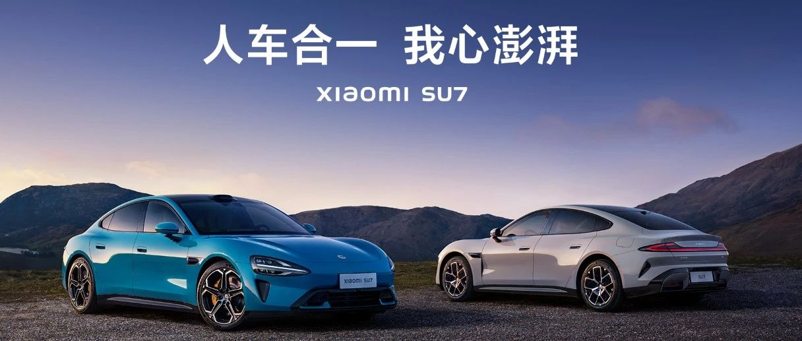

#  小米SU7答网友问（第二集）

[ 小米汽车 ](<javascript:void\(0\);>)

______

昨天我们就大家关心的问题

统一回答了第一集

小米SU7答网友问（第一集）

今天就购买、体验和服务方面

继续回答大家关心的问题👇

  

## **01**

**如果购买了创始版或其他版本，但有更换轮毂需求该怎么办？怎么购买/置换其它款轮毂？**

在锁单之前，可进行不同轮毂轮胎搭配的选择，锁单之后则无法更改。不同的轮毂和轮胎对车辆行驶有不同的适配性，也是车辆年检的检查项之一，如购车后希望更换购买其他型款的轮毂和轮胎，建议咨询官方授权服务中心后再行换购。

特别说明：创始版为已生产的特殊版本，上牌前已无法更换任何配置。

  

## **02**

**轮胎是否为定制款，日后更换是否只能去官方？******

小米SU7 全系都采用全球顶级品牌的轮胎，除19‘’ 米其林 E-Primacy 低滚阻轮胎（能提供更长的续航里程）外，其余三款（原厂匹配 轮胎、19‘’ TURANZA 6 舒适胎、20‘’米其林PilotSport EV静音胎及倍耐力P ZERO 5代运动胎）均为轮胎品牌方结合SU7性能量身打造的定制款。建议通过官方渠道购买定制轮胎。

  

## **03**

**购车之后去4S店的提车流程是哪些？我需要注意哪些材料和手续？**

购车后统一到当地的交付中心提车。

交付中心会预约用户提车时间，需携带以下材料：

  

## **04**  

**锁定配置后，我大概什么时候可以提车？**

小米SU7标准版和Max版预计从4月底开始陆续启动交付，Pro版预计从5月底开始陆续启动交付。当您锁定配置后，我们的工厂即按您设定的配置开始排产。您可以从小米汽车APP中看到大致的进度，及预估的交车时间。锁定配置前，您可以通过「开始配置」的选装过程页面的最下方查看每种配置组合对应的预计交付周期；锁定配置后，您可以通过「查看订单」页面查询预计交付时间。创始版为现车，从4月3日起正式陆续交付。

  

## **05**

**小米汽车后续会不会提供赛道模式？**

小米SU7 Max版带有专业驾驶相关的「大师模式APP beta」，该APP中将会提供G值表和驾驶能力热力图、更细致的TC牵引力辅助，以及ESC车身稳定辅助调节挡位，并预设了自定义模式和漂移模式两种选项。

「大师模式APP beta」主要针对专业驾驶相关用户，所以需要在车机中进行答题后激活，也建议在专业封闭场地激活使用。

  

## **06**

**小米SU7在海外有没有销售计划？**

目前暂没有海外销售计划，请等待官方的后续信息为准。

  

  

## **07******

**购车有无政策补贴？具体怎么查询政策？**

各地政策各有不同。如天津可享受车价15-25万元车型3000元补贴；25-35万元车型4000元补贴。

具体补政策可登录当地车管所或新能源办官网查询。您所在城市的小米汽车门店也可向您提供当地政策补贴的咨询服务。  

  

## **08**

**小米SU7的车险费用大概是多少？小米有自己合作的保险吗？**

不同的车辆售价及不同的城市地区，新车保险价格均有不同。提车前车辆保险价格预估，可咨询当地销售人员或交付专员。

小米汽车与平安财险、阳光财险、人保财险、太平洋财险四大保司合作，为用户提供合适的官方保险产品。用户可在交付提车前，咨询交付专员获得详细产品信息和购买建议。

  

## **09**

**小米家充桩有哪些规格？是否支持免费安装？**

小米家充桩有7kW和11kW两种规格，其中11kW适配SU7 Max车型。您所购买的家充桩产品中，包含家充设备和30米线缆内基础安装服务（中国大陆地区）。欢迎您在小米汽车APP商城选购。

  

## **10**

**小米城市领航辅助驾驶什么时候开放？**

目前小米智驾城市领航的开城计划是：4月开启用户内测、5月开启10城、8月全国可用。这也是业内罕见的城市领航推进速度。具体请以小米汽车官方实际通知为准。

  

## **11**

**其他品牌手机和平板能否实现小米车机投屏？能实现那些功能？**

  

小米澎湃智能座舱有着非常丰富的生态拓展能力，可支持苹果用户使用CarPlay互联，该功能已完成测试开发，会在后续OTA推送。同时，后排可支持iPad上车，在购买专用iPad拓展支架后，iPad可安装在前排椅背。下载安装“小米汽车拓展屏”APP，即可实现座椅空调调节、多媒体调节、影音娱乐等原生车机般的体验。

对于其他多数安卓手机均可通过CarLink将手机与车机系统连接，实现在中控屏上使用手机中的导航、音乐、电话等服务。同时，因为支持DLNA，也支持安卓手机的音视频无线流转，非常方便。

  

## **12**

**质保是只限于首任车主么？是跟车还是跟人？**

质保不限首任车主，跟车不跟人。

  

## **13**

**小米SU7的养车成本怎么样？小保养费用是多少？**

首保（首年或两万公里）480元，第二年750元左右，第三年1400元左右。

  

## **14**

**为什么有媒体实测的加速时间跟官方数据有出入？**

为了充分排除起步瞬间的干扰因素，如轮胎打滑、车手反应时间等，零百加速不含起步时间是行业中普遍的一种测试方法，能更纯粹的反应车本身的能力。媒体实测包含起步时间，并且过程中，轮胎状态、路面条件、气候条件和车手反应均会影响加速表现，所以实测的数据会有些轻微出入。

在媒体实测中，小米SU7 Max 零百加速实测3.09s（官方2.78s），同场地特斯拉Model S Plaid实测2.73s（官方2.1s），保时捷Taycan Turbo 2022款实测3.44s（官方3.2s，含起步时间）。

  

预览时标签不可点

修改于

微信扫一扫  
关注该公众号

继续滑动看下一个

轻触阅读原文

小米汽车 

向上滑动看下一个

[知道了](<javascript:;>)

微信扫一扫  
使用小程序

****

[取消](<javascript:void\(0\);>) [允许](<javascript:void\(0\);>)

****

[取消](<javascript:void\(0\);>) [允许](<javascript:void\(0\);>)

****

[取消](<javascript:void\(0\);>) [允许](<javascript:void\(0\);>)

× 分析

__

微信扫一扫可打开此内容，  
使用完整服务

： ， ， ， ， ， ， ， ， ， ， ， ， 。 视频 小程序 赞 ，轻点两下取消赞 在看 ，轻点两下取消在看 分享 留言 收藏 听过