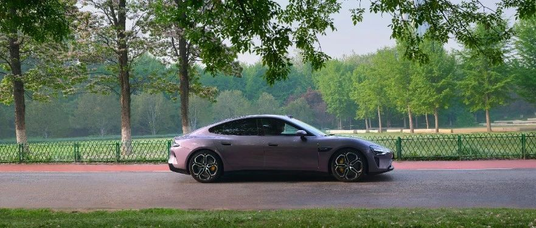

#  小米SU7答网友问（第三十九集）

[ 小米汽车 ](<javascript:void\(0\);>)

______

**01**

**授权登录账号，持续多久后需要重新授权？**

如果您为家人/朋友授权车辆使用权限，默认为长期有效。

如果需要解除授权，随时在小米汽车APP的“车辆-钥匙与安全”内删除即可。

  

## **02**

**智能泊车目前已具备哪些功能？机械车库泊车什么时候支持？**

小米智能泊车辅助目前支持涵盖侧方位、空间车位、极窄车位等200余种类型车位泊入，完成率超过95%，同时也具备机械库位泊入能力，后续将通过OTA进行推送。

  

## **03**

**小米手机上车后，通过车载小爱，可以实现哪些对手机的控制功能？**

小米手机上车，您可以唤醒车载小爱说“用手机xxx”，就能控制很多手机上的功能。比如：

  * 过收费站，可以说“打开微信付款码”或“打开微信扫一扫”，然后拿起手机即可快速付费过站；

  * 途中想看看餐饮评分，可以试试“手机大众点评搜索火锅”；

  * 想听手机上的音乐，也没问题，可以对汽车小爱说“手机播放XX的歌”，手机音乐会从汽车的扬声器播放；

  * 下车的时候，找不到手机，可以说“我的手机掉哪了”，手机就会发出铃。

注：需要在车机「设置-连接-小米互联互通」中连接与车机同账号的小米手机，同时升级至最新的手机小爱版本。

  

## **04**

**车载的智能感知传感器，例如毫米波雷达、激光雷达等，如有意外磕碰损坏，更换维护有什么要注意的吗？**

小米SU7标准版搭载有摄像头、毫米波雷达、超声波雷达三个类型的传感器，小米SU7 Pro和Max还额外搭载有激光雷达。

所有的传感器在出厂之前均完成了标定和校准，用户提车后可直接使用。

如若车辆传感器或安装位置存在碰撞损坏，或出现其他传感器故障提示时，需前往维修中心进行检查和标定，正常使用情况下无须定期标定和校准。

注意: 请勿自行更换或者维修传感器及周边部件，出现任何故障或损伤，请及时联系小米售后中心提供支持。

  

**05**  

**打开主驾头枕扬声器模式，能实现什么功能？**

小米SU7全系车型标配2个头枕扬声器。打开头枕扬声器模式，电话、导航、辅助驾驶播报将仅从头枕扬声器播放，不影响车内乘客听歌娱乐。

在头枕扬声器模式下使用手机通话时，除了对方通话的声音仅从头枕扬声器播放外，还能带来“声音茧”般的通话降噪效果，即通话只收录主驾驶位声音，车内其他乘客的声音不收录，开车打电话不必再担心车内孩子调皮等嘈杂情况。

  

  

小米SU7答网友问  

持续进行中...

[小米SU7答网友问（第一集）](<http://mp.weixin.qq.com/s?__biz=MzkyNzU3MDI3Nw==&mid=2247486958&idx=1&sn=fa1835ddd2eee3bdafefcad5b74d2d94&chksm=c2274de4f550c4f28c7b9e54f1a6a8bcacc3459e88bbe256c362a899a36ca32c80be4f87c45a&scene=21#wechat_redirect>)

[小米SU7答网友问（第二集）](<http://mp.weixin.qq.com/s?__biz=MzkyNzU3MDI3Nw==&mid=2247487024&idx=1&sn=0c7cfca4d7c560dedf8062fa3a7230e3&chksm=c2274e3af550c72cdf2c4b04f2e6f3f66f10eac3634f77346b68be322d895dfb1398978ccbcf&scene=21#wechat_redirect>)

[小米SU7答网友问（第三集）](<http://mp.weixin.qq.com/s?__biz=MzkyNzU3MDI3Nw==&mid=2247487063&idx=2&sn=a0651af985a684e2379d3805947abc23&chksm=c2274e5df550c74b86d3871da393feb8fcadab0dfcdc8e77c806309341c89f1b37396b0e6318&scene=21#wechat_redirect>)

[小米SU7答网友问（第四集）](<http://mp.weixin.qq.com/s?__biz=MzkyNzU3MDI3Nw==&mid=2247487079&idx=1&sn=9cf62cd9e760babefdd444d29ee00b68&chksm=c2274e6df550c77b506f07fb315efff406bc12a55eba23c69b349cba973f61811d88fd0ade33&scene=21#wechat_redirect>)

[小米SU7答网友问（第五集）](<http://mp.weixin.qq.com/s?__biz=MzkyNzU3MDI3Nw==&mid=2247487101&idx=1&sn=9e00cc3239d1e6d9cb373f2efad42e3c&chksm=c2274e77f550c76157349d363d8e0c17ceadab29fae7538c156149e37c9c89e7cc22644201b2&scene=21#wechat_redirect>)

[小米SU7答网友问（第六集）](<http://mp.weixin.qq.com/s?__biz=MzkyNzU3MDI3Nw==&mid=2247487835&idx=2&sn=30cf8170af01397c46dc34cf495f7c02&chksm=c2275151f550d847fcc5d8d333c20a5d27d60276888d7192f51064f53e6fa738e21bf375ef29&scene=21#wechat_redirect>)

[小米SU7答网友问（第七集）](<http://mp.weixin.qq.com/s?__biz=MzkyNzU3MDI3Nw==&mid=2247487849&idx=1&sn=45b7ceae12489188c167129f3fb8b1a6&chksm=c2275163f550d87500cbacfac5ee05ea1b5083b97beb0d16e375b98480c98c823fbfdcc4d45a&scene=21#wechat_redirect>)

[小米SU7答网友问（第八集）](<http://mp.weixin.qq.com/s?__biz=MzkyNzU3MDI3Nw==&mid=2247487860&idx=1&sn=337ffc5a7972e5758d3208fb1eb7a28d&chksm=c227517ef550d86838d64b08036486d07a6ea303f0f8e2e9bb93b097750beeb6b2649b692ede&scene=21#wechat_redirect>)

[小米SU7答网友问（第九集）](<http://mp.weixin.qq.com/s?__biz=MzkyNzU3MDI3Nw==&mid=2247487868&idx=1&sn=8021638c108d845fab76580a6cc405e9&chksm=c2275176f550d86086dc3bcdbc3b4cf518b1ba41a294c3ad5d39504791907edcc6422b015131&scene=21#wechat_redirect>)

[小米SU7答网友问（第十集）](<http://mp.weixin.qq.com/s?__biz=MzkyNzU3MDI3Nw==&mid=2247487890&idx=1&sn=47696df25bbc82e7c5aea71ccd30030e&chksm=c2275198f550d88e577cf942e5f0b4a7a6a21cc2cec4b0f04562b6acaa878177be8d8f2507b9&scene=21#wechat_redirect>)

[小米SU7答网友问（第十一集）](<http://mp.weixin.qq.com/s?__biz=MzkyNzU3MDI3Nw==&mid=2247487900&idx=1&sn=7765954b27cc8772008540f91ca7224d&chksm=c2275196f550d8807e8be4cee38e091559c454cfc8bed3e843d4e425f4b002ee0cb931c883d8&scene=21#wechat_redirect>)

[小米SU7答网友问（第十二集）](<http://mp.weixin.qq.com/s?__biz=MzkyNzU3MDI3Nw==&mid=2247487915&idx=1&sn=abbebbb9cbe0668b66a9c1026b12932f&chksm=c22751a1f550d8b73c8ad64a95a0158ef65c19c0becad656d616125a396dc6b4c6703e97f967&scene=21#wechat_redirect>)

[小米SU7答网友问（第十三集）](<http://mp.weixin.qq.com/s?__biz=MzkyNzU3MDI3Nw==&mid=2247487947&idx=1&sn=f544e6be6fd1221b57e5123f58c1f72c&chksm=c22751c1f550d8d76cf64deaaaf06423ad37525bfbda26eb8e1d0a5952a5b1ae30188c90c2c4&scene=21#wechat_redirect>)

[小米SU7答网友问（第十四集）](<http://mp.weixin.qq.com/s?__biz=MzkyNzU3MDI3Nw==&mid=2247487955&idx=1&sn=ee2a1734fe86b15000822bee9ae0ffd2&chksm=c22751d9f550d8cfdb48ae0c890173e37f66356ad6316e9ada00ee7c231d0772ee6e4c817c65&scene=21#wechat_redirect>)

[小米SU7答网友问（第十五集）](<http://mp.weixin.qq.com/s?__biz=MzkyNzU3MDI3Nw==&mid=2247487979&idx=1&sn=ab9d29fdf3c1147cd9c500ac5fafedde&chksm=c22751e1f550d8f725f7b294d004e04caa682567387ee5ee39a067fad1859fcaca2e68748e6f&scene=21#wechat_redirect>)

[小米SU7答网友问（第十六集）](<http://mp.weixin.qq.com/s?__biz=MzkyNzU3MDI3Nw==&mid=2247488003&idx=1&sn=9ed994132d197917e93f91b9f332e8d1&chksm=c2275209f550db1fe70c13abc492f5c01be8e5b5b81fba7379fe76c52c5256038eb4d6080ce6&scene=21#wechat_redirect>)

[小米SU7答网友问（第十七集）](<http://mp.weixin.qq.com/s?__biz=MzkyNzU3MDI3Nw==&mid=2247488035&idx=1&sn=fcfdeca83d7ca7c13e84b84a92146ed0&chksm=c2275229f550db3f3019dfe29d896a4c7c49a61351dd801e7b3520c9174e26ce040555c9756a&scene=21#wechat_redirect>)

[小米SU7答网友问（第十八集）](<http://mp.weixin.qq.com/s?__biz=MzkyNzU3MDI3Nw==&mid=2247488044&idx=1&sn=15e0313c7b352da563c38d6b64e5cb27&chksm=c2275226f550db303d96d77050e8fe6c21f6c0fd9453e84d129f29cd0024fcf7dd5d0cab4ec8&scene=21#wechat_redirect>)

[小米SU7答网友问（第十九集）](<http://mp.weixin.qq.com/s?__biz=MzkyNzU3MDI3Nw==&mid=2247488049&idx=1&sn=20d5d20c485040ccd9bbe1100ad0dd18&chksm=c227523bf550db2d8d6d7bb477f3f83742d63b451060848150a41d9bf819ff812b73c67add01&scene=21#wechat_redirect>)

[小米SU7答网友问（第二十集）](<http://mp.weixin.qq.com/s?__biz=MzkyNzU3MDI3Nw==&mid=2247488056&idx=1&sn=efcffc7ee04fad7bcb74c548c6941929&chksm=c2275232f550db24c3c6d404748637a9d2a1e60c653ddbf9ddafdc767e79454a3602f3d0ef1c&scene=21#wechat_redirect>)

[小米SU7答网友问（第二十一集）](<http://mp.weixin.qq.com/s?__biz=MzkyNzU3MDI3Nw==&mid=2247488116&idx=1&sn=023b64046c6b458d5d18d3127927f1d7&chksm=c227527ef550db683a84f930ced2a5490c3db91875d0f42b3f9389ccd9c7f28f2df9bc801981&scene=21#wechat_redirect>)

[小米SU7答网友问（第二十二集）](<http://mp.weixin.qq.com/s?__biz=MzkyNzU3MDI3Nw==&mid=2247488132&idx=1&sn=9886d3575c66671b6730a33b6306dab3&chksm=c227528ef550db987a53c13da3d506b2811d5055612cd653ef3991e43c17f4ec4537272e2921&scene=21#wechat_redirect>)

[小米SU7答网友问（第二十三集）](<http://mp.weixin.qq.com/s?__biz=MzkyNzU3MDI3Nw==&mid=2247488147&idx=1&sn=152e9e104197e2a3cf83a0752b29ab2c&chksm=c2275299f550db8f55fc3419acf0eaaa7942e67e59fd74824fe80163cc474cfe2c2c4f86b57e&scene=21#wechat_redirect>)

[小米SU7答网友问（第二十四集）](<http://mp.weixin.qq.com/s?__biz=MzkyNzU3MDI3Nw==&mid=2247488153&idx=1&sn=5813bae70bf685e3be696e424e91c2b8&chksm=c2275293f550db85b0f9e2c070e7e44c503db4898fc24aa5408212264c0047d4f027510be852&scene=21#wechat_redirect>)

[小米SU7答网友问（第二十五集）](<http://mp.weixin.qq.com/s?__biz=MzkyNzU3MDI3Nw==&mid=2247488181&idx=2&sn=8c839457b13992e0fa44edf3c74c9b89&chksm=c22752bff550dba973f0a90364cfd25c389abce8b4d1f193fd418ab7ec724579d6b6b7c70848&scene=21#wechat_redirect>)

[小米SU7答网友问（第二十六集）](<http://mp.weixin.qq.com/s?__biz=MzkyNzU3MDI3Nw==&mid=2247488457&idx=2&sn=dc543fd12a83946ac754f5587901551b&chksm=c22753c3f550dad5ffda70b1d547b1c1ebfb49acd80723e8532dbf868b6ce80322f3a21f54c2&scene=21#wechat_redirect>)

[小米SU7答网友问（第二十七集）](<http://mp.weixin.qq.com/s?__biz=MzkyNzU3MDI3Nw==&mid=2247488844&idx=2&sn=98831e69ba6a5309e094f854c33c1239&chksm=c2275546f550dc50ae5e62fa68397d8534114ad575fa9d42a024a02a7c76e4f387c67870ecd4&scene=21#wechat_redirect>)

[小米SU7答网友问（第二十八集）](<http://mp.weixin.qq.com/s?__biz=MzkyNzU3MDI3Nw==&mid=2247489053&idx=1&sn=3d62061e54b6f4f3c1bba10951f9fd63&chksm=c2275617f550df01be5542c293f970e423f9de7f4b52f78df9d859f093ac70c3f245e3b1c61f&scene=21#wechat_redirect>)

[小米SU7答网友问（第二十九集）](<http://mp.weixin.qq.com/s?__biz=MzkyNzU3MDI3Nw==&mid=2247489094&idx=1&sn=c848ebd55207ba710c9de9073d962c9e&chksm=c227564cf550df5aea0babf7ffa56a9799b53568bb4b6070cfa211e40e53bcabce20a6af7604&scene=21#wechat_redirect>)

[小米SU7答网友问（第三十集）](<http://mp.weixin.qq.com/s?__biz=MzkyNzU3MDI3Nw==&mid=2247489111&idx=2&sn=4f2f8dd41b74d1d89d550e2ae815c1f2&chksm=c227565df550df4b59a0f1299d22fc9754f4e30d0b0d6988391880fd69b9fdccbc1df03c1e48&scene=21#wechat_redirect>)

[小米SU7答网友问（第三十一集）](<http://mp.weixin.qq.com/s?__biz=MzkyNzU3MDI3Nw==&mid=2247489124&idx=1&sn=6d53ab6ed9f1c1cc939c74ddbe76a650&chksm=c227566ef550df78f38c97a793e31a7f0dffe7479d6c9f7f218fbefd726bb7eba073b9b21464&scene=21#wechat_redirect>)

[小米SU7答网友问（第三十二集）](<http://mp.weixin.qq.com/s?__biz=MzkyNzU3MDI3Nw==&mid=2247489152&idx=2&sn=2229789f64f8dc70a5d7ded66f0f6baa&chksm=c227568af550df9cccce7432efc9ecb9e6e805032c0bd5bfa1a8d8d5c3d5b725e2925237e33d&scene=21#wechat_redirect>)

[小米SU7答网友问（第三十三集）](<http://mp.weixin.qq.com/s?__biz=MzkyNzU3MDI3Nw==&mid=2247489245&idx=1&sn=e4f7c471dda5bd47e73caa15527ad794&chksm=c22756d7f550dfc1d5d8643e8565e173a998c108296a5d9ceb1d406be13f6e0c5449cd034ab5&scene=21#wechat_redirect>)

[小米SU7答网友问（第三十四集）](<http://mp.weixin.qq.com/s?__biz=MzkyNzU3MDI3Nw==&mid=2247489298&idx=2&sn=1f871b382371e8b67d0ff1b215f282f5&chksm=c2275718f550de0eeff4fb8a4cc934759826a3ef78444c2aef5b7a624e7420cc0d9a32aa07ac&scene=21#wechat_redirect>)

[小米SU7答网友问（第三十五集）](<http://mp.weixin.qq.com/s?__biz=MzkyNzU3MDI3Nw==&mid=2247489302&idx=1&sn=766fc99aa9b769aa665f9472def7a9ab&chksm=c227571cf550de0aa58d5ef6cda5a89fcb974624a98c63920cccd8a162975293a783f37db438&scene=21#wechat_redirect>)

[小米SU7答网友问（第三十六集）](<http://mp.weixin.qq.com/s?__biz=MzkyNzU3MDI3Nw==&mid=2247489317&idx=1&sn=180e2c4ccf08ec946fe76b0d6d036bc4&chksm=c227572ff550de39da94a83c13f9dd07d8765d73352b313af828f7ef1dd4c1c13640d77f077d&scene=21#wechat_redirect>)

[小米SU7答网友问（第三十七集）](<http://mp.weixin.qq.com/s?__biz=MzkyNzU3MDI3Nw==&mid=2247489351&idx=1&sn=f2d124f2b6428510ed6c35e736139220&chksm=c227574df550de5bbc46ced0788893dd5de4160db027705aa6d4fe7925bcf0ced45758851cb7&scene=21#wechat_redirect>)

[小米SU7答网友问（第三十八集）](<http://mp.weixin.qq.com/s?__biz=MzkyNzU3MDI3Nw==&mid=2247489704&idx=1&sn=5ff9177389c27e0f3d44fc7155093920&chksm=c22758a2f550d1b4fd1b08407c8def3d1add572f7af411f7b101b9674980f0f306da479a6c4a&scene=21#wechat_redirect>)

* * *

北京国际车展期间，每小时答题抽奖活动已同步结束。恭喜中奖的740名幸运用户，请及时填写收货地址，**截止5月9日24点** ，未填写收货地址的中奖用户，**视为自愿放弃** 。****

  

预览时标签不可点

微信扫一扫  
关注该公众号

继续滑动看下一个

轻触阅读原文

小米汽车 

向上滑动看下一个

[知道了](<javascript:;>)

微信扫一扫  
使用小程序

****

[取消](<javascript:void\(0\);>) [允许](<javascript:void\(0\);>)

****

[取消](<javascript:void\(0\);>) [允许](<javascript:void\(0\);>)

****

[取消](<javascript:void\(0\);>) [允许](<javascript:void\(0\);>)

× 分析

__

微信扫一扫可打开此内容，  
使用完整服务

： ， ， ， ， ， ， ， ， ， ， ， ， 。 视频 小程序 赞 ，轻点两下取消赞 在看 ，轻点两下取消在看 分享 留言 收藏 听过