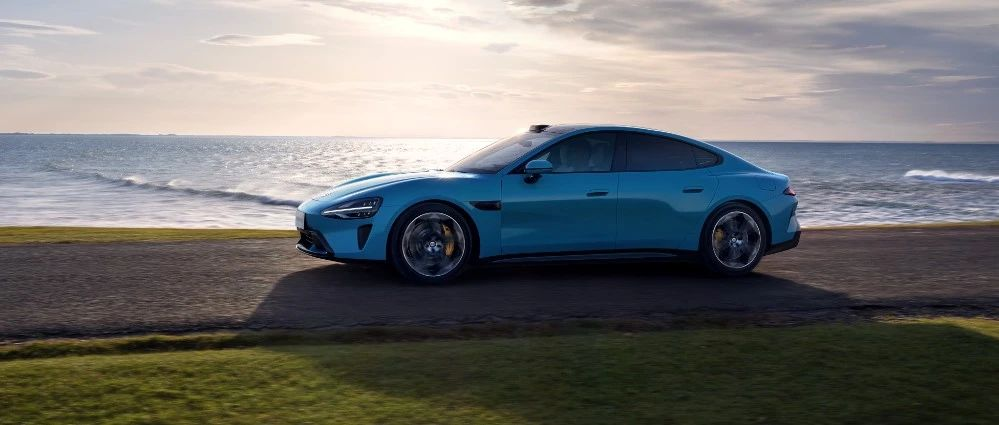

#  小米SU7答网友问（第四十二集）

[ 小米汽车 ](<javascript:void\(0\);>)

______

  

  

****

**01**  

**目前小米SU7的产能和交付提升进展如何？**

经过一系列努力，目前我们的产能扩充和交付提速进展非常顺利。

6月，小米汽车工厂将开双班，我们会确保6月实现单月交付1万辆以上。

今年全年我们将确保交付10万辆以上，同时会进一步冲刺12万辆交付。

**02**  

**有媒体测试，“小米SU7充满73.6度电池费了87.86度电”，这是为什么呢？**  

先说结论：这并不是“反向虚标”，也不会额外花费更多的电费，而是真实充电量、放电量的如实体现。

要解释清楚这个问题，我们首先要介绍一个概念：就是真实「电量」（包括充电量和放电量），和产品公告中标注的电池电量之间，是存在差别的。实际上，标注的电量是测试出来的，并非一个固定值。

行业中普遍用1C或者1/3C来给电池标注电量。这个“1C”或“1/3C”是“放电倍率”，指的是“以多快的速度（几倍的速率）来放电”：

  * 1C，就是满电的电池，以固定电流放电，1小时放至亏电
  * 1/3C，即满电的电池，以固定电流放电，3小时放至亏电

按照法规的要求，小米SU7公告时，是按照1C的标准申报，如此小米SU7标准版电池容量为73.6度。按照1/3C放电，小米SU7标准版能放出的电量是76.8度。可以看到，根据不同的放电倍率，同一电池所放出来的电量是有差别的。同时，日常工况中，放电倍率是更低的，电池可以放出更多电量，还能跑出更多的里程。

而关于充电，还有更多影响因素：首先，为保证新车交付到用户手中时电量达标，实际充入的电量会高于标注电量；其次，因为放电深度、充电电流大小、电池管理策略的不同，充入的实际电量也会有差异，有可能会充入更多电量。

当然，大家不必都深入了解其中原理，可以简单理解为：在缓和充电和放电工况下，能够充入和放出的电量，相较标注电量，都可以更多，而且不会有额外花费更多电费的担忧。同时，小米SU7车端显示的能耗，就是实际能耗，和充入电量及标注电量都无关，也不存在反向虚标的情况。

**03**  

**小米SU7手机无线充电最高支持50W，为什么有时候感觉没那么快？**  

小米SU7标配了最大充电功率50W的手机无线充电板，但实际手机充电功率会因手机品牌/型号不同、手机状态不同而有差异：

  * 小米SU7的手机无线充电板支持小米私有协议和Qi协议，不同手机的无线充电功率有区别

    * 小米系列手机的无线充电采用小米私有协议，可以在小米SU7的手机无线充电板获得最大50W的充电功率。但其中小米13 Pro因采用发热低、效率高的小感值接收线圈，所以在小米SU7的手机无线充电板上能获得最大30W的无线充电功率。

    * 其它安卓手机的无线充电采用Qi协议，所以在小米SU7的手机无线充电板能获得最大15W的无线充电功率。

    * 因苹果手机采用Qi协议的特定频段，所以在小米SU7的手机无线充电板能获得最大7.5W的无线充电功率。

  * 手机状态不同，无线充电功率也会不同

    * 手机当前正处于大功率运行状态下，手机无线充电功率会主动降低进行热保护。

    * 手机当前电量较满时，手机无线充电功率也会主动降低进行电池保护。

  * 此外，如果手机放置较偏， 也可能导致无线充电功率降低，可尝试调整手机位置以获得最大无线充电功率。

  

**04**  

**当把空调风量调大的时候，媒体音量也会自动变大，是正常的吗？**

正常，此为声音自动补偿功能。当此功能开启后，声音会根据周围环境噪音进行补偿，提供更好的听觉体验。您可根据自己的喜好需求，在“设置”-“声音”中进行开启或关闭。  

  

**05**  

**屏幕显示“主驾用户离车时，禁用手机镜像功能”，这个可以关闭吗？**  

为了用户在使用妙享桌面功能时，保护主驾用户的隐私，当主驾用户下车或打开车门时，会暂时关闭妙享桌面功能入口。此时中控屏底部手机图标置灰，暂时无法点击使用。此功能为默认开启，无法关闭。

  

  

  

小米SU7答网友问

持续进行中…

[小米SU7答网友问总集（上）：整车产品篇](<http://mp.weixin.qq.com/s?__biz=MzkyNzU3MDI3Nw==&mid=2247489972&idx=1&sn=b8c58d29e1da2eb08549f48262d2fcce&chksm=c22759bef550d0a88c50e70ab4bc59b26ab31ee5e634a52694ee0cc28f08979a4662fe598032&scene=21#wechat_redirect>)

[小米SU7答网友问总集（中）：智能体验篇](<http://mp.weixin.qq.com/s?__biz=MzkyNzU3MDI3Nw==&mid=2247490580&idx=1&sn=c0e685b4d60f817a799fd4594ab294ad&chksm=c2275c1ef550d508549e791b5b0d076288f55ee40a8145ea3642e6f9166aedba8b267cb11051&scene=21#wechat_redirect>)

[小米SU7答网友问总集（下）：交付服务篇](<http://mp.weixin.qq.com/s?__biz=MzkyNzU3MDI3Nw==&mid=2247490603&idx=1&sn=88ef8375987c8a7be5c1bc6b8a42e9f6&chksm=c2275c21f550d537cbed33f14c6062f066a768b19efdaa1fd3b67dc17c1abe494d5cffa15124&scene=21#wechat_redirect>)

[小米SU7答网友问（第四十集）](<http://mp.weixin.qq.com/s?__biz=MzkyNzU3MDI3Nw==&mid=2247490643&idx=1&sn=213f175676280f7958bace8d6d467568&chksm=c2275c59f550d54f201060f9c4c7dd8be6c6bd2737d38aa16cc3ccb85f8b7fd9598e0def18f8&scene=21#wechat_redirect>)

[小米SU7答网友问（第四十一集）](<http://mp.weixin.qq.com/s?__biz=MzkyNzU3MDI3Nw==&mid=2247490710&idx=1&sn=56d9b707c60ba5be5457d884f1013f88&chksm=c2275c9cf550d58a249cdd7bf8ea554d1b19869171a8addb307c4ab9daf17ae6f1a8ec8a190d&scene=21#wechat_redirect>)  

  

  

  

预览时标签不可点

微信扫一扫  
关注该公众号

继续滑动看下一个

轻触阅读原文

小米汽车 

向上滑动看下一个

[知道了](<javascript:;>)

微信扫一扫  
使用小程序

****

[取消](<javascript:void\(0\);>) [允许](<javascript:void\(0\);>)

****

[取消](<javascript:void\(0\);>) [允许](<javascript:void\(0\);>)

****

[取消](<javascript:void\(0\);>) [允许](<javascript:void\(0\);>)

× 分析

__

微信扫一扫可打开此内容，  
使用完整服务

： ， ， ， ， ， ， ， ， ， ， ， ， 。 视频 小程序 赞 ，轻点两下取消赞 在看 ，轻点两下取消在看 分享 留言 收藏 听过