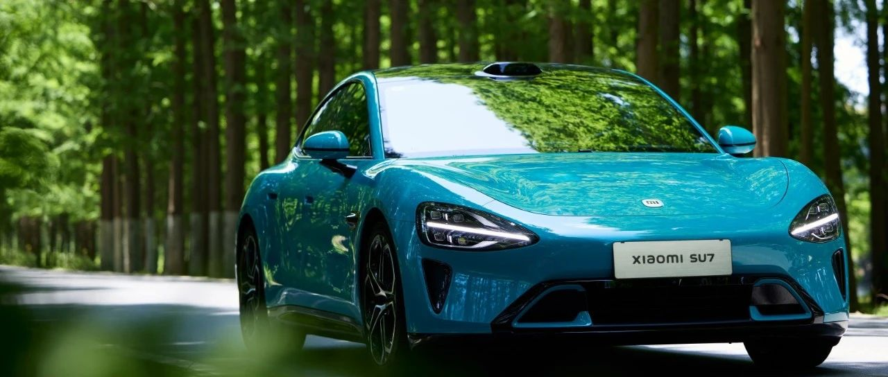

#  小米SU7答网友问（第四十四集）

[ 小米汽车 ](<javascript:void\(0\);>)

______

  

  

****

****

****

**01**  

**小米SU7 Pro后备厢支持电动位置记忆吗？**

支持。在后备厢开启后，手动将其降低或升高至所需的开启高度，长按后备厢关闭按键3s后，响一声提示音代表后备厢开启高度记忆成功，响三声提示音代表后备厢开启高度记忆失败。

特别说明：后备厢最小设定高度为40%；手动降低或升高后备厢高度时，请缓慢平稳地进行操作，以免组件损坏。

**02**  

**小米SU7 Pro选装电动尾翼后，第三个和第四个物理按键分别是什么功能？**  

根据之前用户们的反馈，我们为选装电动尾翼的Pro版用户准备了中控台四个物理按键。目前第三个按键为电动尾翼调节，第四个按键为开启360全景影像的快捷键。

在后续OTA升级中，我们将为大家带来物理按键的更多自定义功能，敬请期待。

**03**  

**小米SU7 Pro相比标准版升级“小米智驾Max”，在现阶段智驾功能与标准版有何区别？**  

小米SU7 Pro版本搭载Xiaomi Pilot Max智驾系统。

小米SU7 Pro版与标准版皆具备高速领航辅助（高速NOA）、代客泊车辅助（AVP）、智能泊车辅助（APA）及遥控泊车辅助（RPA）等增强版智驾功能。

相较标准版，小米SU7 Pro版本具备城市领航辅助（城市NOA）功能。

目前，Pro版车型已具备代客泊车辅助（AVP）功能，标准版后续将通过OTA方式对此功能进行推送，敬请期待。

**04**  

**小米SU7 Pro现在支持机械库位泊车吗？**  

小米SU7全系车型皆支持机械库位泊车，此功能后续将通过OTA的方式进行推送，敬请期待。

**05**  

**购买小米SU7 Pro，可以享用2024汽车以旧换新补贴吗？**  

可以的。根据商务部、财务部等7部门关于印发《汽车以旧换新补贴实施细则》的通知，报废符合条件车辆并购买小米SU7 Pro的个人消费者，将享受10000元补贴。

同时，不仅小米SU7 Pro可以，小米SU7标准版以及Max版也均可享受这一补贴。可在2025年1月10日24时之前，通过线上申请的方式，访问“全国汽车流通信息管理系统网站”，或支付宝、抖音、微信、云闪付平台搜索“汽车以旧换新”小程序，完成补贴申请。  

  

  

  

小米SU7答网友问

持续进行中…

[小米SU7答网友问总集（上）：整车产品篇](<http://mp.weixin.qq.com/s?__biz=MzkyNzU3MDI3Nw==&mid=2247489972&idx=1&sn=b8c58d29e1da2eb08549f48262d2fcce&chksm=c22759bef550d0a88c50e70ab4bc59b26ab31ee5e634a52694ee0cc28f08979a4662fe598032&scene=21#wechat_redirect>)

[小米SU7答网友问总集（中）：智能体验篇](<http://mp.weixin.qq.com/s?__biz=MzkyNzU3MDI3Nw==&mid=2247490580&idx=1&sn=c0e685b4d60f817a799fd4594ab294ad&chksm=c2275c1ef550d508549e791b5b0d076288f55ee40a8145ea3642e6f9166aedba8b267cb11051&scene=21#wechat_redirect>)

[小米SU7答网友问总集（下）：交付服务篇](<http://mp.weixin.qq.com/s?__biz=MzkyNzU3MDI3Nw==&mid=2247490603&idx=1&sn=88ef8375987c8a7be5c1bc6b8a42e9f6&chksm=c2275c21f550d537cbed33f14c6062f066a768b19efdaa1fd3b67dc17c1abe494d5cffa15124&scene=21#wechat_redirect>)

[小米SU7答网友问（第四十集）](<http://mp.weixin.qq.com/s?__biz=MzkyNzU3MDI3Nw==&mid=2247490643&idx=1&sn=213f175676280f7958bace8d6d467568&chksm=c2275c59f550d54f201060f9c4c7dd8be6c6bd2737d38aa16cc3ccb85f8b7fd9598e0def18f8&scene=21#wechat_redirect>)

[小米SU7答网友问（第四十一集）](<http://mp.weixin.qq.com/s?__biz=MzkyNzU3MDI3Nw==&mid=2247490710&idx=1&sn=56d9b707c60ba5be5457d884f1013f88&chksm=c2275c9cf550d58a249cdd7bf8ea554d1b19869171a8addb307c4ab9daf17ae6f1a8ec8a190d&scene=21#wechat_redirect>)  

[小米SU7答网友问（第四十二集）](<http://mp.weixin.qq.com/s?__biz=MzkyNzU3MDI3Nw==&mid=2247490735&idx=1&sn=70a61bb524c263198c3db73cd0f4db6c&chksm=c2275ca5f550d5b3eacbf734b503cfdde5466232420a627886309ae897b7ae6cecdea1acc52a&scene=21#wechat_redirect>)

[小米SU7答网友问（第四十三集）](<http://mp.weixin.qq.com/s?__biz=MzkyNzU3MDI3Nw==&mid=2247490743&idx=1&sn=bffffaf2e910fc0e666a7648ed694fe5&chksm=c2275cbdf550d5ab1bf4c1d6b82c5a1f3b5206ee1a1d05198ae7a8f1af4d59f839dc34fd6ad2&scene=21#wechat_redirect>)

  

  

  

预览时标签不可点

微信扫一扫  
关注该公众号

继续滑动看下一个

轻触阅读原文

小米汽车 

向上滑动看下一个

[知道了](<javascript:;>)

微信扫一扫  
使用小程序

****

[取消](<javascript:void\(0\);>) [允许](<javascript:void\(0\);>)

****

[取消](<javascript:void\(0\);>) [允许](<javascript:void\(0\);>)

****

[取消](<javascript:void\(0\);>) [允许](<javascript:void\(0\);>)

× 分析

__

微信扫一扫可打开此内容，  
使用完整服务

： ， ， ， ， ， ， ， ， ， ， ， ， 。 视频 小程序 赞 ，轻点两下取消赞 在看 ，轻点两下取消在看 分享 留言 收藏 听过