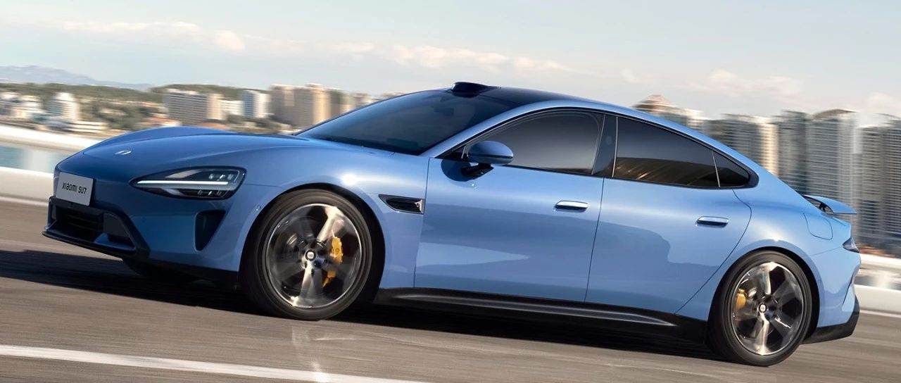

#  小米SU7答网友问（第四集）

[ 小米汽车 ](<javascript:void\(0\);>)

______

前几天我们就大家关心的问题

统一回答了前三集

[小米SU7答网友问（第一集）](<http://mp.weixin.qq.com/s?__biz=MzkyNzU3MDI3Nw==&mid=2247486958&idx=1&sn=fa1835ddd2eee3bdafefcad5b74d2d94&chksm=c2274de4f550c4f28c7b9e54f1a6a8bcacc3459e88bbe256c362a899a36ca32c80be4f87c45a&scene=21#wechat_redirect>)

[小米SU7答网友问（第二集）](<http://mp.weixin.qq.com/s?__biz=MzkyNzU3MDI3Nw==&mid=2247487024&idx=1&sn=0c7cfca4d7c560dedf8062fa3a7230e3&chksm=c2274e3af550c72cdf2c4b04f2e6f3f66f10eac3634f77346b68be322d895dfb1398978ccbcf&scene=21#wechat_redirect>)

[小米SU7答网友问（第三集）](<http://mp.weixin.qq.com/s?__biz=MzkyNzU3MDI3Nw==&mid=2247487063&idx=2&sn=a0651af985a684e2379d3805947abc23&chksm=c2274e5df550c74b86d3871da393feb8fcadab0dfcdc8e77c806309341c89f1b37396b0e6318&scene=21#wechat_redirect>)

今天，我们将继续回答大家关心的问题👇

  

## **01**

**4月3日就能交付的创始版，是已经生产完很久的库存车吗？**

不是。给用户的首批创始版车辆，都是在3月28日发布会前后刚刚生产出来的新车，请大家放心。  

大家应该在3月初到月中见过卫星和媒体拍摄我们工厂的远瞰图，出现其中的早期生产的车辆，是用于我们的超大规模道路测试以及门店的展车、试驾车。

  

## **02**

**下定后显示的提车日期会不会发生变动？**

刚上市的时候我们提供的是全国启动交付时间，待定单配置锁定后，按照定单锁定的时间顺序与生产计划进行匹配，得到每个定单的预计交付时间(指用户锁定配置至车辆到店的时间间隔)。为方便各位用户提前了解并安排提车事宜，我们将此结果更新至用户的APP定单详情页。

自3月29日19时起，我们也把预计交付周期展示在小米汽车APP的选购流程中，作为用户下定和锁单之前的参考。我们正全力提升产能、加快交付，请随时关注APP内信息。

  

## **03**

**如果我已经购买了小米SU7，能否变更提车地址？**

在小米汽车交付同事与您首次联系时，可以主动告知交付地址，我们会竭力配合。

  

## **04**  

**上门试驾的业务是否有规划？如有规划具体试点城市有哪些？**

目前，我们销售端能够支持的预约到店试驾，上门试驾在规划中。主要是因为当前订单与预约试驾需求远超预计，基于有限的试驾车和人员资源，为了保证用户服务的整体高效与时效性，暂时未开放上门试驾，还望谅解。

我们预计将在全国门店获得足量试驾车和人员补充后，逐步开放上门试驾业务。届时我们的销售伙伴也会与有需求的用户朋友联系沟通，敬请期待。

  

## **05**

**为什么门店试驾不能体验小米智驾功能？**

因为门店试驾需求远超预估，目前每位试驾用户体验时间为15分钟，时间较为紧凑，因此暂未在标准体验流程中安排智驾环节，还望大家谅解。如果您对智驾特别感兴趣，可以提前和店员预约说明需求，交车时搭载的智驾功能均可以体验。

我们也会不断优化试驾流程，未来争取给大家更充沛的时间去更全面了解小米SU7的方方面面。

  

## **06**

**有没有更多种类的贷款政策，比如50-50，0首付提车等？**

目前暂时没有50-50或0首付产品政策，但我们提供了市场最主流的等额还款产品，15%首付起、最长60期，且现在定购还可享受年费率2.5%限时优惠；以小米SU7标准版为例，首付最低只需3.24万元，月供不足3500元。

小米汽车金融服务也将时刻关注用户需求，持续开发迭代金融产品，敬请期待。

  

## **07******

**购车时选了分期后面还可以全款付尾款吗？**

如果您下单锁单时选了分期，想要修改为全款支付，您可以在交付同事与您首次联系时，主动告知交付。

  

## **08**

**小米汽车APP积分商城中的积分怎样使用兑换？**

您可以在小米汽车APP“商城”板块购买商品时使用积分抵扣部分应支付金额，使用商品范围以系统所示为准。

积分抵扣比例10:1（即10积分可以抵扣1元人民币），若您的定单金额使用积分抵扣后存在低于0.1元的部分，则低于0.1元的部分不支持积分抵扣。

积分仅限获得该积分的用户（以小米账号为用户识别单位）使用，不可合并，不可转赠、买卖不支持兑换现金或其他优惠形式，不支持用于非本规则约定的用途。

积分规则详情请查询“小米汽车APP-我的-积分-积分规则”部分。

  

## **09******

**定购时不希望选装冰箱，能否取消？**

4月30日前支付大定赠送价值2000元的车载智能冰箱，但不支持替换为普通储物盒。

我们的车载智能冰箱支持远程控制和语音控制。它有4.6L容积，可以放6听标准可乐，还配备了防滚架。制冷制热都可以，既可以冰饮料、保鲜水果，还可以温热饮品。当然也可以关闭作为普通储物空间使用，值得您选装体验。

  

## **10**

**小米汽车支持的充电桩有哪些，是否支持所有品牌的家充桩？**

对于第三方的公用充电桩，小米SU7累计测试了148个品牌超过2000款不同型号的充电桩，总计18900根，并联合三家第三方机构进行了测试验证，充电兼容性到达了99%以上，在已公开信息中充电兼容性行业最高。

基于国标的其它品牌家充桩也能实现充电，详情请咨询原厂家；如需获取更好的互联体验，实现OTA升级及自动开盖解锁等功能，建议使用小米汽车家充桩。

  

## **11**

**车机端控制的家中智能设备数量和型号，与手机端米家有差别吗？**

有差别。您可以将手机端「米家APP」理解为“全量级控制中枢”，即所有绑定在你账号下的智能设备，都可以通过米家APP进行控制。

而车载米家为“非全量级控制中枢”。为了更简洁明了的使用体验，我们特意为车端甄选支持了常用且有明确车端远程控制场景的智能设备。比如家里的灯光、窗帘、空调、摄像头、扫地机器人、空气净化器等都是可以通过车机控制，而电动牙刷、剃须刀、血压计、划船机等没有明确车端控制场景的智能设备则未支持。

未来我们会根据用户的反馈，逐步增加可以在车载米家控制的智能家居设备品类及数量，为大家打造更加智能化的「人车家全生态」美好体验。

  

## **12**

**第二年如果不续费「车载网络服务包」是整车全部无网络服务吗？小爱语音、地图导航、远程控车、OTA升级等网络服务是否永久免费？**

小米SU7系列均可在交付之日起免费使用「车载网络服务包」一年，此权益与车辆绑定。权益期结束后，车主可以通过小米汽车应用程序付费购买「车载网络服务包」。「车载网络服务包」的定价是19.9元/月和199元/年。

小米SU7系列自交付就可使用车载网络连接服务，在没有第三方网络连接的情况下可实现地图导航、远程控车、OTA升级及辅助驾驶、系统应用更新和联网、小爱同学语音助手等基础功能，更多网络功能则需购买「车载网络服务包」或连接 Wi-Fi/手机热点。

购买「车载网络服务包」后，在没有第三方网络连接的情况下，仍可通过车载 SIM 卡的移动蜂窝网络使用车载网络连接服务，包括开启Wi-Fi热点供其他设备使用网络、下载与访问第三方应用（播放网络音乐、视频和 KTV 歌曲、进行游戏等用途）、哨兵模式远程查看视频、下载离线地图等，具体功能请以实车为准。

移动蜂窝网络的网络覆盖范围和网络服务连接速度取决于电信运营商，「车载网络服务包」仅支持中国大陆境内（不含中国香港特别行政区、中国澳门特别行政区及中国台湾地区）。

  

## **13**

**后备厢尾门有没有防夹功能？**

小米SU7尾门全系支持电动开启/关闭，并且带有防夹功能。在尾门关闭过程中，电动尾门遇到障碍物会反向弹开，避免误伤用户或车辆受损。

为了确保尾门安全关闭，尾门即将关闭瞬间会带有电动吸合过程，此时尾门即将进入锁止状态，无法实现反向弹开。

这是行业内为了避免尾门无法安全关闭的通用做法，请大家不要在尾门即将关闭时用手指去测试防夹功能。

  

## **14**

**近期多家媒体测试小米SU7续航，为何更换轮胎后对续航的影响那么大？**

轮胎对续航的主要影响因素是轮胎滚阻，通常情况下运动胎的滚阻大于舒适胎、低滚阻胎。轮胎滚阻小，汽车的行驶阻力小，能耗更低续航更长，同时会略微牺牲加速和刹车性能。反之滚阻大的轮胎加速和刹车性能更好。

以小米SU7 Max为例，全系都采用全球顶级品牌的轮胎，即使配备21"倍耐力P ZERO 5代运动胎，也能实现 725km CLTC续航，并且媒体实测中实现了接近500km的高速续航和超过550km的城市高速综合续航，表现极其优异。

  

  

预览时标签不可点

修改于

微信扫一扫  
关注该公众号

继续滑动看下一个

轻触阅读原文

小米汽车 

向上滑动看下一个

[知道了](<javascript:;>)

微信扫一扫  
使用小程序

****

[取消](<javascript:void\(0\);>) [允许](<javascript:void\(0\);>)

****

[取消](<javascript:void\(0\);>) [允许](<javascript:void\(0\);>)

****

[取消](<javascript:void\(0\);>) [允许](<javascript:void\(0\);>)

× 分析

__

微信扫一扫可打开此内容，  
使用完整服务

： ， ， ， ， ， ， ， ， ， ， ， ， 。 视频 小程序 赞 ，轻点两下取消赞 在看 ，轻点两下取消在看 分享 留言 收藏 听过