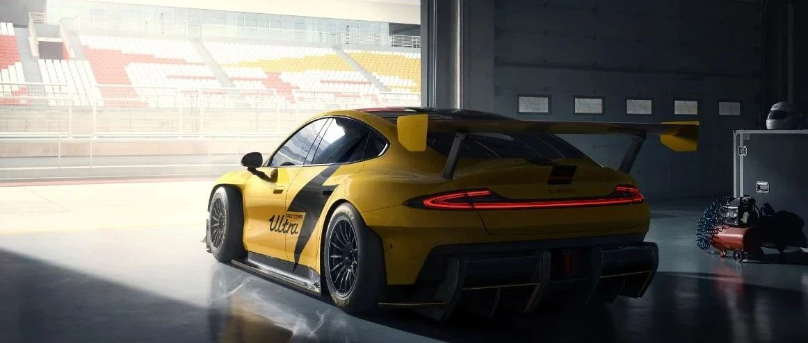

#  小米SU7答网友问（第五十一集）

[ 小米汽车 ](<javascript:void\(0\);>)

______

  

****01****

**我们大概什么时候可以看到小米SU7 Ultra实车？**

昨天雷总在年度演讲返场直播中也提到了，目前小米SU7 Ultra原型车已经都在纽北全力准备10月发起正式冲击。在那之后，我们将考虑把小米SU7 Ultra原型车带回国内，向大家展示。小米SU7 Ultra的量产版实车预计也将在明年跟大家见面。

  

**02**

**今天在网上看到有人说，巴黎街头有小米SU7，是准备在欧洲开卖了吗？**

我们近年内还没有在海外市场销售汽车的计划。大家看到的小米SU7，其实是小米巴黎「人车家全生态」特展，在巴黎博物馆街区布展的展车。小米SU7在欧洲极受关注，非常多各国游客和它拍照合影。

顺便介绍下，小米巴黎「人车家全生态」特展已经于昨日（7月23日）开展，欢迎全球游客前来打卡。这不是一个科技产品展，而是科技生活方式展。我们想通过它，和全球的朋友们一起探讨更开放与多元的文化、科技与生活。

特展位于巴黎博物馆街区蓬皮杜美术馆附近，导航7 RUE BAILLY可达。欢迎全球用户前来「串门」。

  

**03**

**昨天的雷军年度演讲返场直播中，雷总背的是什么包？为什么在小米商城和电商平台都搜不到？**

雷总昨天直播背的是 Xiaomi Life 的休闲小背包。您可以下载小米汽车APP，在【商城】-【生活】板块内进行选购。

**Xiaomi Life 的产品目前仅在小米汽车 APP 商城独家销售。**昨天直播中提及的防晒套装，包括防晒衣、防晒空顶帽、防晒口罩、防晒冰袖，都可以在小米汽车APP商城中选购。

**04**

**夏天临时下车，可以保持空调持续开着吗？**

可以开启「驻车用电保持」功能，以实现即便关门锁车，空调、娱乐系统等用电器依然保持工作状态。在车机屏幕下拉菜单栏中，可打开该功能。同时，用电保持的时长可以设置15分钟~6小时。当车辆电量耗至20%时将自动退出用电保持。

  

**05**

**车载冰箱可以离车长时间保持制冷吗？**

您可以在车载智能冰箱的设置页面，开启“离车持续工作”并选择工作时长，最长可设置为24小时。这样可以确保您在下次上车时无需等待即可享受到冰爽的饮品。您也可以在小米汽车APP中提前开启或关闭冰箱、调节温度。夏天到了，小米SU7助您清凉一夏。

  

小米SU7答网友问

持续进行中…

[小米SU7答网友问总集（上）：整车产品篇](<http://mp.weixin.qq.com/s?__biz=MzkyNzU3MDI3Nw==&mid=2247489972&idx=1&sn=b8c58d29e1da2eb08549f48262d2fcce&chksm=c22759bef550d0a88c50e70ab4bc59b26ab31ee5e634a52694ee0cc28f08979a4662fe598032&scene=21#wechat_redirect>)

[小米SU7答网友问总集（中）：智能体验篇](<http://mp.weixin.qq.com/s?__biz=MzkyNzU3MDI3Nw==&mid=2247490580&idx=1&sn=c0e685b4d60f817a799fd4594ab294ad&chksm=c2275c1ef550d508549e791b5b0d076288f55ee40a8145ea3642e6f9166aedba8b267cb11051&scene=21#wechat_redirect>)

[小米SU7答网友问总集（下）：交付服务篇](<http://mp.weixin.qq.com/s?__biz=MzkyNzU3MDI3Nw==&mid=2247490603&idx=1&sn=88ef8375987c8a7be5c1bc6b8a42e9f6&chksm=c2275c21f550d537cbed33f14c6062f066a768b19efdaa1fd3b67dc17c1abe494d5cffa15124&scene=21#wechat_redirect>)

[小米SU7答网友问（第四十集）](<http://mp.weixin.qq.com/s?__biz=MzkyNzU3MDI3Nw==&mid=2247490643&idx=1&sn=213f175676280f7958bace8d6d467568&chksm=c2275c59f550d54f201060f9c4c7dd8be6c6bd2737d38aa16cc3ccb85f8b7fd9598e0def18f8&scene=21#wechat_redirect>)

[小米SU7答网友问（第四十一集）](<http://mp.weixin.qq.com/s?__biz=MzkyNzU3MDI3Nw==&mid=2247490710&idx=1&sn=56d9b707c60ba5be5457d884f1013f88&chksm=c2275c9cf550d58a249cdd7bf8ea554d1b19869171a8addb307c4ab9daf17ae6f1a8ec8a190d&scene=21#wechat_redirect>)  

[小米SU7答网友问（第四十二集）](<http://mp.weixin.qq.com/s?__biz=MzkyNzU3MDI3Nw==&mid=2247490735&idx=1&sn=70a61bb524c263198c3db73cd0f4db6c&chksm=c2275ca5f550d5b3eacbf734b503cfdde5466232420a627886309ae897b7ae6cecdea1acc52a&scene=21#wechat_redirect>)

[小米SU7答网友问（第四十三集）](<http://mp.weixin.qq.com/s?__biz=MzkyNzU3MDI3Nw==&mid=2247490743&idx=1&sn=bffffaf2e910fc0e666a7648ed694fe5&chksm=c2275cbdf550d5ab1bf4c1d6b82c5a1f3b5206ee1a1d05198ae7a8f1af4d59f839dc34fd6ad2&scene=21#wechat_redirect>)

[小米SU7答网友问（第四十四集）](<http://mp.weixin.qq.com/s?__biz=MzkyNzU3MDI3Nw==&mid=2247490748&idx=1&sn=6160b9038c5209a9e64153ebcb2d3807&chksm=c2275cb6f550d5a0e14bab2b01483fad1bcee53889419e318e91d5768d3952c1c7b30ad0e185&scene=21#wechat_redirect>)

[小米SU7答网友问（第四十五集）](<http://mp.weixin.qq.com/s?__biz=MzkyNzU3MDI3Nw==&mid=2247494797&idx=1&sn=a97b403a4ff07ba213987e171f50119b&chksm=c224ac87f5532591b05a0ee18ef74c9372a10feb14481925ce4f496e9e11ef2f8d4b59336092&scene=21#wechat_redirect>)

[小米SU7答网友问（第四十六集）](<http://mp.weixin.qq.com/s?__biz=MzkyNzU3MDI3Nw==&mid=2247496002&idx=1&sn=581d0d1142d93ce150fea3965895558c&chksm=c224b148f553385e5f55cf9d7371f2db2fb70c3b8abb72b00774d4ffd446d16babcf1186ac00&scene=21#wechat_redirect>)

[小米SU7答网友问（第四十七集）](<http://mp.weixin.qq.com/s?__biz=MzkyNzU3MDI3Nw==&mid=2247496007&idx=1&sn=6a421c3b17cc1c65329d05cb32d9623c&chksm=c224b14df553385b03ed46354e48060b3936c02ef2eb6fc0525f42f293750ed873268571d202&scene=21#wechat_redirect>)

[小米SU7答网友问（第四十八集）](<http://mp.weixin.qq.com/s?__biz=MzkyNzU3MDI3Nw==&mid=2247496032&idx=1&sn=55195b432d452da064fcef7d5974a10f&chksm=c224b16af553387ccad87fac4f24947fa2d47458f9582f2346f5e289a8e7eb26a0347b2b811f&scene=21#wechat_redirect>)

[小米SU7答网友问（第四十九集）](<http://mp.weixin.qq.com/s?__biz=MzkyNzU3MDI3Nw==&mid=2247496197&idx=2&sn=20d2997ddaa8b4acd48320f29c065d02&chksm=c224b20ff5533b1970b474d54e1c45dc70270641db75757bc54f82d4eb96112b4acb25ec8ed3&scene=21#wechat_redirect>)

[小米SU7答网友问（第五十集）](<http://mp.weixin.qq.com/s?__biz=MzkyNzU3MDI3Nw==&mid=2247496220&idx=2&sn=8e78ba969d5a735cdcb52f80ed1ff8f4&chksm=c224b216f5533b002a0f73b964f8bc4c6789e5394dbab1a39f114d627bbe28bfcc054d08e868&scene=21#wechat_redirect>)

  

  

  

预览时标签不可点

修改于

微信扫一扫  
关注该公众号

继续滑动看下一个

轻触阅读原文

小米汽车 

向上滑动看下一个

[知道了](<javascript:;>)

微信扫一扫  
使用小程序

****

[取消](<javascript:void\(0\);>) [允许](<javascript:void\(0\);>)

****

[取消](<javascript:void\(0\);>) [允许](<javascript:void\(0\);>)

****

[取消](<javascript:void\(0\);>) [允许](<javascript:void\(0\);>)

× 分析

__

微信扫一扫可打开此内容，  
使用完整服务

： ， ， ， ， ， ， ， ， ， ， ， ， 。 视频 小程序 赞 ，轻点两下取消赞 在看 ，轻点两下取消在看 分享 留言 收藏 听过