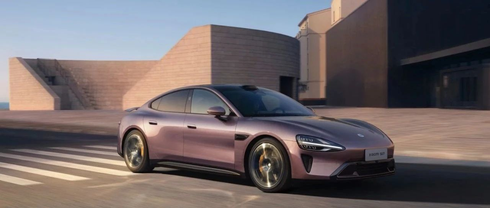

#  小米SU7答网友问（第六十六集）

[ 小米汽车 ](<javascript:void\(0\);>)

______

  

> 到今天为止，《小米SU7答网友问》第二季 将收官。感谢大家的喜爱和支持。后续《小米SU7答网友问》将重新转为不定期更新，但我们会始终不断地倾听用户朋友们的声音，及时回复大家的垂询。再次感谢！

  

****01****

**小米SU7针对内饰会推出清洁套装么，平时应该如何保养浅色内饰？**

目前我们没有针对内饰材质推出清洁套装产品的打算，您可以自行购买汽车内饰专用的清洁剂和保养品进行清洁。小米SU7的真皮座椅表面全部增加了耐脏污助剂，如有脏污，只需使用专用清洁液处理，即可恢复如新。

针对浅色内饰的保养护理，在日常用车中建议您关注以下几点：

  * 避免长时间将车辆暴露在强烈日光中，以防止皮革、织物等材料褪色。若您需要将车辆长时间停泊在户外，请将这些材料覆盖。

  * 某些材质的衣服（如深色牛仔裤和羊皮服装）可能会弄脏内饰面料，如果发生此情况，务必尽快清洁和护理这些部位。

如果不慎弄脏了浅色内饰，可以按以下方式进行清洁。我们建议用皮革保养品处理皮革材料的次数越少越好，浅色皮面一年最多两次。

  * 车门、后备箱和车顶等位置的内饰和纺织面料，应使用专用的清洁剂和干性泡沫、软刷来清理。

  * 座椅等处的真皮面料，普通污物可用微湿的棉布、羊毛布或擦布清洁皮革材料表面；对于严重的油污，您可以使用柔和肥皂溶液蘸布清洁。请您确保不要完全浸湿皮革材料，并避免水渗入针脚缝的内部。皮革表面上有水渍，请及时用柔软的干布擦拭干净。当皮革材料表面出现圆珠笔、墨水、唇膏、鞋油、咖啡、防晒霜等污渍，请尽快清除。对于真皮皮面的清洁，建议使用100%纯聚氨酯发泡的海绵。

  * 不要使用含溶剂（如酒精等）的清洁剂来清洁仪表板、气囊饰盖或皮革制品；也不要在皮面上喷甲醛清洁剂。

  * 建议使用温和肥皂溶液清洁脏污的安全带，不要把安全带从车辆上拆卸下来，在卷收安全带之前，需将安全带完全晾干。

更多保养和清洁方式，可以参考用户手册-内部清洁保养部分。如果您的内饰脏污程度比较严重，可以寻求小米售后人员的帮助。

**  
**

**02**

**我的小米SU7快充口触点，为什么有点发黑？**

充电口端子（俗称充电口触点）有部分发黑的现象，通常是因为充电未完全停止就进行充电枪插拔而造成的。

我们建议在日常充电时，先在车机端或充电桩端进行断电操作，确认充电结束，再拔掉充电枪。

正常情况下，如果发黑很轻微，对充电及车辆不会造成伤害。但如果发现触点发黑严重，建议您及时到店进行检查。

**  
**

**03**

**偶尔遇到车辆定位不准时，车机会自动重新规划路线，手机路线则需再次导航传到车机，有没有什么解决方法？**

车载地图导航会优先用户首选路线进行导航，如遇定位信号极弱导致断连，再次取得信号时会根据车辆新位置重新规划最优路线，这也是经典的地图导航逻辑。当手机导航路线投送至车机后，我们认为驾驶员会优先参考车载导航路线。

如果您强制需要车载及手机端导航路线一致，可以通过在手机/车机上添加途经点来解决，届时车机会按照推送顺序依次导航至各个途经点，直至终点。

此外，导航路况也会结合方位及路况实时更新，可能会出现效率更高的路线建议，届时系统会优先采纳新路线进行导航。导航中也会实时提供多条备选路线，您可以按照需要进行切换。

**  
**

**04**

**最近行业里都在聊智能驾驶端到端技术，小米汽车有相关规划么？**

最近汽车行业热议的智能驾驶端到端技术，小米汽车去年已经发布过了。

小米汽车在2023年12月28日的技术发布会上，公布了小米智能驾驶的端到端技术，并展示了应用于泊车的相关场景，这是全球首个可量产的端到端大模型。

2024年5月17日开始推送的Xiaomi HyperOS 1.1.2上，小米SU7的高阶智驾版车型行业首发基于端到端技术的代客泊车辅助功能，可实现 23km/h 的最高巡航车速、具备动态倒车让行能力，全面提升泊车效率与安全性。

小米在端到端技术上的布局不仅在泊车领域，我们后续也会在合适的时间公布智能驾驶技术的最新进展，请大家关注小米汽车的官方信息。

小米SU7答网友问

持续进行中…

[小米SU7答网友问总集（上）：整车产品篇](<http://mp.weixin.qq.com/s?__biz=MzkyNzU3MDI3Nw==&mid=2247489972&idx=1&sn=b8c58d29e1da2eb08549f48262d2fcce&chksm=c22759bef550d0a88c50e70ab4bc59b26ab31ee5e634a52694ee0cc28f08979a4662fe598032&scene=21#wechat_redirect>)

[小米SU7答网友问总集（中）：智能体验篇](<http://mp.weixin.qq.com/s?__biz=MzkyNzU3MDI3Nw==&mid=2247490580&idx=1&sn=c0e685b4d60f817a799fd4594ab294ad&chksm=c2275c1ef550d508549e791b5b0d076288f55ee40a8145ea3642e6f9166aedba8b267cb11051&scene=21#wechat_redirect>)

[小米SU7答网友问总集（下）：交付服务篇](<http://mp.weixin.qq.com/s?__biz=MzkyNzU3MDI3Nw==&mid=2247490603&idx=1&sn=88ef8375987c8a7be5c1bc6b8a42e9f6&chksm=c2275c21f550d537cbed33f14c6062f066a768b19efdaa1fd3b67dc17c1abe494d5cffa15124&scene=21#wechat_redirect>)

[小米SU7答网友问（第四十集）](<http://mp.weixin.qq.com/s?__biz=MzkyNzU3MDI3Nw==&mid=2247490643&idx=1&sn=213f175676280f7958bace8d6d467568&chksm=c2275c59f550d54f201060f9c4c7dd8be6c6bd2737d38aa16cc3ccb85f8b7fd9598e0def18f8&scene=21#wechat_redirect>)

[小米SU7答网友问（第四十一集）](<http://mp.weixin.qq.com/s?__biz=MzkyNzU3MDI3Nw==&mid=2247490710&idx=1&sn=56d9b707c60ba5be5457d884f1013f88&chksm=c2275c9cf550d58a249cdd7bf8ea554d1b19869171a8addb307c4ab9daf17ae6f1a8ec8a190d&scene=21#wechat_redirect>)  

[小米SU7答网友问（第四十二集）](<http://mp.weixin.qq.com/s?__biz=MzkyNzU3MDI3Nw==&mid=2247490735&idx=1&sn=70a61bb524c263198c3db73cd0f4db6c&chksm=c2275ca5f550d5b3eacbf734b503cfdde5466232420a627886309ae897b7ae6cecdea1acc52a&scene=21#wechat_redirect>)

[小米SU7答网友问（第四十三集）](<http://mp.weixin.qq.com/s?__biz=MzkyNzU3MDI3Nw==&mid=2247490743&idx=1&sn=bffffaf2e910fc0e666a7648ed694fe5&chksm=c2275cbdf550d5ab1bf4c1d6b82c5a1f3b5206ee1a1d05198ae7a8f1af4d59f839dc34fd6ad2&scene=21#wechat_redirect>)

[小米SU7答网友问（第四十四集）](<http://mp.weixin.qq.com/s?__biz=MzkyNzU3MDI3Nw==&mid=2247490748&idx=1&sn=6160b9038c5209a9e64153ebcb2d3807&chksm=c2275cb6f550d5a0e14bab2b01483fad1bcee53889419e318e91d5768d3952c1c7b30ad0e185&scene=21#wechat_redirect>)

[小米SU7答网友问（第四十五集）](<http://mp.weixin.qq.com/s?__biz=MzkyNzU3MDI3Nw==&mid=2247494797&idx=1&sn=a97b403a4ff07ba213987e171f50119b&chksm=c224ac87f5532591b05a0ee18ef74c9372a10feb14481925ce4f496e9e11ef2f8d4b59336092&scene=21#wechat_redirect>)

[小米SU7答网友问（第四十六集）](<http://mp.weixin.qq.com/s?__biz=MzkyNzU3MDI3Nw==&mid=2247496002&idx=1&sn=581d0d1142d93ce150fea3965895558c&chksm=c224b148f553385e5f55cf9d7371f2db2fb70c3b8abb72b00774d4ffd446d16babcf1186ac00&scene=21#wechat_redirect>)

[小米SU7答网友问（第四十七集）](<http://mp.weixin.qq.com/s?__biz=MzkyNzU3MDI3Nw==&mid=2247496007&idx=1&sn=6a421c3b17cc1c65329d05cb32d9623c&chksm=c224b14df553385b03ed46354e48060b3936c02ef2eb6fc0525f42f293750ed873268571d202&scene=21#wechat_redirect>)

[小米SU7答网友问（第四十八集）](<http://mp.weixin.qq.com/s?__biz=MzkyNzU3MDI3Nw==&mid=2247496032&idx=1&sn=55195b432d452da064fcef7d5974a10f&chksm=c224b16af553387ccad87fac4f24947fa2d47458f9582f2346f5e289a8e7eb26a0347b2b811f&scene=21#wechat_redirect>)

[小米SU7答网友问（第四十九集）](<http://mp.weixin.qq.com/s?__biz=MzkyNzU3MDI3Nw==&mid=2247496197&idx=2&sn=20d2997ddaa8b4acd48320f29c065d02&chksm=c224b20ff5533b1970b474d54e1c45dc70270641db75757bc54f82d4eb96112b4acb25ec8ed3&scene=21#wechat_redirect>)

[小米SU7答网友问（第五十集）](<http://mp.weixin.qq.com/s?__biz=MzkyNzU3MDI3Nw==&mid=2247496220&idx=2&sn=8e78ba969d5a735cdcb52f80ed1ff8f4&chksm=c224b216f5533b002a0f73b964f8bc4c6789e5394dbab1a39f114d627bbe28bfcc054d08e868&scene=21#wechat_redirect>)

[小米SU7答网友问（第五十一集）](<http://mp.weixin.qq.com/s?__biz=MzkyNzU3MDI3Nw==&mid=2247496229&idx=2&sn=205628e113bd59563b8fe2132e536723&chksm=c224b22ff5533b39d44cd21f0e85fe29d7cc19e6541ccfbd8167999fddededf1f47f0144005a&scene=21#wechat_redirect>)

[小米SU7答网友问（第五十二集）](<http://mp.weixin.qq.com/s?__biz=MzkyNzU3MDI3Nw==&mid=2247496282&idx=2&sn=47a3e261e951d6f3ab3d32aed082b87a&chksm=c224b250f5533b46ffe02af67695f42360ad3edc1633fe9908efe07ece32baefbd5c7dae856b&scene=21#wechat_redirect>)

[小米SU7答网友问（第五十三集）](<http://mp.weixin.qq.com/s?__biz=MzkyNzU3MDI3Nw==&mid=2247496286&idx=1&sn=338b1ac90677a8dff55e43361658ec8e&chksm=c224b254f5533b42f34681c6d20794a0dff7bf8f3e7f35828d9b6d8d538d924f88949577b67f&scene=21#wechat_redirect>)

[小米SU7答网友问（第五十四集）](<http://mp.weixin.qq.com/s?__biz=MzkyNzU3MDI3Nw==&mid=2247496291&idx=1&sn=c8034dd43f1eab55c8c787131c82a81c&chksm=c224b269f5533b7f804d8eaaee982f6350e000b81a16b735b363f2cddc12e02c39157a1bd9d5&scene=21#wechat_redirect>)

[小米SU7答网友问（第五十五集）](<http://mp.weixin.qq.com/s?__biz=MzkyNzU3MDI3Nw==&mid=2247496295&idx=1&sn=0154fdb6e96799d53aa9650c55e0a7b3&chksm=c224b26df5533b7b3a5f79dda08eb4db2645d19796447c89850a61a5f18454338883a09c699a&scene=21#wechat_redirect>)

[小米SU7答网友问（第五十六集）](<http://mp.weixin.qq.com/s?__biz=MzkyNzU3MDI3Nw==&mid=2247496301&idx=1&sn=693cd3bf9e6ebd6e786e7954c4a54d2b&chksm=c224b267f5533b71beb167a4cbcfb74da91bfb970f6233c3d729b7ef0a2f766764bcfc6d861d&scene=21#wechat_redirect>)

[小米SU7答网友问（第五十七集）](<http://mp.weixin.qq.com/s?__biz=MzkyNzU3MDI3Nw==&mid=2247496307&idx=1&sn=5e54c73955cbe723bc7bd2b166b1b89e&chksm=c224b279f5533b6f6086fa0a188746749f93e1694da1eeed0792a7c815fd79ecffe5dbb4d90a&scene=21#wechat_redirect>)

[小米SU7答网友问（第五十八集）](<http://mp.weixin.qq.com/s?__biz=MzkyNzU3MDI3Nw==&mid=2247496314&idx=2&sn=9b56033d82836fc6528c36e5a53cf0e8&chksm=c224b270f5533b662a8d92612a43e53790adb94443ef8f3399a2c5bcad6f97ab14c4d4dd8c65&scene=21#wechat_redirect>)

[小米SU7答网友问（第五十九集）](<http://mp.weixin.qq.com/s?__biz=MzkyNzU3MDI3Nw==&mid=2247496334&idx=2&sn=f94b71afc1c375a3bb272b5b58413ac6&chksm=c224b284f5533b926f371534c2a7ac665948630edd4043d62d65634e17e6513f448803bc09a6&scene=21#wechat_redirect>)

[小米SU7答网友问（第六十集）](<http://mp.weixin.qq.com/s?__biz=MzkyNzU3MDI3Nw==&mid=2247496343&idx=2&sn=f9fb0417e91c27bb56bca004782933e2&chksm=c224b29df5533b8b3f54e292ffe7ca3d0b1d46e4b1f19616965e99767eb131be070042df6b01&scene=21#wechat_redirect>)

[小米SU7答网友问（第六十一集）](<http://mp.weixin.qq.com/s?__biz=MzkyNzU3MDI3Nw==&mid=2247496368&idx=1&sn=ab0ff55f2076b79349aa1968ea7e01dc&chksm=c224b2baf5533bac4da5e3537330796dd0f2eddf1bedcc4523954fa451ad5644fbcac3f3831a&scene=21#wechat_redirect>)

[小米SU7答网友问（第六十二集）](<http://mp.weixin.qq.com/s?__biz=MzkyNzU3MDI3Nw==&mid=2247497034&idx=1&sn=31c6e5ee21038008f69626f8a86c2be9&chksm=c224b540f5533c56776c271d5715b4bfabb3bd799e8c0439a5a116989a4bb839ef34b33f8e8f&scene=21#wechat_redirect>)

[小米SU7答网友问（第六十三集）](<http://mp.weixin.qq.com/s?__biz=MzkyNzU3MDI3Nw==&mid=2247497058&idx=1&sn=0b887f2c2df940dd828f2209ff7a7284&chksm=c224b568f5533c7ee022556d8ee6ebf135fce98a7741188c2b186ecf502c12b70cac94fbf894&scene=21#wechat_redirect>)

[小米SU7答网友问（第六十四集）](<http://mp.weixin.qq.com/s?__biz=MzkyNzU3MDI3Nw==&mid=2247497067&idx=1&sn=9a653701ec9bc3c6059d8a2d33d87609&chksm=c224b561f5533c77a1490b7cd7d21cc411068fa16245a6e2277e19d736cb9ac5c68c61a66d56&scene=21#wechat_redirect>)

[小米SU7答网友问（第六十五集）](<http://mp.weixin.qq.com/s?__biz=MzkyNzU3MDI3Nw==&mid=2247497072&idx=1&sn=a31c6a23ce4eaecb4baf26a61eb9a990&chksm=c224b57af5533c6c3c3814a074ab97b4e30bb79a9353b446ee19804632360c7bb07c5a452a32&scene=21#wechat_redirect>)

  

  

预览时标签不可点

微信扫一扫  
关注该公众号

继续滑动看下一个

轻触阅读原文

小米汽车 

向上滑动看下一个

[知道了](<javascript:;>)

微信扫一扫  
使用小程序

****

[取消](<javascript:void\(0\);>) [允许](<javascript:void\(0\);>)

****

[取消](<javascript:void\(0\);>) [允许](<javascript:void\(0\);>)

****

[取消](<javascript:void\(0\);>) [允许](<javascript:void\(0\);>)

× 分析

__

微信扫一扫可打开此内容，  
使用完整服务

： ， ， ， ， ， ， ， ， ， ， ， ， 。 视频 小程序 赞 ，轻点两下取消赞 在看 ，轻点两下取消在看 分享 留言 收藏 听过