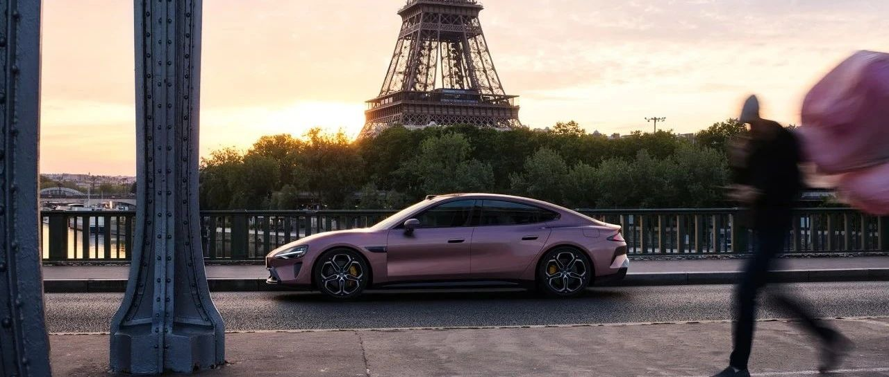

#  小米SU7答网友问（第六十七集）

[ 小米汽车 ](<javascript:void\(0\);>)

______

****  
****

****01****

**小米SU7交付周期最近是否有变化？**

经过我们一系列的提产举措，小米SU7的交付在持续提速。

向大家汇报我们的最新进展：

8月14日20点起，小米SU7 Max的交付将进一步加速。现在下定对比此前锁单预计交付周期缩短6周；已经锁单的小米SU7 Max订单的预计交付周期，最高也可缩短5周，今晚会陆续体现。

我们将持续努力，更快为您交付爱车，感谢大家的支持。

**  
**

**02**

**近期有博主展示了小米SU7的对撞测试，结果是否属实呢？**

我们注意到了相关信息。经过分析，我们认为这一所谓“测试”是设置不严谨、记录不完整、结论不科学的。

现将初步分析中我们的发现向大家报告：

第一，相关测试“碰撞后E-CALL（自动紧急呼叫系统）失效”的说法不实。经查，呼叫中心在碰撞后第一时间呼叫并接通，后台连续呼叫持续5分钟没有收到任何反馈；后对车主登记手机号码共计进行5次回拨，均没有接听。

第二，关于网友关注的“小电瓶断电”相关信息，根据国家监控平台数据显示：在碰撞前该车辆数据长时间掉线，存在小电瓶长时间断开的情况；随后，小电瓶再次被接通。在碰撞时，国家监控平台数据缺失，小电瓶已处于断电状态。

我们无法确认在此过程中小电瓶再次上电时，是否按照标准锁紧电极，也无法排除因装配不当导致碰撞后小电瓶断电的可能。

第三，此前小米SU7在开发过程中，已经进行过严苛的碰撞测试，无安全隐患，且并未出现视频中所述问题。

我们对小米SU7的产品质量有着充分的信心，也在此呼吁：车辆撞击测试，是一项复杂、严谨且异常严肃的测试，应当交由专业机构进行。同时，对于不够严谨、完整、严肃的测试，我们也恳请大家不采信、不传播，感谢大家的关注和支持！

**  
**

**03**

**小米SU7经历过哪些安全碰撞测试，成绩如何？**

小米汽车在产品定义之初，就将“安全与质量”放到最核心的位置，也是产品开发的第一准则。

小米SU7结合最新版C-IASI、C-NCAP、E-NCAP、IIHS等安全碰撞标准，设定了产品开发目标，并结合CIDAS（中国交通事故深入研究）道路实际交通安全事故场景，制定了苛刻的企业安全开发流程与标准。比如2024版C-NCAP正面碰撞要求56km/h，我们做到64km/h；侧面碰撞要求60km/h，我们做到65km/h；追尾后碰要求50km/h，我们做到超越美标的90km/h 70%偏置碰撞等等。

小米SU7将陆续进行C-IASI（中保研）、C-NCAP等标准下的权威第三方安全机构评测。其中2023版C-IASI规程、2024版C-NCAP规程均为当下最严苛的安全碰撞测试标准。小米SU7的具体测试成绩将于相应机构公布之后向大家汇报。

**  
**

**04**

**紧急呼叫功能是否跟小电瓶有关，有没有备用电池能让紧急呼叫功能接通？**

小米SU7的自动紧急呼叫系统（E-CALL）配备了备用电池，即使主电源断电也能持续保持通话一段时间；

此外，即使车辆发生严重碰撞导致了车机受损，小米SU7的自动紧急呼叫系统（E-CALL）也能通过独立的麦克风/扬声器进行；

以上两点冗余设计均能最大程度保持紧急呼叫功能通话的能力，提升救援效率。

**  
**

**05**

**如遇车辆事故导致车外无法打开车门，车内的机械开车门位置在哪？**

小米SU7四门内部均有应急机械拉手，位置如图所示，紧急情况下需要开门，可拉动应急打开对应侧车门。

  * 非紧急情况下，切勿使用车门内应急机械拉手解锁车门，可能会损坏车窗玻璃和密封件。

  * 车辆低压电池亏电时，车门只能通过拉动车门内应急机械拉手进行解锁开门。

  * 另外特别提示：开启车门儿童安全锁功能后，两侧后门将无法从内部打开，仅可在全车解锁后从车外打开。

**  
**

**06**

**为了应对小概率碰撞事件，车内应该常准备什么工具？**

除三角警示牌、反光背心、工具包等随车工具外，建议还可以在车内常备以下物品，以应对可能的紧急事件：

  * 应急药箱

为应对可能的身体不适，建议在车内放置一个药箱，备用止血带、剪刀、消杀纱布、三角巾、创可贴、腹泻药、过敏药、治疗心脏病、治疗跌打损伤等药物。

  * 防割手套

为应对可能的汽车故障临时处理情况，建议在车内备用一副防割手套，以防止在处理临时故障时，双手被划伤。

  * 手电筒/破窗器/安全带割刀

为应对夜间车辆发生故障，或车辆发生碰撞事故，建议在触手可及的位置放置一把集成破窗器、安全带割刀的手电筒，比如米家多功能强光手电筒。

  * 拖车绳

为应对可能出现的车辆抛锚，建议在车内备用一条拖车绳，以将车辆拖到安全地带等候救援。

  * 车载灭火器

为应对紧急情况下遇到火灾，建议在车内备用一支灭火器用于在火灾初期应急扑灭火源。

小米SU7答网友问

持续进行中…

[小米SU7答网友问总集（上）：整车产品篇](<http://mp.weixin.qq.com/s?__biz=MzkyNzU3MDI3Nw==&mid=2247489972&idx=1&sn=b8c58d29e1da2eb08549f48262d2fcce&chksm=c22759bef550d0a88c50e70ab4bc59b26ab31ee5e634a52694ee0cc28f08979a4662fe598032&scene=21#wechat_redirect>)

[小米SU7答网友问总集（中）：智能体验篇](<http://mp.weixin.qq.com/s?__biz=MzkyNzU3MDI3Nw==&mid=2247490580&idx=1&sn=c0e685b4d60f817a799fd4594ab294ad&chksm=c2275c1ef550d508549e791b5b0d076288f55ee40a8145ea3642e6f9166aedba8b267cb11051&scene=21#wechat_redirect>)

[小米SU7答网友问总集（下）：交付服务篇](<http://mp.weixin.qq.com/s?__biz=MzkyNzU3MDI3Nw==&mid=2247490603&idx=1&sn=88ef8375987c8a7be5c1bc6b8a42e9f6&chksm=c2275c21f550d537cbed33f14c6062f066a768b19efdaa1fd3b67dc17c1abe494d5cffa15124&scene=21#wechat_redirect>)

[小米SU7答网友问（第四十集）](<http://mp.weixin.qq.com/s?__biz=MzkyNzU3MDI3Nw==&mid=2247490643&idx=1&sn=213f175676280f7958bace8d6d467568&chksm=c2275c59f550d54f201060f9c4c7dd8be6c6bd2737d38aa16cc3ccb85f8b7fd9598e0def18f8&scene=21#wechat_redirect>)

[小米SU7答网友问（第四十一集）](<http://mp.weixin.qq.com/s?__biz=MzkyNzU3MDI3Nw==&mid=2247490710&idx=1&sn=56d9b707c60ba5be5457d884f1013f88&chksm=c2275c9cf550d58a249cdd7bf8ea554d1b19869171a8addb307c4ab9daf17ae6f1a8ec8a190d&scene=21#wechat_redirect>)  

[小米SU7答网友问（第四十二集）](<http://mp.weixin.qq.com/s?__biz=MzkyNzU3MDI3Nw==&mid=2247490735&idx=1&sn=70a61bb524c263198c3db73cd0f4db6c&chksm=c2275ca5f550d5b3eacbf734b503cfdde5466232420a627886309ae897b7ae6cecdea1acc52a&scene=21#wechat_redirect>)

[小米SU7答网友问（第四十三集）](<http://mp.weixin.qq.com/s?__biz=MzkyNzU3MDI3Nw==&mid=2247490743&idx=1&sn=bffffaf2e910fc0e666a7648ed694fe5&chksm=c2275cbdf550d5ab1bf4c1d6b82c5a1f3b5206ee1a1d05198ae7a8f1af4d59f839dc34fd6ad2&scene=21#wechat_redirect>)

[小米SU7答网友问（第四十四集）](<http://mp.weixin.qq.com/s?__biz=MzkyNzU3MDI3Nw==&mid=2247490748&idx=1&sn=6160b9038c5209a9e64153ebcb2d3807&chksm=c2275cb6f550d5a0e14bab2b01483fad1bcee53889419e318e91d5768d3952c1c7b30ad0e185&scene=21#wechat_redirect>)

[小米SU7答网友问（第四十五集）](<http://mp.weixin.qq.com/s?__biz=MzkyNzU3MDI3Nw==&mid=2247494797&idx=1&sn=a97b403a4ff07ba213987e171f50119b&chksm=c224ac87f5532591b05a0ee18ef74c9372a10feb14481925ce4f496e9e11ef2f8d4b59336092&scene=21#wechat_redirect>)

[小米SU7答网友问（第四十六集）](<http://mp.weixin.qq.com/s?__biz=MzkyNzU3MDI3Nw==&mid=2247496002&idx=1&sn=581d0d1142d93ce150fea3965895558c&chksm=c224b148f553385e5f55cf9d7371f2db2fb70c3b8abb72b00774d4ffd446d16babcf1186ac00&scene=21#wechat_redirect>)

[小米SU7答网友问（第四十七集）](<http://mp.weixin.qq.com/s?__biz=MzkyNzU3MDI3Nw==&mid=2247496007&idx=1&sn=6a421c3b17cc1c65329d05cb32d9623c&chksm=c224b14df553385b03ed46354e48060b3936c02ef2eb6fc0525f42f293750ed873268571d202&scene=21#wechat_redirect>)

[小米SU7答网友问（第四十八集）](<http://mp.weixin.qq.com/s?__biz=MzkyNzU3MDI3Nw==&mid=2247496032&idx=1&sn=55195b432d452da064fcef7d5974a10f&chksm=c224b16af553387ccad87fac4f24947fa2d47458f9582f2346f5e289a8e7eb26a0347b2b811f&scene=21#wechat_redirect>)

[小米SU7答网友问（第四十九集）](<http://mp.weixin.qq.com/s?__biz=MzkyNzU3MDI3Nw==&mid=2247496197&idx=2&sn=20d2997ddaa8b4acd48320f29c065d02&chksm=c224b20ff5533b1970b474d54e1c45dc70270641db75757bc54f82d4eb96112b4acb25ec8ed3&scene=21#wechat_redirect>)

[小米SU7答网友问（第五十集）](<http://mp.weixin.qq.com/s?__biz=MzkyNzU3MDI3Nw==&mid=2247496220&idx=2&sn=8e78ba969d5a735cdcb52f80ed1ff8f4&chksm=c224b216f5533b002a0f73b964f8bc4c6789e5394dbab1a39f114d627bbe28bfcc054d08e868&scene=21#wechat_redirect>)

[小米SU7答网友问（第五十一集）](<http://mp.weixin.qq.com/s?__biz=MzkyNzU3MDI3Nw==&mid=2247496229&idx=2&sn=205628e113bd59563b8fe2132e536723&chksm=c224b22ff5533b39d44cd21f0e85fe29d7cc19e6541ccfbd8167999fddededf1f47f0144005a&scene=21#wechat_redirect>)

[小米SU7答网友问（第五十二集）](<http://mp.weixin.qq.com/s?__biz=MzkyNzU3MDI3Nw==&mid=2247496282&idx=2&sn=47a3e261e951d6f3ab3d32aed082b87a&chksm=c224b250f5533b46ffe02af67695f42360ad3edc1633fe9908efe07ece32baefbd5c7dae856b&scene=21#wechat_redirect>)

[小米SU7答网友问（第五十三集）](<http://mp.weixin.qq.com/s?__biz=MzkyNzU3MDI3Nw==&mid=2247496286&idx=1&sn=338b1ac90677a8dff55e43361658ec8e&chksm=c224b254f5533b42f34681c6d20794a0dff7bf8f3e7f35828d9b6d8d538d924f88949577b67f&scene=21#wechat_redirect>)

[小米SU7答网友问（第五十四集）](<http://mp.weixin.qq.com/s?__biz=MzkyNzU3MDI3Nw==&mid=2247496291&idx=1&sn=c8034dd43f1eab55c8c787131c82a81c&chksm=c224b269f5533b7f804d8eaaee982f6350e000b81a16b735b363f2cddc12e02c39157a1bd9d5&scene=21#wechat_redirect>)

[小米SU7答网友问（第五十五集）](<http://mp.weixin.qq.com/s?__biz=MzkyNzU3MDI3Nw==&mid=2247496295&idx=1&sn=0154fdb6e96799d53aa9650c55e0a7b3&chksm=c224b26df5533b7b3a5f79dda08eb4db2645d19796447c89850a61a5f18454338883a09c699a&scene=21#wechat_redirect>)

[小米SU7答网友问（第五十六集）](<http://mp.weixin.qq.com/s?__biz=MzkyNzU3MDI3Nw==&mid=2247496301&idx=1&sn=693cd3bf9e6ebd6e786e7954c4a54d2b&chksm=c224b267f5533b71beb167a4cbcfb74da91bfb970f6233c3d729b7ef0a2f766764bcfc6d861d&scene=21#wechat_redirect>)

[小米SU7答网友问（第五十七集）](<http://mp.weixin.qq.com/s?__biz=MzkyNzU3MDI3Nw==&mid=2247496307&idx=1&sn=5e54c73955cbe723bc7bd2b166b1b89e&chksm=c224b279f5533b6f6086fa0a188746749f93e1694da1eeed0792a7c815fd79ecffe5dbb4d90a&scene=21#wechat_redirect>)

[小米SU7答网友问（第五十八集）](<http://mp.weixin.qq.com/s?__biz=MzkyNzU3MDI3Nw==&mid=2247496314&idx=2&sn=9b56033d82836fc6528c36e5a53cf0e8&chksm=c224b270f5533b662a8d92612a43e53790adb94443ef8f3399a2c5bcad6f97ab14c4d4dd8c65&scene=21#wechat_redirect>)

[小米SU7答网友问（第五十九集）](<http://mp.weixin.qq.com/s?__biz=MzkyNzU3MDI3Nw==&mid=2247496334&idx=2&sn=f94b71afc1c375a3bb272b5b58413ac6&chksm=c224b284f5533b926f371534c2a7ac665948630edd4043d62d65634e17e6513f448803bc09a6&scene=21#wechat_redirect>)

[小米SU7答网友问（第六十集）](<http://mp.weixin.qq.com/s?__biz=MzkyNzU3MDI3Nw==&mid=2247496343&idx=2&sn=f9fb0417e91c27bb56bca004782933e2&chksm=c224b29df5533b8b3f54e292ffe7ca3d0b1d46e4b1f19616965e99767eb131be070042df6b01&scene=21#wechat_redirect>)

[小米SU7答网友问（第六十一集）](<http://mp.weixin.qq.com/s?__biz=MzkyNzU3MDI3Nw==&mid=2247496368&idx=1&sn=ab0ff55f2076b79349aa1968ea7e01dc&chksm=c224b2baf5533bac4da5e3537330796dd0f2eddf1bedcc4523954fa451ad5644fbcac3f3831a&scene=21#wechat_redirect>)

[小米SU7答网友问（第六十二集）](<http://mp.weixin.qq.com/s?__biz=MzkyNzU3MDI3Nw==&mid=2247497034&idx=1&sn=31c6e5ee21038008f69626f8a86c2be9&chksm=c224b540f5533c56776c271d5715b4bfabb3bd799e8c0439a5a116989a4bb839ef34b33f8e8f&scene=21#wechat_redirect>)

[小米SU7答网友问（第六十三集）](<http://mp.weixin.qq.com/s?__biz=MzkyNzU3MDI3Nw==&mid=2247497058&idx=1&sn=0b887f2c2df940dd828f2209ff7a7284&chksm=c224b568f5533c7ee022556d8ee6ebf135fce98a7741188c2b186ecf502c12b70cac94fbf894&scene=21#wechat_redirect>)

[小米SU7答网友问（第六十四集）](<http://mp.weixin.qq.com/s?__biz=MzkyNzU3MDI3Nw==&mid=2247497067&idx=1&sn=9a653701ec9bc3c6059d8a2d33d87609&chksm=c224b561f5533c77a1490b7cd7d21cc411068fa16245a6e2277e19d736cb9ac5c68c61a66d56&scene=21#wechat_redirect>)

[小米SU7答网友问（第六十五集）](<http://mp.weixin.qq.com/s?__biz=MzkyNzU3MDI3Nw==&mid=2247497072&idx=1&sn=a31c6a23ce4eaecb4baf26a61eb9a990&chksm=c224b57af5533c6c3c3814a074ab97b4e30bb79a9353b446ee19804632360c7bb07c5a452a32&scene=21#wechat_redirect>)

[小米SU7答网友问（第六十六集）](<http://mp.weixin.qq.com/s?__biz=MzkyNzU3MDI3Nw==&mid=2247497080&idx=1&sn=0a0d6cd08ca47b2a7b2f34d954cf0d94&chksm=c224b572f5533c6443833e3172b3bf4a3197f9aba3d0caa32058660f8ae9ae99668b5f951259&scene=21#wechat_redirect>)

  

  

预览时标签不可点

微信扫一扫  
关注该公众号

继续滑动看下一个

轻触阅读原文

小米汽车 

向上滑动看下一个

[知道了](<javascript:;>)

微信扫一扫  
使用小程序

****

[取消](<javascript:void\(0\);>) [允许](<javascript:void\(0\);>)

****

[取消](<javascript:void\(0\);>) [允许](<javascript:void\(0\);>)

****

[取消](<javascript:void\(0\);>) [允许](<javascript:void\(0\);>)

× 分析

__

微信扫一扫可打开此内容，  
使用完整服务

： ， ， ， ， ， ， ， ， ， ， ， ， 。 视频 小程序 赞 ，轻点两下取消赞 在看 ，轻点两下取消在看 分享 留言 收藏 听过