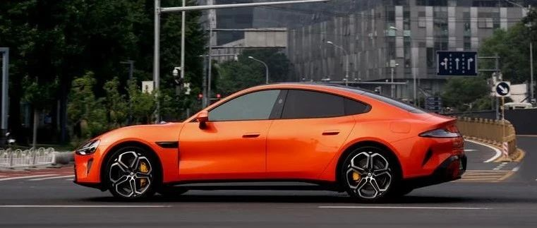

#  小米汽车答网友问（第七十四集）

[ 小米汽车 ](<javascript:void\(0\);>)

______

****  
****

****01****

**在哪里能看明天的发布会直播？这次会发布多少款新品？**

小米15系列 暨 小米澎湃OS 2 新品发布会，将在明晚（10月29日）19:00举行。小米SU7 Ultra量产版将在发布会上同步发布。

本次直播将在小米公司、小米手机、小米汽车等官方账号多平台直播，同时将在多个数码媒体、汽车媒体、电商等平台同步播出，请关注小米官方账号直播动态。

本次发布会将会有小米15系列、小米澎湃OS 2、小米SU7 Ultra、小米平板7等10多款新品亮相，欢迎大家关注发布会直播。

同时，小米SU7 Ultra量产版已开启预约咨询，欢迎大家预约。（本文尾部有预约咨询卡片）

**02**

**看预告片小米SU7 Ultra量产版的性能这么猛，能合法上路么？**

小米SU7 Ultra完全能够合法上路，这是一台拥有纯正赛道基因的量产高性能车。

小米SU7 Ultra整车设计和技术指标，在相关汽车标准及法规要求下严格开发，整车经过了严苛的耐久测试和安全测试，承载如此高性能的动力及底盘系统，也在纽北赛道经历了长时间的赛道验证。

  

**03**

**如何理解雷军所说小米SU7 Ultra“可街可赛”？**

小米SU7 Ultra定位非常清晰，可在城市通勤使用，也可原厂状态直接下赛道。所以，小米SU7 Ultra在具备了巅峰性能的同时，也拥有优秀的豪华和科技能力，即便在城市内使用，也是一款令人愉悦的豪华科技轿车。

  

**04**

**赛用碳陶瓷制动盘跟普通的制动盘比有什么优势，实际体验有什么不同？**

小米SU7 Ultra配备赛用碳陶瓷制动盘，相比普通制动盘更具高耐热性，最高工作温度超1300度，是普通钢刹车盘的2倍以上。其中前刹车盘直径达到430mm，是目前轿车上尺寸最大的碳陶盘，甚至与普通家用车轮毂大小相同，有效增加散热面积更利于散热。

重量更轻、耐久性更高，正常使用寿命几乎可达到终身免保养。但成本昂贵，通常只在高性能车、赛车或一些高端汽车上使用，选配价格也在10万元左右。

实际体验刹车距离更短，刹车过程更加线性，对操控性能大有裨益。

  

**05**

**小米SU7 Ultra量产版这么大尺寸的碳陶盘是定制的么？**

为了满足小米SU7 Ultra强大的性能需求，几乎一切与性能相关的部件均为小米汽车联合研发或深度定制，碳陶瓷制动盘也是如此。

首先，为了满足性能和散热需求，碳陶盘的尺寸是定制的核心，这是目前市场在售轿车中尺寸最大的碳陶盘。我们首先定制了前430/后410mm直径的超大尺寸，同时还要考虑整体制动系统的空间布局。

此外，碳陶盘采用10套不锈钢紧固件，结构复杂难以采用传统的锻造工艺，通过领先的仿形机进行数控机加生产，实现高强度制动时的连接件的稳定性。

最后，包括制动盘打孔布局、内部风道结构等也均为小米与供应商定制研发，最终实现在如此大的体积下，布局，重量，性能，散热，摩擦均匀性等各维度，均实现了极致的表现。

（左侧为小米SU7 MAX前制动盘，右侧为小米SU7 Ultra前碳陶瓷制动盘）

  

**06**

**绞牙减振器和普通的减振器有什么区别，实际体验有什么不同？**

小米SU7 Ultra配备倍适登EVO T1绞牙减振器，相比普通减振器可调节车身高度和阻尼力的大小。这套绞牙减振器结构、刚度和阻尼都是为小米SU7 Ultra全面定制，市场价比普通绞牙减振器贵4倍以上。

配备倍适登EVO T1绞牙减振器套装后，弹簧刚度和最大阻尼力均大幅提升。让加速俯仰梯度、制动俯仰梯度、侧倾梯度三大指标均大幅降低。在实际体验中绞牙减振器操控精准、车身稳定，更适合赛道高速行驶，提供极致的驾控体验与乐趣。

  
  

预览时标签不可点

修改于

微信扫一扫  
关注该公众号

继续滑动看下一个

轻触阅读原文

小米汽车 

向上滑动看下一个

[知道了](<javascript:;>)

微信扫一扫  
使用小程序

****

[取消](<javascript:void\(0\);>) [允许](<javascript:void\(0\);>)

****

[取消](<javascript:void\(0\);>) [允许](<javascript:void\(0\);>)

****

[取消](<javascript:void\(0\);>) [允许](<javascript:void\(0\);>)

× 分析

__

微信扫一扫可打开此内容，  
使用完整服务

： ， ， ， ， ， ， ， ， ， ， ， ， 。 视频 小程序 赞 ，轻点两下取消赞 在看 ，轻点两下取消在看 分享 留言 收藏 听过