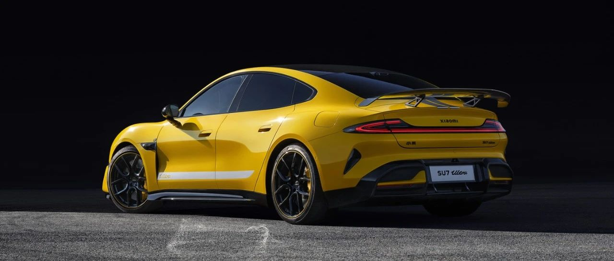

#  小米汽车答网友问（第七十八集）

[ 小米汽车 ](<javascript:void\(0\);>)

______

****  
****

****01****

**在小米SU7 Ultra首次冲刺纽北赛道的纪录片中，为什么出现了看似动力中断（no power），当时真实的情况是怎样？**

感谢您对小米SU7 Ultra纽北冲击的关注，感谢收看我们的纪录片。

我们后台检测到4分17秒左右速度传感器失去信号，完成圈速测试后检查车辆，动力系统无异常。

测试当天因为气候原因赛道路面大量落叶，判断是因为落叶遮挡速度传感器后，牵引力控制系统主动降低扭矩，并非动力中断。针对这一新发现的工况，我们的工程团队进行分析后，已经确定解决思路和方案。

赛道挑战总是会有不确定性，正常情况会单日多次刷圈以达成更优成绩，很遗憾本次测试时间有限，只能完成一圈，我们也希望下一次能够有更好的天气状态和更长的时间窗口，以便达成更优的纽北圈速成绩。

**02**

**在纽北尾段大直道冲刺时，为什么小米SU7 Ultra只跑到了324km/h极速？**

电动车的极速表现受电量、赛道状况等综合因素影响，纽北全程20.832km，赛道末端是大直道，这是一条整体呈上坡趋势的路，且当天赛道多端路面湿滑，对整车状态造成了较大的消耗。此时在电量受限的情况下，小米SU7 Ultra原型车在尾段大直道跑到了324km/h极速。

  

**03**

**小米SU7 Ultra量产车何时挑战纽北？**

量产版明年春天，纽北见！

  

  

**04**

**小米SU7 Ultra搭配的一些赛级配置，Max版后续能否加装？**

小米SU7 Ultra作为巅峰性能科技轿车，是小米SU7系列中定位最高端、性能最强的版本，与小米SU7 Max定位不同。目前Ultra的一些专属高性能配置暂无下放到Max版本的计划。

**05**

**我看到一些小米SU7 Ultra的实拍图和视频，轮胎侧面是“R”标识，这样的轮胎能否满足350km/h的极速？**

目前小米SU7 Ultra的展车均为VP阶段、即验证生产阶段的车型，并非最终量产版本，因此会有部分细节与量产版本不同，轮胎也是其中之一。

最终量产版会使用“ZR”结构类型的轮胎，速度等级为“Y”，能够满足300km/h以上的速度。小米SU7 Ultra的轮胎也经历了充分的测试、并获得了国家强制法规认证，您可以放心使用。

预览时标签不可点

微信扫一扫  
关注该公众号

继续滑动看下一个

轻触阅读原文

小米汽车 

向上滑动看下一个

[知道了](<javascript:;>)

微信扫一扫  
使用小程序

****

[取消](<javascript:void\(0\);>) [允许](<javascript:void\(0\);>)

****

[取消](<javascript:void\(0\);>) [允许](<javascript:void\(0\);>)

****

[取消](<javascript:void\(0\);>) [允许](<javascript:void\(0\);>)

× 分析

__

微信扫一扫可打开此内容，  
使用完整服务

： ， ， ， ， ， ， ， ， ， ， ， ， 。 视频 小程序 赞 ，轻点两下取消赞 在看 ，轻点两下取消在看 分享 留言 收藏 听过