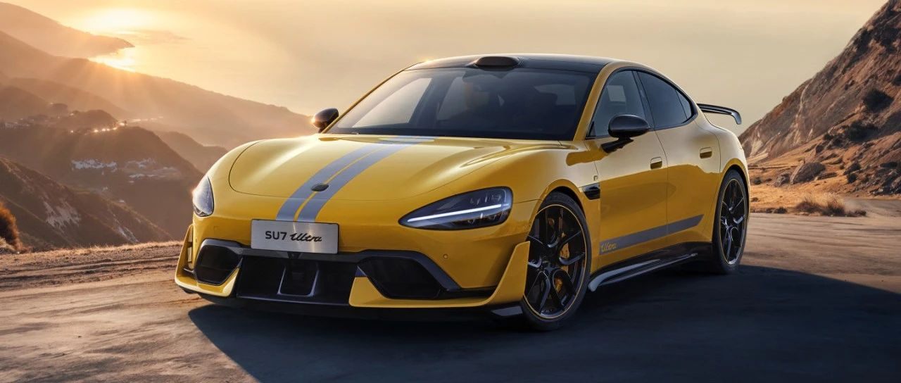

#  小米汽车答网友问（第七十九集）

[ 小米汽车 ](<javascript:void\(0\);>)

______

****  
****

****01****

**小米SU7 Ultra的外部扬声器有几个，可以播放音乐或者自定义么？**

小米SU7 Ultra共有两个外部扬声器，其中包括尾部新增的一个40W扬声器，以满足高性能运动声浪的播放。同时这也有助于提示车辆行驶状态，提升安全性。运动声浪支持开闭，建议在适当的环境开启，以免扰民。外部扬声器暂不支持播放音乐或其他自定义内容。

**02**

**小米SU7 Ultra的赛道版电池，有什么不一样？**

赛道对于电动汽车来说是最难应付的工况之一，想在赛道上取得好成绩，对三电系统要求极为苛刻。除了需要电机持续的高功率输出，更需要电池有极高的放电功率、极强的散热能力、极快的充电性能。

首先，小米SU7 Ultra 量产版搭载与原型车同源的赛道版高功率电池包，峰值电压达到897V，最大放电功率达到1330kW，最大放电倍率16C。配合多重创新电池技术，即使20%电量，也能放出800kW的最大功率。这样的性能表现意味着，在馈电状态下比纽北赛场上的一些“纯电猛兽”满电状态下的性能还要强。

其次，持续的高性能输出，热量积累是一大难题。我们通过高导电解液、超高孔隙率多孔电极等应用，使得电芯内阻低至全球量产最低的0.25mΩ，大大降低电池工作时的产热量。基于新的电芯形态，电池包同样采用行业最强的双大面主动冷却技术，峰值换热功率高达18kW，使小米SU7 Ultra能够在纽北连续飞行两圈，并且全程电池都处于合适的工作温度。

最后，配合小米「原子化充电」、「近冷源极耳散热」等技术，电池包可以做到5.2C超高充电倍率，10%~80%的充电时间仅需11分钟。轻松一刻就能重返赛道，不仅大大提高赛道乐趣，更是超越了日常的补能需求。

除此之外，小米SU7 Ultra赛道版高功率电池包延续小米CTB一体化电池的安全基因。依然采用电芯倒置技术、14层物理结构防护、7.3m²双大面冷却、170片气凝胶、17层高压绝缘防护、车云协同安全预警系统等，共同守护电池安全。即使在55℃高温满电情况下、单颗电芯热失效也不会热蔓延。在此基础上我们还为赛道版高功率电池包额外增加了专门的防护结构，将会在正式上市时再和大家详细分享。小米SU7 Ultra电池安全依旧坚若磐石，赛道安全更进一步。

  

**03**

**285kg的下压力在日常行驶有帮助么？**

285kg的最大下压力是在350km/h极速下达成的，日常驾驶速度远低于此数值，拿120km/h时速举例，整车下压力约为33kg。

但日常驾驶时额外的下压力依旧可以提升操控稳定性，因为下压力的增加，意味着车辆可以在获得额外抓地力的同时不增加惯性。

具体到操控表现上，可以有效提升紧急变道、高速行驶与湿滑路面时的稳定性，有效减少转向不足与转向过度，面对路面抛跳也会更加从容。

  

**04**

**升级1.4.0后，如何分享我自己的驾驶模式给别人？如何添加别人的驾驶模式？**

在小米SU7 MAX车型上，提供了丰富的自定义驾驶参数设置。升级了1.4.0之后，可以将自己定义的驾驶模式通过分享码分享给其他小米SU7 MAX车友。在设置-驾驶偏好中，点击M1或者M2模式，点击分享图标，可以生成该模式的9位分享码和性能参数简报。<<左右滑动查看更多>>同样，在M1或者M2自定义中，通过添加别人的9位分享码，也可以瞬间获得其他车友的各种个性化驾驶模式。

预览时标签不可点

微信扫一扫  
关注该公众号

继续滑动看下一个

轻触阅读原文

小米汽车 

向上滑动看下一个

[知道了](<javascript:;>)

微信扫一扫  
使用小程序

****

[取消](<javascript:void\(0\);>) [允许](<javascript:void\(0\);>)

****

[取消](<javascript:void\(0\);>) [允许](<javascript:void\(0\);>)

****

[取消](<javascript:void\(0\);>) [允许](<javascript:void\(0\);>)

× 分析

__

微信扫一扫可打开此内容，  
使用完整服务

： ， ， ， ， ， ， ， ， ， ， ， ， 。 视频 小程序 赞 ，轻点两下取消赞 在看 ，轻点两下取消在看 分享 留言 收藏 听过