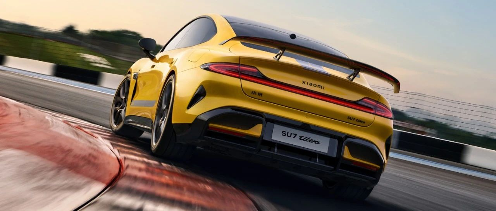

#  小米汽车答网友问（第八十集）

[ 小米汽车 ](<javascript:void\(0\);>)

______

****  
****

****01****

**小米SU7 Ultra量产版为什么不保留原型车前机盖上的两个通风口？**

小米SU7 Ultra Prototype（简称PT版）是小米汽车纯电架构打造的赛道原型车，完全为赛道而生，无法实现合法上路。PT版的设计初衷就是追求赛道的极致表现，并验证三电系统、热管理系统及底盘等核心技术。

PT版为了追求更优异的赛道性能，不需考虑日常实用性，所以将前备箱区域调整成两个贯穿的风道，用于获得赛道中的更极致的散热、减重和下压力，如最大下压力达到2145kg。

小米SU7 Ultra量产版作为可街可赛定位的巅峰性能科技轿车，设计最大下压力285kg，达到两三百万级别跑车的水平，相关设计指标也兼顾赛道需求和日常驾驶需求。量产车的热管理需求更加复杂，除了赛道散热，还需要平衡日常使用需求，所以我们设计了以高性能风扇为基础的散热系统，这样的散热方案既能满足赛道工况下极端的散热需求，同时日常使用时的低温能耗，空调性能，超充制冷等达到行业顶尖的体验，也保障了车内静谧和分区储物的需求。

完全为赛道而生和可街可赛是两种不同产品方向，我们会相应地去调整相关设计。

**02**

**小米SU7 Ultra量产版有哪些拉花样式可供选择？**

拉花是赛车文化中非常重要的一部分，小米SU7 Ultra作为一辆可合法上路的四门赛车，也配备了专属拉花。

这款拉花采用了经典的赛车条纹拉花，低调的银色颇具质感；细节方面，前窄后宽，带些梭形的设计，简洁而又强化了动感。

未来，我们还会带来其他样式的拉花，充分满足用户对个性的需求。在最近直播中，**雷军也确认未来将在量产版中提供原型车闪电拉花** 。具体的安装方式、价格等，请关注官方信息。

<小米SU7 Ultra 原型车闪电拉花>

  

  

**03**

**我的行车记录能够录制多长时间的视频？**

在最新的HyperOS 1.4.0版本中，系统优化了行车记录的存储逻辑，放开了行车记录循环录制时间上限，会根据使用的U盘存储的大小动态调整存储时长。

在1.4.0版本中，用户还可以一键删除同类视频，在影像记录APP中，下拉视频列表，点击删除，可以批量删除同类视频，快速释放更多存储空间。

  

**04**

**如何设置地图的限行提醒？**

从1.4.0版本开始，小米车机地图提供“限行提醒”功能，在地图-设置-导航中的“避开限行”中设置您的车牌号，打开避开限行开关，在每次导航路线规划中，会尝试为您规划避开限行的路线，同时提示相关的限行规定。

预览时标签不可点

微信扫一扫  
关注该公众号

继续滑动看下一个

轻触阅读原文

小米汽车 

向上滑动看下一个

[知道了](<javascript:;>)

微信扫一扫  
使用小程序

****

[取消](<javascript:void\(0\);>) [允许](<javascript:void\(0\);>)

****

[取消](<javascript:void\(0\);>) [允许](<javascript:void\(0\);>)

****

[取消](<javascript:void\(0\);>) [允许](<javascript:void\(0\);>)

× 分析

__

微信扫一扫可打开此内容，  
使用完整服务

： ， ， ， ， ， ， ， ， ， ， ， ， 。 视频 小程序 赞 ，轻点两下取消赞 在看 ，轻点两下取消在看 分享 留言 收藏 听过