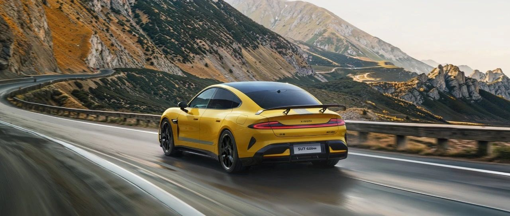

#  小米汽车答网友问（第八十二集）

[ 小米汽车 ](<javascript:void\(0\);>)

______

****  
****

****01****

**小米SU7冰箱制热的最高温度是多少？可以提前用APP预加热么？**  

小米SU7在冬季的用车舒适性非常出色，小米SU7标配诸多配置，比如双区空调、方向盘加热、四个座椅加热，并且支持通过小米汽车APP远程开启，保证用户上车即温暖。同时小米SU7全系可选装车载智能冰箱，其不仅支持2℃~15℃制冷，还支持35℃~50℃制热，也可通过小米汽车APP远程控制，冬天在车里再也不用喝冰水。

除了饮品外，小米SU7也为冬季的大件衣包提供了优秀的储物便利性，冬季随身厚衣物较多，而小米SU7的中控台镂空储物区域容积达到21.7L，足以放下手套、围巾等物品，且取放便利。同时在后排的B柱区域，小米SU7还贴心的设计了挂钩，可放置外套。

随着天气转凉、部分城市将陆续出现降雪天气，我们也将持续与大家分享冬季用车小贴士，敬请关注。

  

**02**

**小米汽车的智驾更新速度太快了，是如何实现的？**  

小米汽车在产品定义之初，就明确将对核心技术持续投入，在智能驾驶上坚持自研路线，投入充足的研发资源。同时为了确保在2024年进入第一梯队，小米智驾团队在高速NOA、全国无图、端到端三线同时作战，三条线承接不同阶段的交付工作，保证阶段性用户的最优体验。

快速迭代可以说是全栈自研的最大优势之一，虽然技术之间存在一些差异，但整个工作方法、底层代码与资源是完全共享且自主的，这是供应商黑盒方案永远无法逾越的天然壁垒，我们三条战线相互赋能、资源共享、结果共享，为快速研发提供了基础保障。

  

**03**

**小米SU7 Ultra所采用的碳纤维套件是什么工艺？是选配方案么？**  

小米SU7 Ultra全车90%以上的碳纤维套件均使用热压罐成型工艺，即所谓的「干碳」。热压罐成型工艺是制作碳纤维产品最昂贵的成型方式，广泛应用于航空航天领域比如卫星、火箭等航空器结构部件。优势是有更高的强度、更高的刚度和更轻的重量，并且成型工艺稳定可靠，制品力学性能优良，但是成本非常昂贵。

小米SU7 Ultra全车内外共使用17处碳纤维部件，总使用面积高达3.74平方米，既满足了极佳的力学性能要求，又兼顾了设计美学的需求。我们也将在车辆最终上市时，和大家分享我们完整的配置方案。

  

**04**

**小米SU7 Ultra的轮毂还有其他设计或样式可以选择么？**  

在10月29日发布会上，小米SU7 Ultra首次展示了21英寸轮毂，设计感别具一格，它由5个“U”构成，凸显专属感；外侧搭配纤细的黄色外圈，尽显性能。

小米汽车一直希望不断为用户提供足够丰富的选配方案，未来，我们会持续带来其他样式和工艺的轮毂，充分满足不同用户的个性化需求，敬请期待。

  

预览时标签不可点

微信扫一扫  
关注该公众号

继续滑动看下一个

轻触阅读原文

小米汽车 

向上滑动看下一个

[知道了](<javascript:;>)

微信扫一扫  
使用小程序

****

[取消](<javascript:void\(0\);>) [允许](<javascript:void\(0\);>)

****

[取消](<javascript:void\(0\);>) [允许](<javascript:void\(0\);>)

****

[取消](<javascript:void\(0\);>) [允许](<javascript:void\(0\);>)

× 分析

__

微信扫一扫可打开此内容，  
使用完整服务

： ， ， ， ， ， ， ， ， ， ， ， ， 。 视频 小程序 赞 ，轻点两下取消赞 在看 ，轻点两下取消在看 分享 留言 收藏 听过