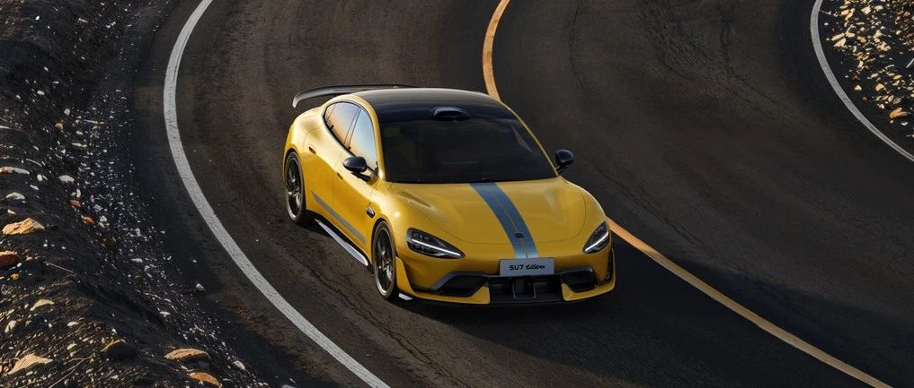

#  小米汽车答网友问（第八十六集）

[ 小米汽车 ](<javascript:void\(0\);>)

______

****  
****

****01****

**升级1.4.0后，一键狂暴的Boost模式特效可以关闭吗？**

可以关闭，从1.4.0版本开始用户可以在设置-驾驶偏好中关闭Boost模式动效，中控屏在启动boost模式时将保持原有状态。

使用一键狂暴功能请确保路况安全，在湿滑路面，大角度转弯等复杂路况，务必确保行驶安全。

  

**02**

**小米SU7 Ultra的碳陶瓷刹车盘，卡钳以及制动片是官方定制的么，可以在第三方买到么？**

小米SU7 Ultra的赛道版制动系统是小米与3家不同的合作伙伴专门定制的。其中超大尺寸的碳陶瓷制动盘由国内领先的碳基复合材料供应商金博股份提供；前六活塞后四活塞的高性能制动卡钳也来自于著名国际品牌Akebono®️，这也是一家专精高性能制动系统的供应商；而制动片则由常年活跃于赛场的顶级品牌ENDLESS®️提供（需选装）。

为达到小米SU7 Ultra对制动性能的高要求，我们的工程师找到了上述3家业界领先的合作伙伴，共同打造出了一套超强性能的赛道版制动系统。其不但拥有极强的制动力，还有满足连续高强度赛道驾驶的抗热衰减性能，让小米SU7 Ultra的100-0km/h制动距离仅为30.8m，180-0km/h连续10次制动无衰减。

在开发过程中，小米SU7 Ultra对制动系统进行了长期且严格的测试与调校，包括低温测试、高温测试和在纽北进行的赛道测试，保证了制动系统的安全性与稳定性，也让用户原厂无需改装就可以直接下赛道。

  

**03**

**小米SU7 Ultra会推出不带激光雷达的选配版本么？**

小米SU7 Ultra定位巅峰性能科技轿车，同时也将搭载小米汽车旗舰级的软硬件技术。

小米SU7 Ultra可街可赛的产品定位，让智能驾驶成为不可或缺的一项关键能力。因此为了给用户提供全维度进阶的产品体验，我们暂未规划取消激光雷达的版本。

同时，小米汽车对激光雷达进行了超低风阻以及高度集成化的设计改良，在1548PS超强马力之下，其对赛道性能的影响以及日常续航表现的影响基本可以忽略不计。

  

**04**

**绞牙减振器要怎么调节，需要把车举起来调吗？**

小米SU7 Ultra可选配小米在纽北定制调校的顶级BILSTEIN EVO T1绞牙减振器，其相比空气弹簧的刚度更高，可为用户带来无限接近赛车的操控体验。调整绞牙减振器的阻尼时，无需将车辆举升即可调节，前轮减振器可通过塔顶外露的旋钮进行调节，后轮减振器可通过位于轮拱内的旋钮进行调节；调整绞牙减振器的高度时，需将车辆举升，将轮胎拆下，调整好减振器的弹簧压缩量后，再装好轮胎。

而小米SU7 Ultra标配的双腔闭式空气弹簧+高性能连续阻尼可变减振器，可根据驾驶模式、路况、车身响应智能切换，单独调节刚度和高度，既能满足激烈驾驶的运动需求，又能满足日常舒适代步。

  

预览时标签不可点

微信扫一扫  
关注该公众号

继续滑动看下一个

轻触阅读原文

小米汽车 

向上滑动看下一个

[知道了](<javascript:;>)

微信扫一扫  
使用小程序

****

[取消](<javascript:void\(0\);>) [允许](<javascript:void\(0\);>)

****

[取消](<javascript:void\(0\);>) [允许](<javascript:void\(0\);>)

****

[取消](<javascript:void\(0\);>) [允许](<javascript:void\(0\);>)

× 分析

__

微信扫一扫可打开此内容，  
使用完整服务

： ， ， ， ， ， ， ， ， ， ， ， ， 。 视频 小程序 赞 ，轻点两下取消赞 在看 ，轻点两下取消在看 分享 留言 收藏 听过