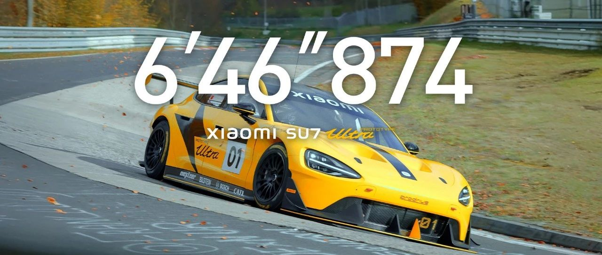

#  小米汽车答网友问（第八十九集）

[ 小米汽车 ](<javascript:void\(0\);>)

______

****  
****

****01****

**即将在广州车展上亮相的小米SU7 Ultra原型车，是在纽北刷出6分46秒874成绩的那台么？**

在11月15日举办的广州车展上，我们将首次向大家展示，刚刚在纽北完成圈速挑战荣耀而归的小米SU7 Ultra Prototype原型车，也就是获得纽北四门车圈速第一的同一台车，我们甚至没有对车辆进行美化，将保持纽北圈速挑战完成后的真实车辆状态。

此外本次车展上，小米SU7 Ultra量产版也将首次与大家见面，同时小米SU7 全系9色也将同场齐聚。欢迎大家来展台逛一逛，小米汽车所在的展区位置为7.2号馆·17204展位。

  

**02**

**雷军会出席广州车展么？**

感谢大家的关注与支持，雷军将会参加此次11月15日广州车展媒体日，届时也将在车展发布会上，跟大家汇报小米汽车一系列最新的技术进展。

此外11月14日，雷军也将举办一场智能驾驶体验直播，首次向大家展示小米SU7端到端全场景智能驾驶，并和大家聊聊小米智能驾驶的最新进展。

  

**03**

**为什么表显续航下降的里程数，会比实际行驶的里程多？**

在实际驾驶中，不同的工况环境、不同的用户驾驶习惯等，都会存在一些差异，车机显示的续航数据并不一定能100%表达真实的续航情况，会存在一定的区别。

小米SU7提供了CLTC续航、预估续航两种不同的续航里程显示方式。其中预估续航，针对气温差异和驾驶习惯差异，综合考虑了高温、低温和激烈驾驶等工况，能实现更精准的续航预估。

小米SU7拥有优秀的超低能耗及续航表现，非常多专业媒体及用户对小米SU7对续航表现均给出了极高的评价。小米SU7三个配置版本，分别提供了700km、830km及800km的官方续航里程，均可以提供令人安心的出行体验。

**04**

**提车快半年了，需要回店做检查/保养么？**

您可以参考小米SU7用户手册里面的车辆保养章节，如果您的爱车已经行驶了2万公里，建议到小米汽车服务中心进行一次全方位的检查和保养；

提车没有超过1年或行驶2万公里，暂时不需要回店进行检查/保养；

如果车辆需要经常行驶在以下恶劣环境中，可能需要增加额外的保养项目或缩短保养间隔：

  * 在高尘土的环境中行驶；

  * 在严寒（-20℃以下）或高温（40℃以上）的环境中行驶；

  * 在潮湿环境下行驶或经常涉水；

  * 在多盐或腐蚀性材料路面上行驶；

  * 频繁制动或在多山地区行驶；

  * 经常处于高负荷使用等特殊用途；

  * 特殊用途的加装或改装。

预览时标签不可点

微信扫一扫  
关注该公众号

继续滑动看下一个

轻触阅读原文

小米汽车 

向上滑动看下一个

[知道了](<javascript:;>)

微信扫一扫  
使用小程序

****

[取消](<javascript:void\(0\);>) [允许](<javascript:void\(0\);>)

****

[取消](<javascript:void\(0\);>) [允许](<javascript:void\(0\);>)

****

[取消](<javascript:void\(0\);>) [允许](<javascript:void\(0\);>)

× 分析

__

微信扫一扫可打开此内容，  
使用完整服务

： ， ， ， ， ， ， ， ， ， ， ， ， 。 视频 小程序 赞 ，轻点两下取消赞 在看 ，轻点两下取消在看 分享 留言 收藏 听过