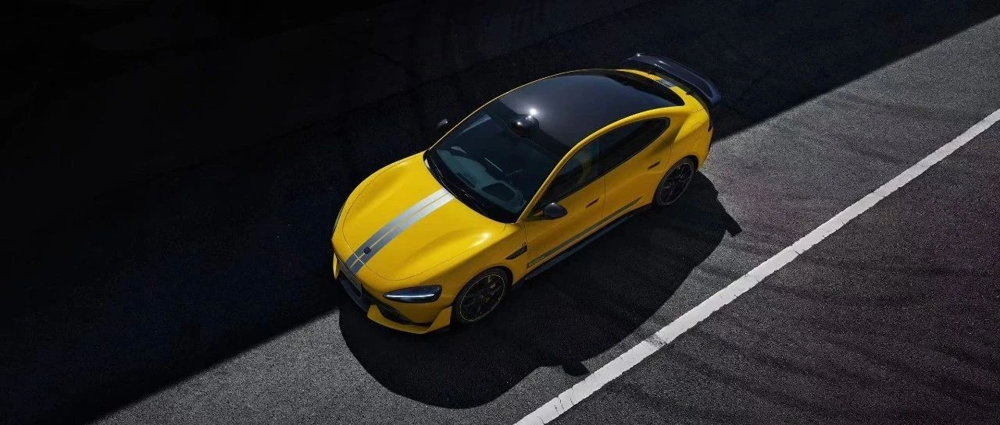

#  小米汽车答网友问（第九十一集）

[ 小米汽车 ](<javascript:void\(0\);>)

______

****  
****

****01****

**这次广州车展，小米汽车展台有什么特别的看点？**

2024广州车展将于明天正式开幕！明天是媒体日，小米汽车车展发布会将在上午9点准时开播，邀您收看；16日（本周六）一直持续到11月24日，广州车展将面向公众开放，小米汽车为大家准备了许多看点和福利：

**小米SU7 Ultra** 将首次面向公众亮相；刚刚凯旋而归的纽北最速四门车——**小米SU7 Ultra原型车** 也将亮相小米汽车展位，欢迎您亲临现场感受性能之美；

同时，**全系9色的小米SU7** 也将悉数亮相，并有专业销售为您1对1讲解，全面解答疑虑；您还可以现场体验到「人车家全生态展区」及「车辆选配体验区」，帮您全面了解小米SU7。更有车展限定矿泉水免费领取。**欢迎大家到「广州国际会展中心-17.2号馆·204号小米汽车展位」打卡！**

  

**  
**

**02**

**雷总今天去看了珠海航展，小米有考虑做航空相关业务吗？**

这个真没有。雷总是到金山珠海总部出差，和金山集团管理层一起顺便参观航展。小米集团完全没有关于航空业务的规划。

**  
**

**03**

**今天发布的小米智能底盘预研技术，什么时候可以量产？**

小米汽车始终坚持量产一代，发布一代，预研一代的技术路径，本次发布的智能底盘预研技术就是“预研一代”。

这次我们发布的有：小米全主动悬架 、小米超级四电机系统、小米48V线控制动、小米48V线控转向4项技术，目前这些技术处于验证、测试阶段，距离量产还有一段时间。未来量产的具体计划，我们将择机再向大家汇报，敬请大家关注官方信息。

**  
**

**04**

**“汽车跳舞”、“原地起跳”看起来很酷，这些技术在实际用车场景中有什么作用？**

“汽车跳舞”、“原地起跳” 等功能，均是基于小米汽车全主动悬架实现的。全主动悬架是目前最先进的悬架技术之一，每个轮端都配备独立动力源，主动出力对抗路面，这是它与半主动悬架的核心区别。在应对复杂路况时，适应性和响应速度更出色，甚至实现「零颠簸、零侧倾、零俯仰」，让日常乘坐更舒适，极限驾控更稳健。

“汽车跳舞”的底层能力，是悬架必须能快速调整车辆的高度，并精确协调各轮端悬架的运动。小米全主动悬架高度调节幅度达到140mm，可以让车辆通过大幅度坎，还能实现悬架迎宾功能，仪式感十足。调节速度是空气弹簧的100倍，可以精确地过滤掉非常细碎的路面颠簸。

“原地起跳”，则需要悬架有极强的举升力。小米全主动悬架的每个轮端都配备了功率高达4.6kW的动力源，可以从超高压平台取电，使减振器迅速获得超高油压；系统举升力最大超 44400N，相当于两个小米SU7 Max的重量，这是实现快速原地起跳的关键。日常生活中，也能让车辆在面对大侧倾、大俯仰、大颠簸等极端场景下更加从容。

除此之外，小米汽车全主动悬架还能实现更多功能，比如结合实时监控道路路面复杂情况，并结合云端数据提前预判路况等，预调整悬架工况。当然，也能与整车软硬件打通配合，打造流畅安全的智能驾驶，为未来的完全自动驾驶做好准备。

**  
**

**05**

**端到端智驾一定比无图好吗？能解决无图哪些问题？**

小米汽车是国内率先在泊车场景应用端到端技术的汽车品牌。

在端到端能力上，小米即将行车、泊车全场景端到端，体验上限更高，具有更连贯和一致的表现。

无图NOA的积累是端到端的基础，端到端引入了用户驾驶数据训练，在无图基础上，轨迹更拟人、通行更高效、驾驶更安全，VLM视觉语言大模型加持后可以应对更多复杂场景。

  * 驾驶更拟人：行驶过程中的轨迹更加平滑、自然，急加速和急刹车明显减少，能够智能预判并规划最佳行驶路径，提前做出更合理的驾驶决策。

  * 通行更高效：车位启动，上车就能用，博弈能力更强，灵活应对对向来车、行人、静态障碍物，可实现ETC、闸机卡口通行，车位到车位，全程无断点。

  * 驾驶更安全：端到端模型自由的多维度评估机制对轨迹实时进行安全性评估，把安全底线刻在基因里，两轮车、行人混淆复杂路况，反应更快。

  * VLM应对更多复杂场景：对路面情况实时分析，坑洼路面、施工场景、丁字路口等识别并提示驾驶员。

**  
**

**06**

**今天雷总直播展示了“车位到车位”的智驾能力，什么时候能够推送给用户？**

我们将在11月16日开启定向邀请内测，12月底开启先锋版推送，请大家耐心等待。

  

预览时标签不可点

微信扫一扫  
关注该公众号

继续滑动看下一个

轻触阅读原文

小米汽车 

向上滑动看下一个

[知道了](<javascript:;>)

微信扫一扫  
使用小程序

****

[取消](<javascript:void\(0\);>) [允许](<javascript:void\(0\);>)

****

[取消](<javascript:void\(0\);>) [允许](<javascript:void\(0\);>)

****

[取消](<javascript:void\(0\);>) [允许](<javascript:void\(0\);>)

× 分析

__

微信扫一扫可打开此内容，  
使用完整服务

： ， ， ， ， ， ， ， ， ， ， ， ， 。 视频 小程序 赞 ，轻点两下取消赞 在看 ，轻点两下取消在看 分享 留言 收藏 听过