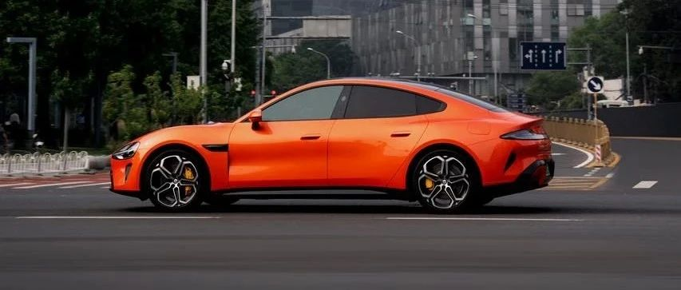

#  小米汽车答网友问（第九十四集）

[ 小米汽车 ](<javascript:void\(0\);>)

______

****  
****

**01**

**雨雪天气对智驾功能有影响吗？**

小米智驾系统搭载超分辨率占用网络技术，该技术主要服务于激光雷达对于异形障碍物的精确识别，但该技术加持下也同样优化了雨雪天气智驾系统的运行。

在雨雪天气时，该技术可以对激光雷达采集的数据进行降噪。如雨天行驶时前车车轮溅起的水花，在降噪前会被识别为障碍物，降噪后则会将其视为非障碍物并正常通行。

但在能见度极低、路面附着力极低等极端恶劣的天气下我们建议用户不要使用智驾功能。

此外，如果雨雪或沙尘遮挡了智驾相关的传感器, 系统会对用户进行及时提示, 建议在出现提示时及时清理传感器。

  

**02**

**小米SU7的智驾功能在没有信号的地库还能使用么？还能自动泊车吗？**

小米智能泊车功能跟网络信号无关, 即便没有网络信号, 小米智能泊车功能依旧可正常使用。小米全系车型均搭载了基于端到端模型的代客泊车辅助功能，可以实现最高23km/h的地下车库巡航。对停车场内车道、障碍物进行精确感知，并实现障碍物绕行、甚至倒车避让。车上搭载的智驾芯片完成全部运算，因此功能的实现并不需要网络信号。

**  
**

**03****小米首创的双活塞电子卡钳为什么选择双活塞方案？**

小米48V线控制动首创“双活塞电子制动卡钳”，相比传统单活塞，摩擦面积扩大 50%，即使在激烈驾驶、连续制动场景中也能提供稳定优异的制动性能。此外还配有的高精度夹紧力感知模块，使夹紧精度提升一倍，制动控制更精细，确保制动过程减速更平顺。同时，小米电子制动卡钳，具有卡钳盘片间隙主动调节功能，可根据工况智能调整，拖滞力矩减少 50%，车辆续航里程额外增加 10 公里以上。除了优秀的性能外，这款卡钳的外观也十分出色，它采用仿固钳设计，黄色的涂装颇具性能感，充分满足用户对外观个性的追求。

  

**04**

**什么时候能在我的城市看到小米SU7 Ultra量产版展车？**

我们即将在12月开启小米SU7 Ultra量产版的全国巡展，具体的巡展城市和时间将会在不久后公布，敬请期待！

  

预览时标签不可点

微信扫一扫  
关注该公众号

继续滑动看下一个

轻触阅读原文

小米汽车 

向上滑动看下一个

[知道了](<javascript:;>)

微信扫一扫  
使用小程序

****

[取消](<javascript:void\(0\);>) [允许](<javascript:void\(0\);>)

****

[取消](<javascript:void\(0\);>) [允许](<javascript:void\(0\);>)

****

[取消](<javascript:void\(0\);>) [允许](<javascript:void\(0\);>)

× 分析

__

微信扫一扫可打开此内容，  
使用完整服务

： ， ， ， ， ， ， ， ， ， ， ， ， 。 视频 小程序 赞 ，轻点两下取消赞 在看 ，轻点两下取消在看 分享 留言 收藏 听过