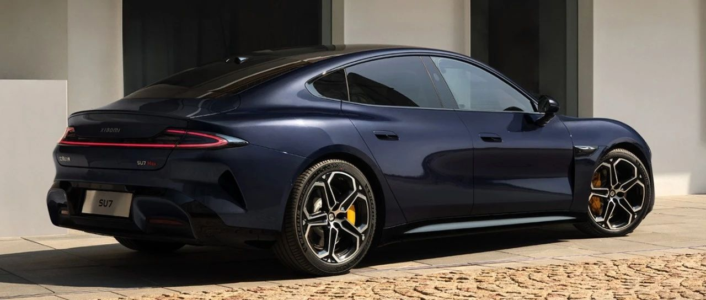

#  小米汽车答网友问（第九十五集）

[ 小米汽车 ](<javascript:void\(0\);>)

______

****  
****

****01****

**小米汽车已交付10万台，今年还剩1个月，新目标13万交付能达成么？**

我们有信心。小米汽车于11月13日实现了第10万辆整车的下线，230天的时间创造了国内新车企最快下线纪录。截止目前，小米汽车已经完成了第10万辆新车交付。

这也不是我们第一次上调生产交付目标。接下来不到一个半月的时间内，完成3万辆的交付，是一个挑战，但基于工厂产线能力和全国销交服体系能力的不断提升，我们有信心能做到。感谢大家的支持！

  

  

**02**

**小米SU7除了可显示CLTC续航里程数外，还有其他显示逻辑么？**

小米SU7提供CLTC续航、预估续航两种不同的续航里程显示方式。其中预估续航，针对气温差异和驾驶习惯差异，综合考虑了高温、低温和激烈驾驶等工况，能实现更精准的续航预估。

您可根据自己的使用需求，在中控屏点击“系统设置-充放电-续航显示方式”，实现CLTC续航和预估续航之间自由切换。

小米SU7拥有优秀的超低能耗及续航表现，非常多专业媒体及用户对SU7的续航表现均给出了极高的评价。小米SU7三个配置版本，分别提供了700km、830km及800km的官方续航里程，均可以提供令人安心的出行体验。

  

**03**

**小米SU7在低温条件下长时间停放，小电瓶会没电么？**

无论燃油车还是新能源车，低温长时间静置都有可能导致小电池亏电，最终车辆无法启动。但小米SU7标配了锂离子小电池，其相比传统铅酸电池具有更好的低温启动性能，同时其还通过内置BMS实现了智能补电/智能保电等智能化控制，最大程度避免了低温下车辆长时间静置导致的小电池亏电问题。

智能补电，即小电池电量低于一定阈值时，车辆自动打通高压电池为小电池补电，从而降低小电池亏电的可能性，且该过程由智能化控制，用户无需干预；同时，高压电池的电量也有安全阈值，避免车辆长时间停放，高压电池电量放空。

智能保电，即高压电池电量低于安全阈值，无法继续为小电池补电，小电池电量也降低到更低的安全阈值时，整车自动断开供电电路，并通过小米汽车APP提醒用户，此时用户返回车辆仍可正常解锁、启动车辆，无需救援，就近通过充电枪充电即可恢复整车正常功能。

以上的智能补电、智能保电功能，既可以最大程度确保小电池不亏电、高压电池不亏电、车辆不趴窝，又能避免小电池损坏。此外，小米SU7锂离子小电池的寿命也远长于传统铅酸小电池，用车成本更低，其重量、体积也均优于传统铅酸小电池。

友情提示：虽然小米SU7的锂离子小电池拥有极强的低温性能，但为了保证您的用车体验及车辆健康状态，还是不建议车辆长时间静置。

**04**

**开启全景影像功能有速度限制么？**

打开360°全景影像没有速度限制。在行驶中，您也可以通过中控屏下方控制栏手动打开360°全景影像，此时360°全景影像不会随着车速增加而自动退出。

如果车辆挡位从R挡切换到D挡后，车速超过10km/h时360°全景影像将自动退出。或者您也可以通过点击中控屏Home键操作手动退出360°全景影像。

  

预览时标签不可点

微信扫一扫  
关注该公众号

继续滑动看下一个

轻触阅读原文

小米汽车 

向上滑动看下一个

[知道了](<javascript:;>)

微信扫一扫  
使用小程序

****

[取消](<javascript:void\(0\);>) [允许](<javascript:void\(0\);>)

****

[取消](<javascript:void\(0\);>) [允许](<javascript:void\(0\);>)

****

[取消](<javascript:void\(0\);>) [允许](<javascript:void\(0\);>)

× 分析

__

微信扫一扫可打开此内容，  
使用完整服务

： ， ， ， ， ， ， ， ， ， ， ， ， 。 视频 小程序 赞 ，轻点两下取消赞 在看 ，轻点两下取消在看 分享 留言 收藏 听过