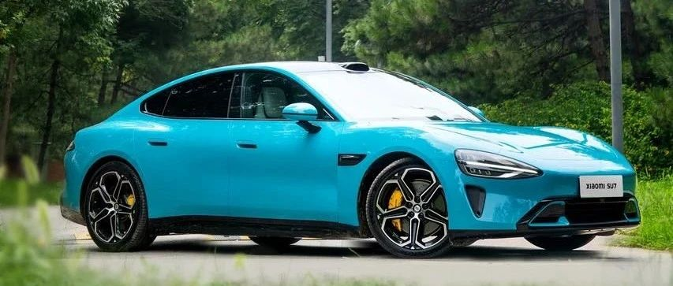

#  小米汽车答网友问（第九十九集）

[ 小米汽车 ](<javascript:void\(0\);>)

______

****  
****

****01****

**最近小米SU7有新增「车速过快」的系统提示音，这是更新的新功能么？**

在刚刚推送的Xiaomi HyperOS 1.4.3版本中，新增了「车速过高提醒」功能。这项功能目的是进一步强化公开道路行驶时的车速过高提醒措施，减少事故发生。当您听到语音提示车速过快时，说明您当前的行驶车速已经远超中华人民共和国道路交通安全法（以下简称道交法）对于公共道路的最高限速。

「车速过高提醒」功能将会在每次车辆启动时默认开启。如遇特殊情况需关闭功能，可于设置-驾驶偏好-行车安全处临时关闭，届时本次用车周期内将不再进行超速提醒。

值得注意的是，该功能只包含了声、光、语音提醒，并不会进行动力限制，因此不会影响到紧急避险等工况下的车辆行驶表现。同时在大师模式或漂移模式开启状态下，「车速过高提醒」会自动停用，不打扰您的赛道体验。

友情提示：车道非赛道，请在日常驾驶车辆时务必时刻遵守道交法、关注路况、控制车速、注意行车安全，切勿在公共道路上激烈驾驶。

  

  

**02**

**在没有信号的地库还能使用小爱同学么？**

车载小爱支持全离线语音交互，无论是车辆设备（如控制空调、车窗等）、车机（如询问状态灯、开启功能等）、还是地图（如导航至目的地、放大缩小地图等）均可离线控制，支持在线支持的绝大部分功能，无惧弱网、无网挑战。

但当语音大模型功能因数据需由云端处理时，则需要联网才能正常使用（如询问新闻、识别前车等）。

**03**

**开启车载冰箱制热模式一天，消耗的电量多吗？可以远程控制定时开启/关闭么？**

小米SU7的冰箱提供低能耗的制冷制热功能，在确保体验的同时，不会对整车能耗造成明显影响。当整车电量低于20%时冰箱会停止工作，以保证您正常的续航行驶。

您可以在小米汽车APP“车辆”页面点击“冰箱”，即可远程控制冰箱的开/关、调节制冷/制热模式、工作温度、运行模式等。您还可以根据自己的实际需求，在APP远程设定离车持续工作时长。比如即使工作一天后再上车，依然能在初冬的季节里，一上车就可享受暖饮。

  

**04**

**在冬季积雪路面，雪地模式可以一直打开么？**

在冰雪天气行车，如遇积雪路面，建议您打开雪地模式，因为在雪地模式下，车辆动力输出更加缓和、动能回收力度更弱、ESC等电子辅助系统的介入也会更积极，从而尽量保证车辆平稳行驶。但当车辆驶离积雪路段，建议您恢复正常驾驶模式，从而获得更好的驾驶体验以及更优的能耗。

  

  

预览时标签不可点

微信扫一扫  
关注该公众号

继续滑动看下一个

轻触阅读原文

小米汽车 

向上滑动看下一个

[知道了](<javascript:;>)

微信扫一扫  
使用小程序

****

[取消](<javascript:void\(0\);>) [允许](<javascript:void\(0\);>)

****

[取消](<javascript:void\(0\);>) [允许](<javascript:void\(0\);>)

****

[取消](<javascript:void\(0\);>) [允许](<javascript:void\(0\);>)

× 分析

__

微信扫一扫可打开此内容，  
使用完整服务

： ， ， ， ， ， ， ， ， ， ， ， ， 。 视频 小程序 赞 ，轻点两下取消赞 在看 ，轻点两下取消在看 分享 留言 收藏 听过